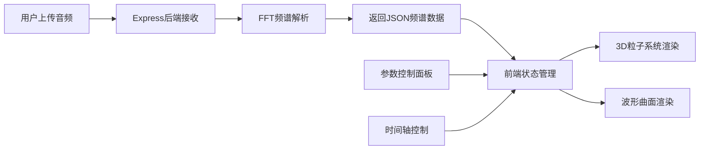

## 1. 产品概述
音乐幻视（Music Visualizer）是一款基于WebGL的3D音乐可视化应用，将抽象的音频频谱数据转化为沉浸式的动态视觉体验。用户上传音频文件后，系统实时解析频谱并生成随音乐律动的粒子云和波形曲面，支持丰富的参数调节和视觉主题切换。

- 核心价值：将音乐转化为直观的视觉艺术，提供可交互的沉浸式体验
- 目标用户：音乐爱好者、视觉艺术家、VJ创作者、教育工作者
- 市场定位：轻量级、高性能的浏览器端音乐可视化工具

## 2. 核心功能

### 2.1 用户角色
| 角色 | 注册方式 | 核心权限 |
|------|----------|----------|
| 普通用户 | 无需注册 | 上传音频、调节参数、切换主题、回放控制 |

### 2.2 功能模块
1. **音频上传与解析**：支持WAV/MP3格式上传，FFT频谱分析，进度显示
2. **3D粒子系统**：500-5000个动态粒子，随频谱三轴偏移，颜色渐变
3. **波形曲面可视化**：32x32网格曲面，顶点高度随频谱动态变化，涟漪效果
4. **时间轴回放控制**：波形缩略预览，拖拽跳转，片段循环播放
5. **参数控制面板**：粒子数量/大小/颜色/旋转速度/聚集形态实时调节
6. **视觉主题切换**：极光、霓虹、水墨三种预设风格

### 2.3 页面详情
| 页面名称 | 模块名称 | 功能描述 |
|---------|---------|----------|
| 主页面 | 3D渲染区 | 全屏Three.js场景，粒子云+波形曲面，鼠标拖拽旋转、滚轮缩放 |
| 主页面 | 右侧控制面板 | 上传区、参数调节区、预设主题按钮、时间轴轨道 |
| 主页面 | 顶部标题栏 | 应用标题、设置按钮、全屏按钮 |

## 3. 核心流程

用户上传音频文件 → 后端FFT解析生成频谱数据 → 前端接收数据并存入状态 → 3D场景实时渲染粒子和波形 → 用户通过控制面板调节参数 → 视觉效果实时更新 → 用户拖拽时间轴跳转/截取片段循环

## 4. 用户界面设计

### 4.1 设计风格
- **整体风格**：深色科技感，沉浸式视觉体验
- **主色调**：深海蓝 #0a0a1a（背景）
- **强调色**：青色渐变、紫色渐变、金色点缀
- **材质效果**：磨砂玻璃（backdrop-filter: blur(12px)）、半透明、发光效果
- **字体**：现代无衬线字体，标题使用更具设计感的字体
- **控件风格**：圆角卡片、胶囊按钮、渐变滑块轨道
- **图标风格**：线性简约图标，与整体科技感一致

### 4.2 页面设计概述
| 页面名称 | 模块名称 | UI元素 |
|---------|---------|--------|
| 主页面 | 3D场景 | 粒子云发光尾迹、波形曲面流光、动态环境光 |
| 主页面 | 控制面板 | 磨砂玻璃背景、圆角卡片分组、渐变滑块、胶囊主题按钮 |
| 主页面 | 时间轴 | 淡蓝色波形缩略图、圆形播放头、开始/结束标记 |

### 4.3 响应式
- Desktop-first设计
- 屏幕宽度 < 768px 时，控制面板移至底部变为横向可折叠条（高度60px）
- 3D场景高度自适应填充剩余空间
- 触控优化：支持触摸拖拽旋转、双指缩放

### 4.4 3D场景指引
- **环境与氛围**：深色宇宙空间感，粒子发光营造星云层效果
- **光照设置**：环境光 + 点光源，颜色随主题变化
- **相机设置**：PerspectiveCamera，初始距离适中，支持OrbitControls
- **构图与焦点**：粒子云居中，波形曲面在XZ平面，形成空间层次感
- **交互与动画**：粒子随音乐律动，波形涟漪扩散，整体缓慢自转
- **后期效果**：轻微辉光效果，增强视觉冲击力
- **性能预算**：3000粒子 ≥ 45FPS，5000粒子 ≥ 30FPS
