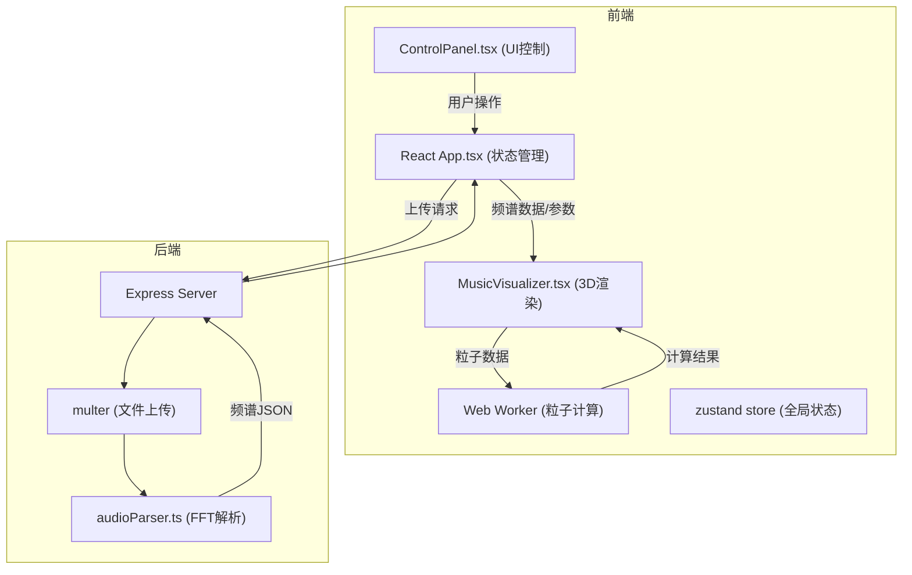
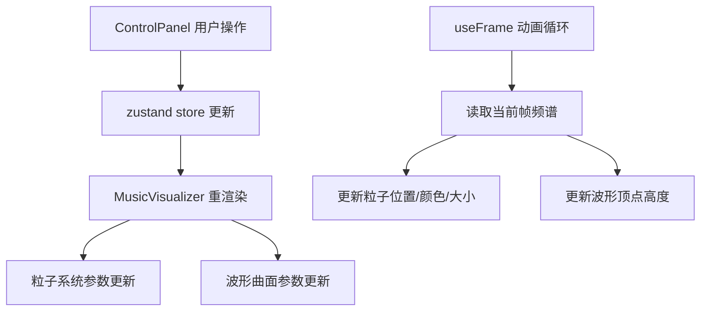

## 1. 架构设计



## 2. 技术描述
- **前端框架**：React 18 + TypeScript
- **构建工具**：Vite 5 + @vitejs/plugin-react
- **3D渲染**：Three.js + @react-three/fiber + @react-three/drei
- **状态管理**：zustand
- **样式方案**：CSS Modules / Tailwind CSS (待定)
- **后端框架**：Express 4 + TypeScript
- **文件上传**：multer
- **音频解析**：wav-parser + 自定义FFT实现
- **跨域处理**：cors
- **开发代理**：Vite dev server proxy

## 3. 路由定义
| 路由 | 用途 |
|------|------|
| / | 主页面（3D可视化 + 控制面板） |

## 4. API定义

### 4.1 上传音频并解析
- **路径**：POST /api/audio/analyze
- **请求**：multipart/form-data，字段名 `audio`
- **支持格式**：wav, mp3
- **响应**：
```typescript
interface SpectrumData {
  duration: number;           // 音频总时长(秒)
  frameCount: number;         // 频谱帧数
  frameRate: number;          // 帧率(帧/秒)
  binsPerFrame: number;       // 每帧频段数(128)
  frames: number[][];         // 频谱数据帧，每帧128个音量值(0-1)
}
```

## 5. 服务器架构图


## 6. 数据模型

### 6.1 前端状态模型
```typescript
interface VisualizerState {
  // 音频数据
  audioFile: File | null;
  spectrumData: SpectrumData | null;
  currentFrame: number;
  isPlaying: boolean;
  
  // 粒子参数
  particleCount: number;       // 500 - 5000
  particleSize: number;        // 基础大小
  particleColorStart: string;  // 渐变起始色
  particleColorEnd: string;    // 渐变结束色
  rotationSpeed: number;       // 旋转速度
  clusteringAmount: number;    // 聚集程度
  
  // 主题
  theme: 'aurora' | 'neon' | 'ink';
  
  // 播放控制
  loopStart: number | null;
  loopEnd: number | null;
}
```

### 6.2 数据流图


## 7. 项目结构

```
auto69/
├── package.json
├── vite.config.ts
├── tsconfig.json
├── index.html
├── server/
│   ├── index.ts              # Express服务器入口
│   └── audioParser.ts        # FFT音频解析模块
└── src/
    ├── main.tsx              # React入口
    ├── App.tsx               # 应用主组件
    ├── index.css             # 全局样式
    ├── store/
    │   └── useVisualizerStore.ts  # zustand状态管理
    ├── components/
    │   ├── MusicVisualizer.tsx    # 3D渲染核心组件
    │   ├── ControlPanel.tsx       # 控制面板组件
    │   ├── ParticleSystem.tsx     # 粒子系统子组件
    │   ├── WaveformSurface.tsx    # 波形曲面子组件
    │   ├── Timeline.tsx           # 时间轴组件
    │   └── ThemeSelector.tsx      # 主题选择器组件
    ├── hooks/
    │   └── useAudioPlayback.ts    # 音频播放hook
    ├── workers/
    │   └── particleWorker.ts      # 粒子计算Web Worker
    ├── types/
    │   └── index.ts               # 类型定义
    └── utils/
        ├── audioUtils.ts          # 音频工具函数
        └── colorUtils.ts          # 颜色工具函数
```
