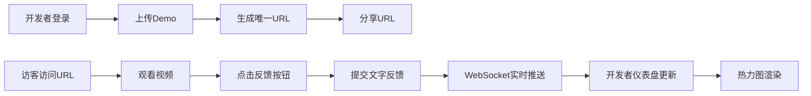

## 1. 产品概述

为独立游戏开发者提供实时作品集展示与交互反馈平台，解决开发者无法直观收集用户对游戏Demo的即时评价与崩溃报告的问题。

- 核心用途：游戏Demo展示、用户反馈收集、崩溃报告统计
- 目标用户：独立游戏开发者、游戏爱好者/测试玩家
- 产品价值：建立开发者与玩家之间的实时反馈桥梁，加速游戏迭代

## 2. 核心 Features

### 2.1 用户角色

| 角色 | 注册方式 | 核心权限 |
|------|---------|---------|
| 开发者 | 登录认证 | 上传Demo、查看仪表盘、管理反馈数据 |
| 访客 | 无需注册 | 浏览Demo、播放视频、提交喜欢/不喜欢反馈、提交文字反馈 |

### 2.2 Feature 模块

1. **Demo上传页**：表单填写、封面图拖拽上传、预览功能、URL生成
2. **Demo展示页**：视频播放、交互按钮、文字反馈输入
3. **开发者仪表盘**：Demo列表、实时通知条、数据概览
4. **Demo详情页**：反馈热力图、反馈列表、崩溃报告统计

### 2.3 页面详情

| 页面名称 | 模块名称 | 功能描述 |
|---------|---------|---------|
| Demo上传页 | 表单模块 | 标题、描述输入、封面图拖拽上传和预览 |
| Demo上传页 | URL生成 | 生成唯一的展示页面URL |
| Demo展示页 | 视频模块 | 嵌入视频简介，静音自动播放 |
| Demo展示页 | 反馈按钮 | 喜欢/不喜欢按钮，点击实时上报 |
| Demo展示页 | 文字反馈 | 输入框提交文字评论 |
| 仪表盘 | Demo列表 | 卡片式展示所有已发布Demo |
| 仪表盘 | 通知模块 | 顶部淡入通知条，抖动动画，自动滚动 |
| 详情页 | 热力图 | Canvas绘制反馈时间点聚合热力图 |
| 详情页 | 反馈列表 | 按时间排序的反馈记录 |
| 详情页 | 崩溃报告 | 崩溃统计列表展示 |

## 3. 核心流程

### 开发者流程
开发者登录 → 上传Demo信息（标题、描述、封面图）→ 获取唯一URL → 分享给玩家 → 实时查看仪表盘反馈数据

### 访客流程
访问Demo展示URL → 观看视频简介 → 点击喜欢/不喜欢 → 可选提交文字反馈 → 数据实时推送至开发者

## 4. 用户界面设计

### 4.1 设计风格
- **色彩方案**：深色主题，主背景 `#1a1a2e`，辅助色 `#16213e`，强调色 `#e94560`
- **按钮风格**：圆角矩形，强调色填充，hover时轻微放大
- **字体**：现代无衬线字体，标题粗体，正文常规
- **布局风格**：卡片式布局，网格排列，阴影营造层次感
- **图标风格**：线性图标，与强调色保持一致

### 4.2 页面设计概述

| 页面名称 | 模块名称 | UI元素 |
|---------|---------|--------|
| Demo上传页 | 表单模块 | 深色输入框、拖拽区域（虚线边框+高亮）、图片预览区 |
| 仪表盘 | Demo列表 | 卡片网格、悬停上浮8px + 阴影过渡（0.3s ease） |
| 仪表盘 | 通知条 | 顶部滑入、淡入动画、轻微抖动、强调色边框 |
| 详情页 | 热力图 | Canvas画布、颜色深浅表示密度、实时重绘 |
| 展示页 | 反馈按钮 | 大号按钮、点击动画、状态切换视觉反馈 |

### 4.3 响应式设计
- **桌面端**：多列网格布局，卡片间距适中
- **平板端**：2-3列自适应布局
- **移动端**：单列布局，按钮间距增大，字体大小响应式调整，触摸区域优化

### 4.4 动效设计
- **卡片悬停**：向上浮动8px，阴影加深，过渡时间0.3s ease
- **通知条**：顶部淡入（opacity 0→1），轻微抖动（shake动画），3秒后淡出
- **热力图**：数据更新时平滑过渡颜色
- **按钮点击**：缩放反馈（scale 0.95→1.0）

## 5. 性能要求

- **实时通知延迟**：≤500ms（WebSocket直连）
- **热力图更新频率**：≥6fps（requestAnimationFrame驱动）
- **首屏加载**：≤2s
- **交互响应**：按钮点击反馈≤100ms
