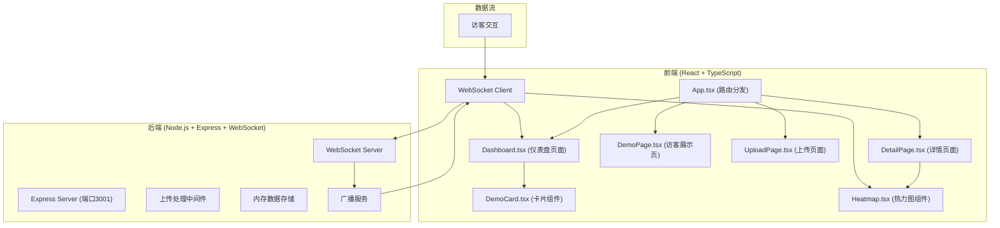
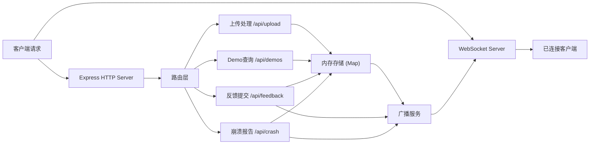
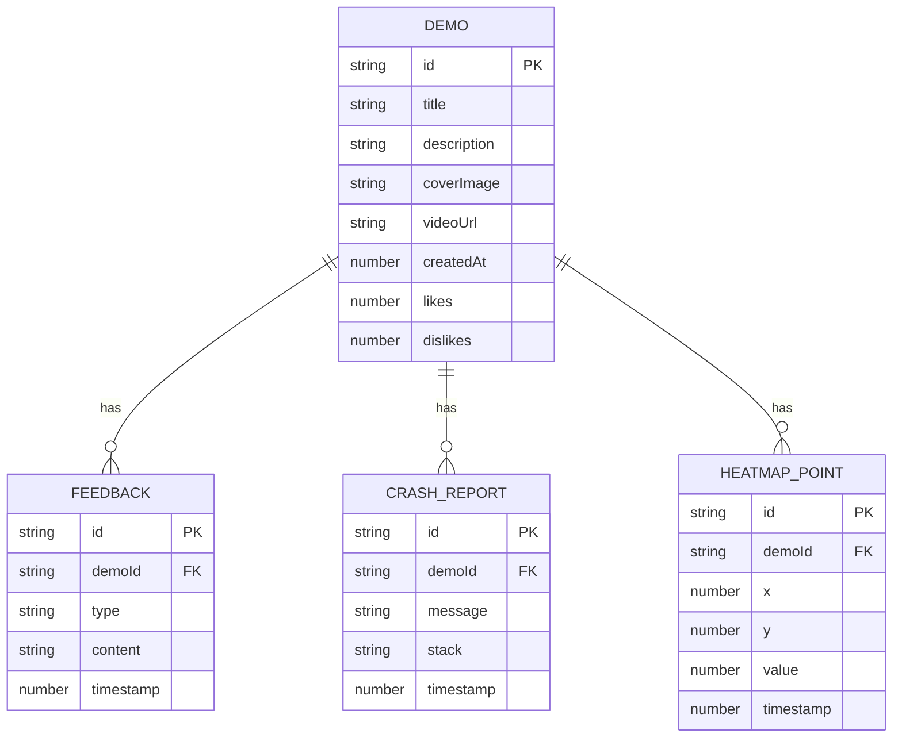

## 1. 架构设计



## 2. 技术描述

- **前端**：React 18 + TypeScript + Vite
- **构建工具**：Vite 5.x（配置React插件，开发服务器代理到后端3001端口）
- **后端**：Node.js + Express 4.x + ws (WebSocket库)
- **数据存储**：内存存储（开发环境），支持后续升级为持久化存储
- **额外依赖**：uuid（生成唯一ID）、canvas-confetti（庆祝动效）

## 3. 路由定义

| 路由 | 页面 | 用途 |
|------|------|------|
| `/` | Dashboard | 开发者仪表盘，展示Demo列表 |
| `/demo/:id` | DemoPage | 访客Demo展示页，视频播放和反馈 |
| `/detail/:id` | DetailPage | Demo详情页，热力图和反馈统计 |
| `/upload` | UploadPage | 上传新Demo表单 |

## 4. API 定义

### 类型定义

```typescript
interface Demo {
  id: string;
  title: string;
  description: string;
  coverImage: string;
  videoUrl: string;
  createdAt: number;
  likes: number;
  dislikes: number;
  feedbacks: Feedback[];
  crashReports: CrashReport[];
  heatmapData: HeatmapPoint[];
}

interface Feedback {
  id: string;
  demoId: string;
  type: 'like' | 'dislike' | 'text';
  content?: string;
  timestamp: number;
}

interface CrashReport {
  id: string;
  demoId: string;
  message: string;
  stack?: string;
  timestamp: number;
}

interface HeatmapPoint {
  x: number;
  y: number;
  value: number;
  timestamp: number;
}

interface WebSocketMessage {
  type: 'feedback' | 'crash' | 'heatmap' | 'init';
  payload: any;
}
```

### REST API

| 方法 | 路径 | 描述 | 请求体 | 响应 |
|------|------|------|--------|------|
| POST | `/api/upload` | 上传Demo | `{title, description, coverImage, videoUrl}` | `{demoId, url}` |
| GET | `/api/demos` | 获取所有Demo列表 | - | `Demo[]` |
| GET | `/api/demos/:id` | 获取单个Demo详情 | - | `Demo` |
| POST | `/api/feedback` | 提交反馈 | `{demoId, type, content?}` | `{success: true}` |
| POST | `/api/crash` | 提交崩溃报告 | `{demoId, message, stack?}` | `{success: true}` |

### WebSocket 事件

| 事件类型 | 方向 | 描述 | 数据 |
|----------|------|------|------|
| `subscribe` | 客户端→服务端 | 订阅Demo的实时更新 | `{demoId}` |
| `unsubscribe` | 客户端→服务端 | 取消订阅 | `{demoId}` |
| `feedback` | 服务端→客户端 | 新反馈通知 | `Feedback` |
| `crash` | 服务端→客户端 | 新崩溃报告 | `CrashReport` |
| `heatmap` | 服务端→客户端 | 热力图数据更新 | `HeatmapPoint[]` |
| `init` | 服务端→客户端 | 初始数据 | `Demo` |

## 5. 服务器架构



## 6. 数据模型

### 6.1 实体关系图



### 6.2 存储结构

```typescript
// 内存数据存储结构
interface DataStore {
  demos: Map<string, Demo>;
  feedbacks: Map<string, Feedback[]>;
  crashReports: Map<string, CrashReport[]>;
  heatmapData: Map<string, HeatmapPoint[]>;
  connections: Map<string, Set<WebSocket>>; // demoId -> 订阅的客户端连接
}
```

## 7. 性能优化策略

1. **WebSocket 批量广播**：使用微批处理，每100ms聚合一次更新，减少消息发送频率
2. **热力图节流**：前端使用requestAnimationFrame，确保渲染频率不超过60fps，最低保持6fps
3. **内存缓存**：高频访问数据（Demo列表）使用LRU缓存
4. **数据压缩**：WebSocket消息使用JSON压缩传输
5. **虚拟滚动**：反馈列表和崩溃报告列表使用虚拟滚动，处理大量数据
6. **Canvas 离屏渲染**：热力图使用OffscreenCanvas进行后台渲染
