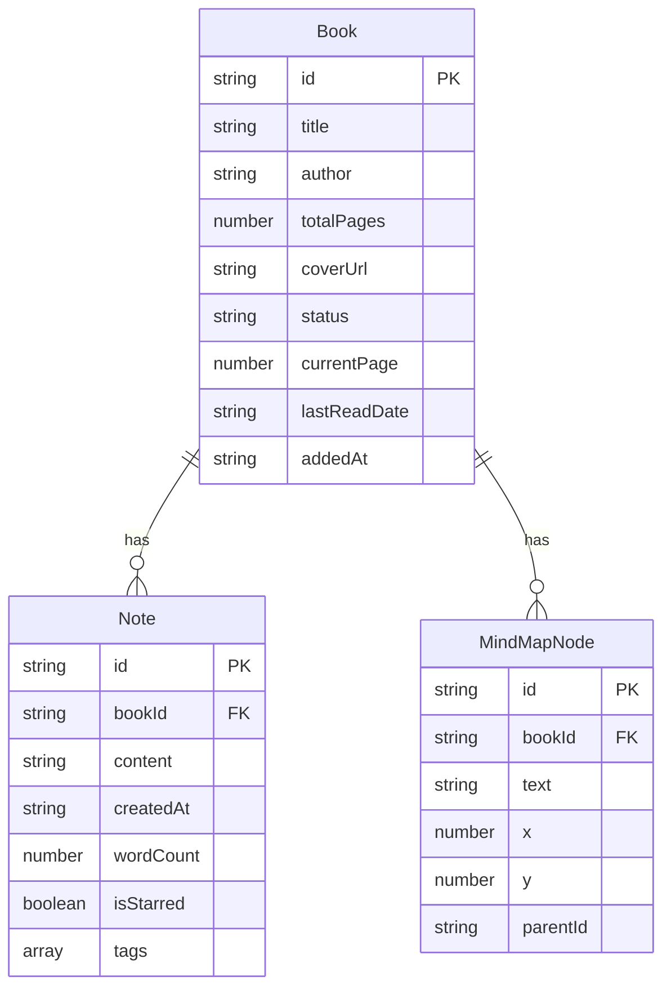

## 1. 架构设计

```mermaid
flowchart TB
    subgraph "前端层"
        "BookModule" --- "NoteModule"
        "BookModule" --- "types.ts"
        "NoteModule" --- "types.ts"
        "BookModule" --- "dataService.ts"
        "NoteModule" --- "dataService.ts"
    end
    subgraph "数据层"
        "dataService.ts" --- "localStorage"
    end
    subgraph "导入导出"
        "dataService.ts" --- "JSON文件"
    end
```

纯前端应用，无后端服务。数据持久化使用浏览器localStorage，导入导出使用JSON文件。

## 2. 技术说明
- 前端：React@18 + TypeScript + Vite
- 状态管理：React Context + useState（按用户指定的两模块架构）
- 样式方案：CSS Modules / 内联样式
- 数据持久化：localStorage（封装为Promise接口）
- 依赖库：react, react-dom, typescript, vite, @vitejs/plugin-react, uuid, react-markdown, date-fns, react-beautiful-dnd, file-saver

## 3. 路由定义
| 路由 | 用途 |
|------|------|
| / | 首页：图书卡片网格、搜索筛选、添加图书 |
| /book/:id | 详情页：书籍信息、思维导图、读书笔记 |

## 4. 数据模型

### 4.1 数据模型定义



### 4.2 数据定义
- Book.id: UUID格式
- Book.status: 枚举值 "want_to_read" | "reading" | "read"
- Note.tags: 数组，元素为 "核心观点" | "金句摘录" | "个人感悟"
- MindMapNode: 支持树形结构，parentId为空表示根节点

## 5. 文件结构
```
├── package.json
├── index.html
├── vite.config.js
├── tsconfig.json
└── src/
    ├── BookModule.tsx    # 图书管理模块
    ├── NoteModule.tsx    # 笔记管理模块
    ├── types.ts          # 类型定义
    └── dataService.ts    # 数据持久化层
```

## 6. 性能要求
- 搜索防抖：300ms延迟执行过滤
- 思维导图拖拽：requestAnimationFrame驱动，帧率≥45fps
- JSON导入导出：1MB数据量下响应时间<2秒
