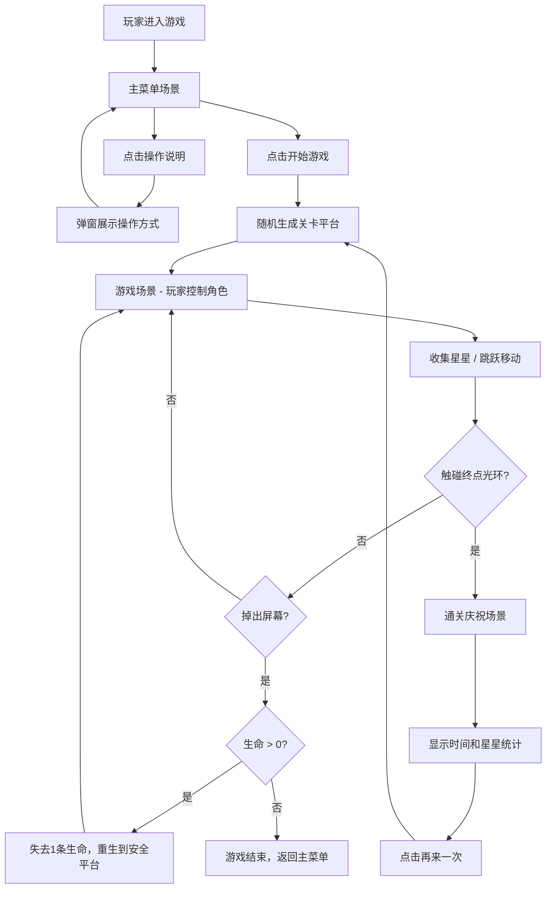

## 1. 产品概述

基于物理引擎的2D平台跳跃闯关游戏，玩家控制圆角方形角色在随机生成的关卡中收集星星并到达终点。游戏融合了动态视觉效果与流畅的物理操作，为玩家提供轻松有趣的跳跃闯关体验。

- 核心玩法：左右移动 + 跳跃，在随机平台间穿梭，收集星星，抵达终点光环
- 目标用户：休闲游戏爱好者，支持桌面端和移动端
- 产品价值：提供无需安装的轻量级游戏体验，随机性带来每次游玩的新鲜感

## 2. 核心 Features

### 2.1 功能模块

1. **主菜单场景**：毛玻璃效果卡片，开始游戏/操作说明按钮，操作说明弹窗
2. **游戏场景**：动态渐变天空背景、视差滚动山丘、玩家角色、随机生成平台阵列、星星收集物、终点光环、UI信息显示
3. **结算场景**：成功庆祝界面，彩色纸屑效果，时间和星星统计，再来一次按钮
4. **控制系统**：键盘（A/D移动，空格跳跃）+ 移动端触控（左右半屏控制）
5. **物理系统**：重力、碰撞检测、抛物线跳跃、平台物理属性

### 2.2 页面详情

| 页面名称 | 模块名称 | 功能描述 |
|-----------|-------------|---------------------|
| 主菜单 | 毛玻璃卡片 | 包含游戏标题、开始游戏按钮、操作说明按钮 |
| 主菜单 | 操作说明弹窗 | 展示键盘和触控操作图示 |
| 游戏场景 | 背景系统 | 动态渐变天空（随玩家位置变化）、视差滚动山丘剪影 |
| 游戏场景 | 玩家角色 | 圆角方形，支持左右移动和跳跃，落地灰尘粒子 |
| 游戏场景 | 平台系统 | 固定平台、移动平台（水平/垂直）、易碎平台，不同材质颜色 |
| 游戏场景 | 星星系统 | 旋转发光五角星，收集时播放动画和粒子爆散 |
| 游戏场景 | 终点系统 | 旋转光环，触碰后触发通关庆祝 |
| 游戏场景 | 生命值系统 | 3条生命，心形图标显示，掉出屏幕重生 |
| 游戏场景 | 触控系统 | 移动端左右移动区、跳跃区，高亮和震动反馈 |
| 结算场景 | 庆祝界面 | 背景变暗、彩色纸屑、统计信息、再来一次按钮 |

## 3. 核心流程

## 4. 界面设计

### 4.1 设计风格

- **主色调**：蓝紫渐变（#4A90D9 → #7B59C4）
- **点缀色**：暖黄色（#F5A623）用于星星和强调元素
- **按钮风格**：圆角矩形，悬停时缩放+阴影变化，毛玻璃质感
- **字体**：现代无衬线字体，数字使用等宽字体增强游戏感
- **图标**：心形生命值、星星收集物、光环终点
- **动画**：平滑过渡、弹性缓动、粒子效果

### 4.2 页面设计概述

| 页面名称 | 模块名称 | UI元素 |
|-----------|-------------|-------------|
| 主菜单 | 毛玻璃卡片 | 半透明背景、模糊效果、蓝紫渐变边框、居中布局 |
| 主菜单 | 按钮 | 圆角、悬停缩放(1.05)、阴影加深、暖黄色点缀 |
| 主菜单 | 弹窗 | 半透明遮罩、毛玻璃面板、关闭按钮 |
| 游戏场景 | 背景 | 动态天空渐变（根据玩家Y位置插值颜色）、远山剪影（3层视差滚动） |
| 游戏场景 | 玩家 | 圆角方形（8px圆角）、蓝紫渐变填充、白色描边 |
| 游戏场景 | 平台 | 岩石灰(#8B8B8B)、木板棕(#8B5A2B)、冰块浅蓝(#B8E0F0)，表面细小纹理 |
| 游戏场景 | 星星 | 五角星形状、金色发光、旋转动画、收集时缩放弹跳 |
| 游戏场景 | 终点光环 | 同心圆设计、蓝紫渐变、旋转动画、脉冲发光 |
| 游戏场景 | UI | 左上角星星计数（数字滚动动画）、右上角生命值（心形图标） |
| 游戏场景 | 触控按钮 | 半透明圆形、触摸时高亮/放大、位置固定在屏幕两侧 |
| 结算场景 | 庆祝界面 | 半透明黑色背景遮罩、彩色纸屑从顶部飘落、居中统计卡片 |
| 结算场景 | 统计信息 | 大字号显示时间和星星数、暖黄色强调 |

### 4.3 响应式设计

- **桌面端优先**：完整键盘操作体验，鼠标悬停效果
- **移动端适配**：自动检测设备，显示触控按钮，禁用页面滚动
- **触控优化**：触控区域足够大（最小48x48px），防误触设计
- **屏幕适配**：Canvas按比例缩放，保持游戏画面比例

### 4.4 视觉动效

- **背景过渡**：天空颜色随玩家高度平滑过渡（低海拔蓝色 → 高海拔紫色）
- **粒子效果**：落地灰尘、星星收集爆散、平台碎裂碎片
- **状态反馈**：跳跃时轻微压扁拉伸、生命值减少时心形破碎变红
- **场景切换**：淡入淡出过渡动画
- **数字动画**：星星计数使用数字滚动效果
