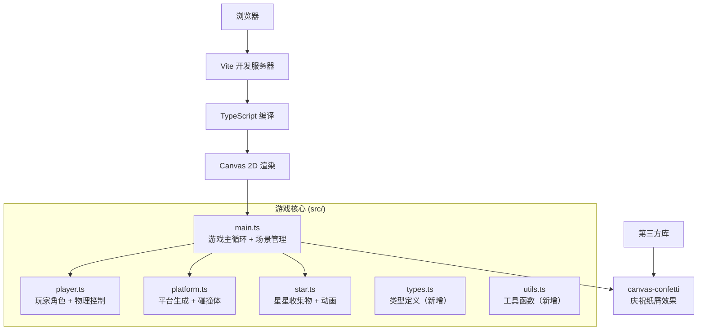

## 1. 架构设计



## 2. 技术描述

- **前端框架**：无框架，原生 TypeScript + HTML5 Canvas 2D
- **构建工具**：Vite 5.x，提供快速热更新和TypeScript支持
- **渲染引擎**：原生 Canvas 2D API，自行实现渲染循环
- **物理引擎**：自行实现简化2D物理（重力、AABB碰撞检测、抛物线运动）
- **第三方依赖**：
  - `typescript` ^5.0.0 - TypeScript 编译器
  - `vite` ^5.0.0 - 构建工具和开发服务器
  - `canvas-confetti` ^1.9.0 - 彩色纸屑动画效果

## 3. 项目结构

```
auto71/
├── package.json              # 项目配置和依赖
├── vite.config.js            # Vite 配置
├── tsconfig.json             # TypeScript 配置（严格模式）
├── index.html                # 入口 HTML
└── src/
    ├── main.ts               # 游戏主循环、场景管理、输入处理
    ├── player.ts             # 玩家类：移动、跳跃、碰撞、渲染
    ├── platform.ts           # 平台类：生成、物理属性、渲染
    ├── star.ts               # 星星类：旋转动画、收集判定、粒子
    ├── types.ts              # 类型定义（新增，非用户指定但必需）
    └── utils.ts              # 工具函数（新增，非用户指定但必需）
```

## 4. 核心数据结构定义

### 4.1 向量和物理类型

```typescript
// src/types.ts
export interface Vector2 {
  x: number;
  y: number;
}

export interface AABB {
  x: number;
  y: number;
  width: number;
  height: number;
}

export type PlatformType = 'static' | 'moving-horizontal' | 'moving-vertical' | 'fragile';
export type PlatformMaterial = 'rock' | 'wood' | 'ice';

export interface PlatformConfig {
  type: PlatformType;
  material: PlatformMaterial;
  x: number;
  y: number;
  width: number;
  height: number;
  moveRange?: number;
  moveSpeed?: number;
}

export interface Particle {
  x: number;
  y: number;
  vx: number;
  vy: number;
  life: number;
  maxLife: number;
  color: string;
  size: number;
}

export type GameScene = 'menu' | 'playing' | 'victory';
```

## 5. 核心算法

### 5.1 平台生成算法 (O(n) 复杂度)

```
输入：关卡长度 levelLength, 平台数量 n
输出：平台数组 platforms

1. 初始化 platforms 数组
2. 设置起始平台 (玩家出生点下方)
3. 对于 i = 1 到 n:
   a. 根据难度计算水平间距 gapX = random(80, 150)
   b. 计算高度变化 gapY = random(-80, 80)，限制在屏幕范围内
   c. 随机选择平台类型：
      - 70% 固定平台
      - 15% 水平移动平台
      - 10% 垂直移动平台
      - 5% 易碎平台
   d. 随机选择材质
   e. 设置平台宽度 random(60, 120)
   f. 创建平台并加入数组
4. 在最后一个平台上方放置终点光环
5. 在平台之间随机位置生成星星
6. 返回 platforms
```

### 5.2 AABB 碰撞检测

```typescript
function checkAABB(a: AABB, b: AABB): boolean {
  return a.x < b.x + b.width &&
         a.x + a.width > b.x &&
         a.y < b.y + b.height &&
         a.y + a.height > b.y;
}
```

### 5.3 物理更新（固定时间步长）

使用固定时间步长确保物理行为一致：
```
accumulator += deltaTime
while accumulator >= fixedStep:
    updatePhysics(fixedStep)
    accumulator -= fixedStep
render(interpolation = accumulator / fixedStep)
```

## 6. 性能优化策略

1. **粒子数量控制**：限制同时存在的粒子数最多 150 个，超出时复用最旧粒子
2. **对象池**：粒子对象使用对象池复用，避免频繁 GC
3. **离屏裁剪**：只渲染屏幕可视区域内的平台和星星
4. **requestAnimationFrame**：使用浏览器原生帧率控制，暂停时停止循环
5. **移动平台限制**：同时最多 5 个移动平台，减少计算量
6. **Canvas 优化**：使用 `imageSmoothingEnabled = false` 提升像素感，合理使用 `save()`/`restore()`

## 7. 文件职责说明

### 7.1 main.ts - 游戏主循环
- 场景状态机（menu → playing → victory）
- requestAnimationFrame 主循环
- 键盘和触控输入处理
- Canvas 初始化和尺寸适配
- UI 渲染（星星计数、生命值、菜单）
- 相机跟随逻辑

### 7.2 player.ts - 玩家角色
- 位置、速度、加速度物理属性
- 移动控制（左右加速、摩擦）
- 跳跃逻辑（跳跃力、 coyote time、跳跃缓冲）
- 碰撞检测和响应
- 落地粒子效果
- 淡入重生动画

### 7.3 platform.ts - 平台系统
- 平台类定义（静态、移动、易碎）
- 随机生成算法
- 移动平台更新逻辑
- 易碎平台计时和碎裂效果
- 平台纹理渲染
- 碰撞体查询

### 7.4 star.ts - 星星系统
- 旋转动画
- 发光效果
- 收集判定
- 收集动画（缩放弹跳）
- 粒子爆散效果

### 7.5 types.ts - 类型定义
- 所有接口、枚举、类型别名
- 确保类型安全

### 7.6 utils.ts - 工具函数
- 数学工具（lerp, clamp, random）
- 颜色处理
- AABB 碰撞检测
- 粒子系统基类
