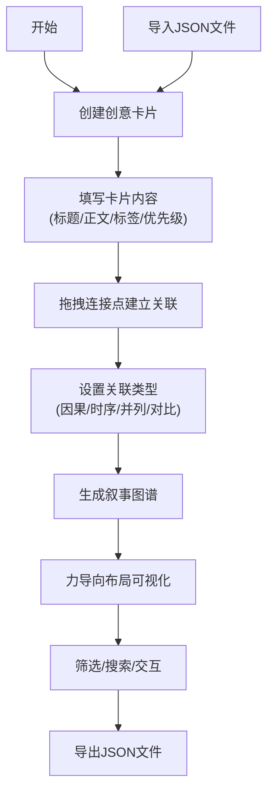

## 1. 产品概述

面向个人写作者的灵感碎片收集与整理工具，帮助用户将零散的创意、片段和思绪以卡片形式快速记录，并通过标签和关联图谱自动串联成结构化故事大纲。

- 核心价值：解决创作者灵感碎片化、难以组织成完整叙事结构的痛点
- 目标用户：小说作者、编剧、内容创作者、需要创意整理的个人用户
- 市场定位：轻量级、可视化的创意管理与叙事构建工具

## 2. 核心 Features

### 2.1 User Roles

本产品为单用户工具，无多角色区分。

| Role | Registration Method | Core Permissions |
|------|---------------------|------------------|
| 创作者 | 无需注册，本地使用 | 完整的卡片创建、编辑、关联、图谱生成、导出导入权限 |

### 2.2 Feature Module

1. **创意画布（Canvas）**：卡片列表展示、拖拽排列、连接关系建立
2. **卡片编辑器（CardEditor）**：卡片创建与编辑面板，支持标题、正文、标签、优先级设置
3. **叙事图谱（GraphViewer）**：基于力导向布局的关联图谱可视化，支持筛选和交互
4. **搜索与过滤**：实时关键字搜索、标签类型筛选
5. **数据管理**：JSON格式导出导入、后端持久化存储

### 2.3 Page Details

| Page Name | Module Name | Feature description |
|-----------|-------------|---------------------|
| 主应用页面 | 顶部工具栏 | 搜索框、标签过滤按钮组、视图切换（画布/图谱）、导出/导入按钮 |
| 主应用页面 | Canvas画布区域 | 卡片列表渲染、拖拽排序、连接点拖拽建立关联、连接线动画效果 |
| 主应用页面 | 侧边/底部编辑器 | 卡片表单编辑，支持Markdown正文、标签选择、优先级设置 |
| 主应用页面 | GraphViewer图谱视图 | 力导向布局节点渲染、连线可视化、类型筛选、节点点击跳转 |

## 3. 核心 Process

### 用户主要流程：

用户在Canvas上创建创意卡片，填写标题、正文、选择标签和优先级。通过拖拽连接点在卡片间建立时序、因果、并列等关联关系。系统根据连接关系自动生成可交互的树状叙事图谱，支持过滤和搜索。用户可随时导出/导入项目数据。

## 4. User Interface Design

### 4.1 Design Style

- **主色调**：深色主题，背景 #1a1a2e，卡片 #16213e，文字 #e0e0e0
- **标签配色**：人物 #e74c3c，事件 #3498db，地点 #2ecc71，物品 #f39c12
- **关系连线配色**：因果 #ff6b6b，时序 #4dabf7，并列 #51cf66，对比 #cc5de8
- **按钮样式**：胶囊样式，选中态填充配色，未选中态透明描边
- **字体**：系统无衬线体，-apple-system, BlinkMacSystemFont, "Segoe UI", Roboto
- **布局风格**：卡片式布局，Canvas居中，侧边编辑器面板
- **图标**：简约线性图标，优先级使用P0-P3徽标

### 4.2 Page Design Overview

| Page Name | Module Name | UI Elements |
|-----------|-------------|-------------|
| 主应用 | 顶部工具栏 | 搜索框（黄色高亮匹配）、胶囊标签按钮组、视图切换按钮、导出/导入按钮 |
| 主应用 | Canvas区域 | 圆角卡片（8px）、阴影效果、悬浮动画、连接点、贝塞尔曲线连接线、流动虚线动画 |
| 主应用 | 卡片编辑器 | 表单输入、Markdown编辑区、标签多选、优先级下拉、保存/删除按钮 |
| 主应用 | 图谱视图 | 力导向节点、彩色连线、缩放平移、筛选下拉、节点点击高亮 |

### 4.3 Responsiveness

- 桌面端（≥768px）：侧边编辑器面板，Canvas占满中央区域
- 移动端（<768px）：编辑器改为底部弹出面板，Canvas自适应填充剩余高度
- 触摸优化：增大点击区域，支持触摸拖拽操作

### 4.4 动画与交互

- 卡片悬浮：y轴偏移-2px，阴影加深，300ms过渡
- 连接线：贝塞尔曲线，流动虚线动画，拖拽时拖尾粒子效果
- 视图切换：300ms淡入/滑动过渡动画
- 节点交互：点击节点高亮回弹效果

## 5. 性能约束

- 50张卡片、80条连接时，Canvas拖拽和连线操作保持30fps以上
- 力导向图谱初始布局计算在1秒内完成
- 搜索过滤实时响应，延迟<100ms
