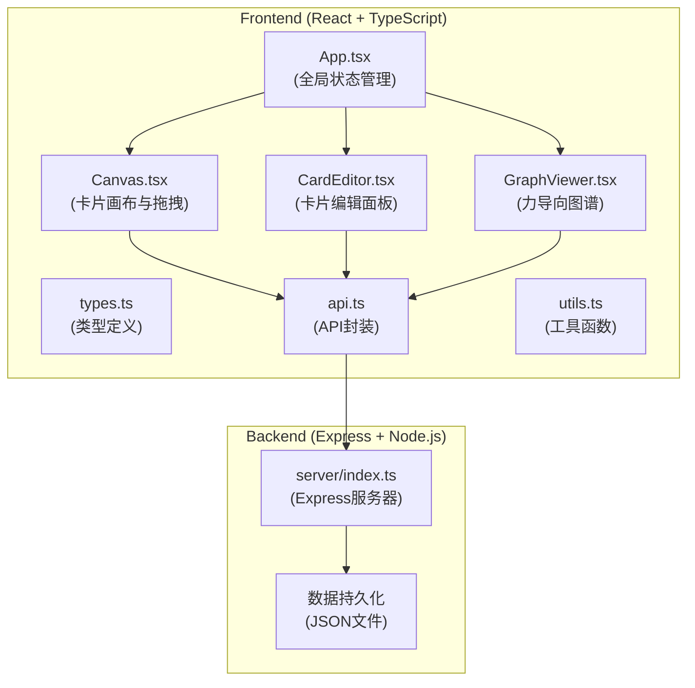
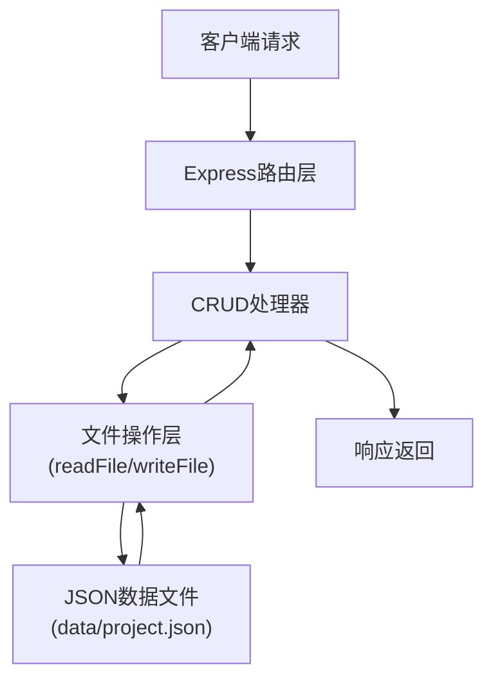
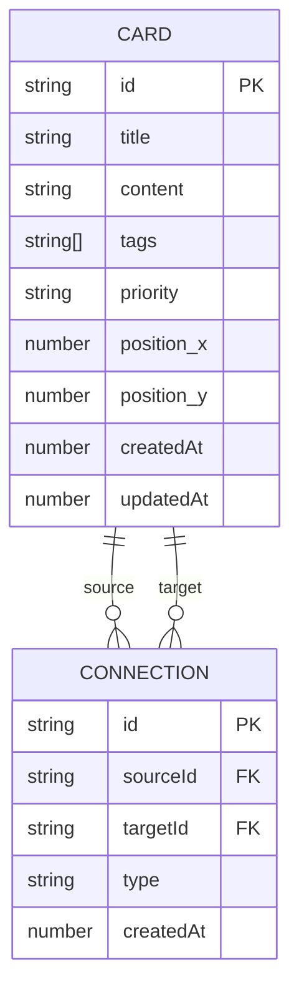

## 1. Architecture Design



## 2. Technology Description

- **Frontend**: React@18 + TypeScript@5 + Vite@5
- **状态管理**: React useState/useReducer（本地状态，无需Redux）
- **拖拽库**: react-dnd@16 + react-dnd-html5-backend@16
- **图谱可视化**: d3-force@3
- **样式方案**: CSS Modules + CSS Variables
- **后端**: Express@4 + Node.js@18
- **数据存储**: 本地JSON文件（data/project.json）
- **唯一标识**: uuid@9
- **中间件**: body-parser@1 + cors@2

## 3. Route Definitions

| Route | Purpose |
|-------|---------|
| / | 前端入口页面 |
| /api/cards [GET] | 获取所有卡片 |
| /api/cards [POST] | 创建新卡片 |
| /api/cards/:id [PUT] | 更新卡片 |
| /api/cards/:id [DELETE] | 删除卡片 |
| /api/connections [GET] | 获取所有连接 |
| /api/connections [POST] | 创建新连接 |
| /api/connections/:id [PUT] | 更新连接类型 |
| /api/connections/:id [DELETE] | 删除连接 |
| /api/project [GET] | 获取完整项目数据 |
| /api/project [PUT] | 导入覆盖项目数据 |
| /api/export [GET] | 导出项目JSON（含版本号和时间戳） |

## 4. API Definitions

### 类型定义

```typescript
// 卡片标签类型
type CardTag = '人物' | '事件' | '地点' | '物品';

// 优先级
type Priority = 'P0' | 'P1' | 'P2' | 'P3';

// 连接关系类型
type ConnectionType = '关联' | '因果' | '时序' | '并列' | '对比';

// 卡片接口
interface Card {
  id: string;
  title: string;
  content: string;
  tags: CardTag[];
  priority: Priority;
  position: { x: number; y: number };
  createdAt: number;
  updatedAt: number;
}

// 连接接口
interface Connection {
  id: string;
  sourceId: string;
  targetId: string;
  type: ConnectionType;
  createdAt: number;
}

// 项目数据接口
interface ProjectData {
  version: string;
  timestamp: number;
  cards: Card[];
  connections: Connection[];
}
```

### 请求响应示例

**GET /api/cards**
- Response: `Card[]`

**POST /api/cards**
- Request: `Omit<Card, 'id' | 'createdAt' | 'updatedAt'>`
- Response: `Card`

**GET /api/export**
- Response: `ProjectData`

## 5. Server Architecture Diagram



## 6. Data Model

### 6.1 Data Model Definition



### 6.2 数据文件结构

**data/project.json**
```json
{
  "version": "1.0.0",
  "timestamp": 1718888888888,
  "cards": [
    {
      "id": "uuid-1",
      "title": "卡片标题",
      "content": "Markdown格式正文",
      "tags": ["人物", "事件"],
      "priority": "P1",
      "position": { "x": 100, "y": 200 },
      "createdAt": 1718888888888,
      "updatedAt": 1718888888888
    }
  ],
  "connections": [
    {
      "id": "uuid-2",
      "sourceId": "uuid-1",
      "targetId": "uuid-3",
      "type": "因果",
      "createdAt": 1718888888888
    }
  ]
}
```

### 6.3 文件调用关系与数据流向

1. **数据流向（前端→后端）**：
   - `CardEditor.tsx` → `api.ts:createCard()` → `server/index.ts:POST /api/cards` → 写入JSON文件
   - `Canvas.tsx` → `api.ts:createConnection()` → `server/index.ts:POST /api/connections` → 写入JSON文件

2. **数据流向（后端→前端）**：
   - JSON文件 → `server/index.ts:GET /api/project` → `api.ts:getProject()` → `App.tsx` → 分发到各子组件

3. **组件间数据流**：
   - `App.tsx` → 传递 `cards`/`connections` 状态 → `Canvas.tsx`/`GraphViewer.tsx`/`CardEditor.tsx`
   - 子组件 → 调用回调函数 → `App.tsx` 更新状态 → 重新渲染
