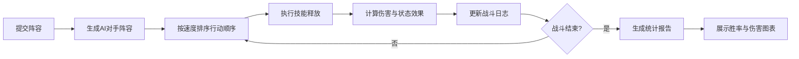

# 驯龙竞技场阵容策略模拟器 - 产品需求文档

## 1. 产品概述

驯龙竞技场阵容策略模拟器是一款面向回合制对战游戏玩家的阵容搭配与战斗模拟工具，帮助玩家通过不同龙种、技能和站位组合来优化战斗表现，提升游戏策略深度。

- **核心价值**：让玩家在实际对战前，通过可视化模拟验证阵容策略的有效性
- **目标用户**：回合制策略游戏爱好者、驯龙题材游戏玩家
- **市场定位**：轻量级策略规划工具，兼具教育性和娱乐性

## 2. 核心功能

### 2.1 用户角色

| 角色 | 注册方式 | 核心权限 |
|------|----------|----------|
| 玩家用户 | 无需注册，直接使用 | 浏览龙种图鉴、编辑阵容、进行战斗模拟、查看统计结果 |

### 2.2 功能模块

1. **阵容编辑模块**：龙种图鉴浏览、龙种选择与移除、阵容拖拽排序、属性相克展示
2. **战斗模拟模块**：AI对手生成、回合制战斗、技能动画、战斗日志、统计图表
3. **数据服务模块**：龙种元数据管理、属性计算、伤害公式

### 2.3 页面详情

| 页面名称 | 模块名称 | 功能描述 |
|---------|---------|----------|
| 主界面 | 阵容编辑面板 | 左侧展示龙种图鉴卡片，支持拖拽排序，显示3D像素头像和属性信息 |
| 主界面 | 战斗舞台 | 中央6x5站位网格，展示双方龙单位，带属性光环和呼吸光效 |
| 主界面 | 战斗日志面板 | 右侧逐行显示战斗行动描述，打字机效果，颜色区分敌我 |
| 主界面 | 底部控制栏 | 开始模拟按钮，带脉冲加载效果，模拟结束弹出结果报告 |

## 3. 核心流程

### 3.1 阵容编辑流程

### 3.2 战斗模拟流程

## 4. 用户界面设计

### 4.1 设计风格

- **主色调**：深邃暗灰金属质感背景，搭配龙鳞纹理边框
- **属性色**：火（红橙渐变）、水（蓝青渐变）、风（绿翠渐变）、土（棕黄渐变）、光（金白渐变）
- **稀有度色**：普通灰、稀有蓝、史诗紫、传说金
- **字体**：使用 Cinzel 作为标题字体（古典史诗感），Roboto 作为正文字体
- **按钮风格**：圆角金属质感按钮，带微妙的悬停光泽效果
- **布局风格**：三栏式布局，左侧编辑、中央战场、右侧日志

### 4.2 页面设计概述

| 页面名称 | 模块名称 | UI元素 |
|---------|---------|--------|
| 主界面 | 龙种卡片 | 渐变背景（按稀有度）、3D像素头像、属性标签、技能描述、拖拽阴影效果 |
| 主界面 | 战斗网格 | 6x5网格布局、圆角矩形头像、呼吸光效、属性光环、行动弹跳动画 |
| 主界面 | 战斗日志 | 打字机逐行显示、蓝色（己方）/红色（敌方）区分、滚动自动定位 |
| 主界面 | 结果弹窗 | 中央淡入缩放动画、胜率环形图、伤害柱状图、详细数据列表 |

### 4.3 响应式

- 桌面端优先设计，支持1280px以上分辨率
- 战斗舞台区域保持固定宽高比
- 侧边栏可折叠，适配中等屏幕

### 4.4 3D场景指导

- **环境风格**：深邃的竞技场氛围，深色金属背景配合微光反射
- **光照设置**：环境光 + 定向光 + 点光源补光，突出龙形模型的立体感
- **相机设置**：正交或透视相机，头像展示时缓慢旋转
- **动画效果**：头像呼吸缩放、旋转预览、受击抖动、技能释放闪光
- **性能目标**：30fps以上帧率，单次模拟2秒内响应
