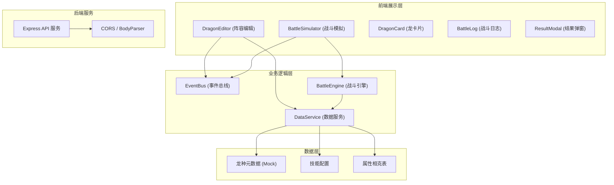

# 驯龙竞技场阵容策略模拟器 - 技术架构文档

## 1. 架构设计



## 2. 技术描述

- **前端框架**：React 18 + TypeScript
- **构建工具**：Vite 5（端口3000）
- **3D渲染**：Three.js + @react-three/fiber + @react-three/drei
- **状态管理**：React useState/useReducer + 自定义EventBus
- **样式方案**：CSS Modules + CSS 变量
- **后端服务**：Express 4 + CORS + body-parser
- **唯一ID**：uuid
- **数据来源**：本地Mock数据 + Express静态服务

## 3. 项目文件结构

```
d:\Pro\tasks\auto75/
├── package.json
├── vite.config.js
├── tsconfig.json
├── index.html
├── server/
│   └── index.js          # Express 后端服务器
└── src/
    ├── main.tsx
    ├── App.tsx
    ├── modules/
    │   ├── editor/
    │   │   ├── DragonEditor.tsx    # 阵容编辑主组件
    │   │   ├── DragonCard.tsx      # 龙卡片组件
    │   │   └── DataService.ts      # 数据服务
    │   └── battle/
    │       ├── BattleSimulator.tsx # 战斗模拟主组件
    │       └── BattleEngine.ts     # 战斗引擎
    └── shared/
        ├── EventBus.ts             # 事件总线
        └── types.ts                # 类型定义
```

## 4. 核心模块说明

### 4.1 阵容编辑模块 (Editor Module)

| 文件 | 职责 |
|------|------|
| DragonEditor.tsx | 管理龙种选择状态、阵容排列、属性连线显示，调用DataService获取数据，通过EventBus提交阵容 |
| DragonCard.tsx | 单条龙的卡片展示，包含3D头像渲染、属性动画、拖拽交互 |
| DataService.ts | 龙种元数据管理，提供获取、过滤、排序方法，本地状态存储 |

### 4.2 战斗模拟模块 (Battle Module)

| 文件 | 职责 |
|------|------|
| BattleSimulator.tsx | 接收阵容数据、管理战斗动画、播放技能效果、展示日志和统计 |
| BattleEngine.ts | 回合制战斗核心逻辑，速度排序、技能释放、伤害计算、状态效果处理 |

### 4.3 共享模块 (Shared)

| 文件 | 职责 |
|------|------|
| EventBus.ts | 跨模块事件通信，使用自定义事件实现editor和battle模块解耦 |
| types.ts | TypeScript类型定义，龙种、技能、阵容、战斗日志等接口 |

## 5. 类型定义

### 5.1 龙种接口

```typescript
interface Dragon {
  id: string;
  name: string;
  element: 'fire' | 'water' | 'wind' | 'earth' | 'light';
  rarity: 'common' | 'rare' | 'epic' | 'legendary';
  baseStats: {
    hp: number;
    attack: number;
    defense: number;
    speed: number;
  };
  skills: Skill[];
  avatarColor: string;
  description: string;
}
```

### 5.2 技能接口

```typescript
interface Skill {
  id: string;
  name: string;
  damageMultiplier: number;
  cooldown: number;
  effect?: {
    type: 'burn' | 'freeze' | 'stun' | 'heal' | 'shield';
    duration: number;
    value: number;
  };
  description: string;
}
```

### 5.3 阵容配置

```typescript
interface TeamConfig {
  dragons: Dragon[];
  positions: Record<string, { row: number; col: number }>;
}
```

### 5.4 战斗日志

```typescript
interface BattleLogEntry {
  id: string;
  turn: number;
  actor: string;
  actorTeam: 'player' | 'enemy';
  action: string;
  damage?: number;
  effect?: string;
  timestamp: number;
}
```

## 6. 属性相克系统

```
火 → 风 → 土 → 水 → 火 (相克循环)
光 为中性属性，与所有属性互不相克
相克时伤害提升 25%
被克时伤害降低 20%
```

## 7. 战斗引擎流程

1. **初始化**：双方龙单位入场，设置初始HP和状态
2. **回合排序**：根据速度属性从高到低排序行动顺序
3. **行动阶段**：
   - 检查单位状态（眩晕跳过回合）
   - 选择技能（AI随机或预设策略）
   - 计算伤害（攻击力 × 技能倍率 × 属性相克修正）
   - 应用状态效果（灼烧、冰冻、眩晕等）
4. **回合结束**：检查胜负条件，更新战斗日志
5. **统计输出**：计算总伤害、承受伤害、胜率等数据

## 8. 性能目标

- 动画帧率：≥ 30fps
- 单次模拟响应时间：≤ 2秒
- 内存占用：合理控制Three.js场景规模
