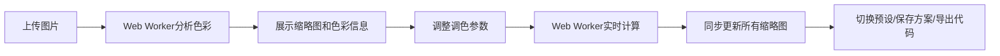

## 1. 产品概述

在线音视频创作者调色板，为视频创作者和设计师提供浏览器内的图片组颜色风格预览与调整工具，支持导出统一的LUT和CSS滤镜代码。

- 核心价值：无需专业软件，在浏览器中快速完成批量图片调色
- 目标用户：视频创作者、设计师、前端开发人员
- 市场定位：轻量级在线调色工具，填补专业软件与简易滤镜之间的空白

## 2. 核心功能

### 2.1 功能模块

1. **上传面板**：拖拽/点击上传图片，自动提取主色调和直方图
2. **调色面板**：色相旋转、饱和度、亮度曲线、对比度实时调整
3. **预设系统**：复古、胶片、赛博朋克、日系清新等预设一键切换
4. **代码生成**：自动生成3x3颜色矩阵和CSS filter字符串，支持一键复制
5. **收藏夹**：保存调色方案，支持加载和删除
6. **缩略图预览**：网格展示处理后的图片，悬停放大显示详情

### 2.2 页面详情

| 页面名称 | 模块名称 | 功能描述 |
|-----------|-------------|---------------------|
| 主工作区 | 上传面板 | 拖拽上传区，支持至少5张图片批量上传，显示上传进度 |
| 主工作区 | 缩略图网格 | 右侧并列展示缩略图，下方显示主色条和色彩饼图 |
| 主工作区 | 调色面板 | 左侧滑块控制面板，预设切换按钮，代码展示区 |
| 主工作区 | 收藏抽屉 | 底部滑出面板，卡片展示已保存方案 |

## 3. 核心流程

用户流程：上传图片 → 查看自动分析的色彩信息 → 调整参数或选择预设 → 实时预览效果 → 保存方案或导出CSS代码。

## 4. 用户界面设计

### 4.1 设计风格

- **色彩系统**：
  - 背景：深灰(#1a1a2e)到深蓝(#16213e)渐变
  - 主色：霓虹蓝(#00d4ff)、紫色(#8b5cf6)交替用于边框和滑块轨道
  - 按钮悬停：蓝色→紫色渐变
  - 文字：白色(#ffffff)、浅灰(#e0e0e0)
  
- **控件样式**：
  - 滑块：圆角胶囊形，发光拖拽点
  - 卡片：半透明玻璃态，霓虹边框
  - 按钮：圆角矩形，渐变填充，发光阴影

- **字体**：
  - 标题：Orbitron（科技感无衬线）
  - 正文：Inter（清晰易读）
  - 代码：JetBrains Mono（等宽字体）

- **动效**：
  - 微光扩散动画（点击、滑块调整时）
  - 预设切换500ms平滑渐变过渡
  - 悬停放大效果
  - 抽屉滑入滑出动画

### 4.2 页面布局

| 区域 | 位置 | 占比 | 内容 |
|------|------|------|------|
| 调色面板 | 左侧 | 30% | 滑块控件、预设按钮、代码输出 |
| 缩略图网格 | 右侧 | 70% | 图片网格、色彩分析 |
| 收藏抽屉 | 底部 | 100% | 方案卡片列表 |

### 4.3 响应式设计

- **桌面端(≥1280px)**：左右分栏布局，左侧调色面板固定宽度360px
- **iPad横屏(768px-1279px)**：左右分栏，调色面板宽度自适应至300px
- **iPad竖屏(<768px)**：上下布局，调色面板在上，缩略图在下

### 4.4 交互细节

- **声音反馈**：点击和滑块移动时播放细微点击音效（Web Audio API生成）
- **悬停效果**：图片放大1.1倍，显示RGB平均值tooltip
- **拖拽体验**：滑块拖拽点带发光效果，跟随鼠标有微光拖尾
- **上传动画**：文件拖拽进入时边框发光，显示波纹效果
