## 1. 架构设计

```mermaid
graph TD
    subgraph "主线程"
        A["main.tsx"] --> B["ColorStateContext"]
        B --> C["TuningPanel.tsx"]
        B --> D["UploadPanel.tsx"]
        B --> E["CollectionsDrawer.tsx"]
        C --> F["自定义事件总线"]
        D --> F
        E --> F
    end
    
    subgraph "Web Worker"
        G["ColorEngine.ts"]
    end
    
    F <-->|postMessage| G
    
    style A fill:#00d4ff,stroke:#8b5cf6
    style B fill:#8b5cf6,stroke:#00d4ff
    style G fill:#1a1a2e,stroke:#00d4ff
```



## 2. 技术描述

- **前端框架**：React 18 + TypeScript 5
- **构建工具**：Vite 5 + @vitejs/plugin-react
- **状态管理**：React Context + useReducer
- **并发处理**：Web Worker（颜色计算）
- **工具库**：uuid（唯一标识）、lodash（工具函数）、date-fns（日期格式化）
- **样式方案**：CSS Modules + CSS Variables
- **性能优化**：requestAnimationFrame、debounce、OffscreenCanvas

## 3. 文件结构

```
d:\Pro\tasks\auto76/
├── package.json
├── vite.config.js
├── tsconfig.json
├── index.html
└── src/
    ├── ColorModule/
    │   ├── ColorEngine.ts          # Web Worker - 颜色计算核心
    │   └── ColorStateContext.tsx   # React Context - 状态管理
    ├── UIModule/
    │   ├── UploadPanel.tsx         # 上传面板 + 缩略图网格
    │   ├── TuningPanel.tsx         # 调色面板 + 预设系统
    │   └── CollectionsDrawer.tsx   # 收藏夹抽屉
    ├── main.tsx                    # 入口文件
    └── styles/
        ├── global.css              # 全局样式
        └── variables.css           # CSS变量
```

## 4. 核心数据结构

### 4.1 调色参数类型

```typescript
interface ColorParams {
  hueRotate: number;        // 色相旋转 0-360°
  saturation: number;       // 饱和度 -100 到 100
  brightness: number;       // 亮度 -100 到 100
  contrast: number;         // 对比度 -100 到 100
}

interface Preset {
  id: string;
  name: string;
  params: ColorParams;
  thumbnail: string;        // 3色渐变预览
}

interface ImageData {
  id: string;
  file: File;
  url: string;
  originalData: ImageBitmap;
  processedData: ImageBitmap | null;
  dominantColors: string[]; // 主色调
  histogram: number[];      // 色彩直方图
  rgbAverage: { r: number; g: number; b: number };
}

interface SavedScheme {
  id: string;
  name: string;
  createdAt: number;
  params: ColorParams;
  previewColors: string[];  // 3色预览
}
```

### 4.2 Web Worker 消息协议

```typescript
// 主线程 -> Worker
type WorkerRequest = 
  | { type: 'analyzeImage'; payload: { id: string; imageData: ImageBitmap } }
  | { type: 'applyFilter'; payload: { id: string; imageData: ImageBitmap; params: ColorParams } }
  | { type: 'generateMatrix'; payload: { params: ColorParams } }
  | { type: 'generateCSS'; payload: { params: ColorParams } };

// Worker -> 主线程
type WorkerResponse =
  | { type: 'imageAnalyzed'; payload: { id: string; dominantColors: string[]; histogram: number[]; rgbAverage: object } }
  | { type: 'filterApplied'; payload: { id: string; processedData: ImageBitmap } }
  | { type: 'matrixGenerated'; payload: { matrix: number[][] } }
  | { type: 'cssGenerated'; payload: { css: string } };
```

## 5. 性能优化策略

1. **Web Worker隔离**：所有颜色空间转换、矩阵运算、像素级处理在Worker线程执行
2. **防抖处理**：滑块调整使用16ms防抖，确保60FPS
3. **requestAnimationFrame**：所有DOM更新使用RAF调度
4. **图片缩放**：缩略图使用低分辨率版本处理，原图仅在导出时使用
5. **内存管理**：及时释放ImageBitmap和Blob URL，避免内存泄漏
6. **懒加载**：缩略图使用IntersectionObserver实现可视区域渲染

## 6. 事件通信机制

模块间通过自定义事件和Context双层通信：

1. **Context**：共享调色参数、预设列表、收藏夹数据等状态
2. **自定义事件**：
   - `paramsChanged`：参数变化时触发，通知Worker重新计算
   - `presetApplied`：预设应用时触发，带动画参数
   - `schemeSaved`：方案保存时触发，通知抽屉更新
   - `imageUploaded`：图片上传完成时触发

## 7. 性能指标

- 交互响应时间：≤100ms
- 动画帧率：≥60FPS
- 图片处理延迟：≤50ms（单张缩略图）
- 预设切换动画：500ms平滑过渡
- 内存占用：≤500MB（10张图片同时处理）
