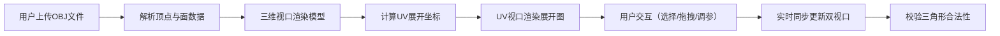

## 1. 产品概述

3D模型UV展开可视化工具，帮助3D建模师在浏览器中直观预览UV展开效果、交互调整展开参数，并支持面片选择与顶点拖拽微调。

- 核心价值：降低UV展开调试成本，提供三维与二维联动的直观预览体验
- 目标用户：3D建模师、纹理设计师、游戏美术从业者

## 2. 核心功能

### 2.1 功能模块

1. **模型导入模块**：OBJ格式文件上传、顶点/面数据解析
2. **三维视口模块**：半透明模型渲染、面片点击高亮、视角交互
3. **UV展开视口模块**：Canvas2D渲染UV面片、棋盘格背景、顶点拖拽
4. **参数控制模块**：棋盘格密度、边界线宽、线框显示切换
5. **面片信息面板**：选中面片的顶点UV坐标、面积数值展示

### 2.2 功能详情

| 模块名称 | 功能点 | 详细描述 |
|---------|--------|---------|
| 模型导入 | OBJ上传 | 支持拖拽或点击上传OBJ文件，解析顶点坐标与面索引 |
| 三维视口 | 模型渲染 | 半透明材质 + 环境光 + 轻微自动旋转动画 |
| 三维视口 | 视角控制 | 鼠标拖拽旋转、滚轮缩放，交互时停止自动旋转 |
| 三维视口 | 面片选择 | 点击高亮（边缘发光闪动），Shift+点击多选 |
| UV视口 | 展开渲染 | 三角面片按UV坐标平铺，HSL色相渐变着色 |
| UV视口 | 棋盘格背景 | CSS棋盘格纹理，辅助观察拉伸变形 |
| UV视口 | 顶点拖拽 | 拖拽单个顶点微调，相邻面片高亮 |
| UV视口 | 同步联动 | 选中面片与三维视口双向同步高亮 |
| 参数控制 | 棋盘格密度 | 4x4 ~ 32x32 滑块调节 |
| 参数控制 | 边界线宽 | 1~5像素滑块调节 |
| 参数控制 | 线框显示 | 开关切换模型线框叠加 |
| 信息面板 | UV坐标 | 显示选面片顶点UV坐标列表 |
| 信息面板 | 面积数值 | 显示选中面片面积 |
| 校验 | 合法性校验 | 拖拽后校验三角形是否退化/自交，非法时红色警告 |

## 3. 核心流程

## 4. 用户界面设计

### 4.1 设计风格
- **主色调**：深暗色背景 `#1a1a2e`，科技感暗色调主题
- **强调色**：青色高亮 `#00d4ff`，红色警告 `#ff4757`
- **按钮风格**：圆角设计，悬停轻微上浮动画
- **字体**：现代无衬线字体，等宽字体显示数值
- **布局**：左右分栏（左60% / 右40%），顶部工具栏毛玻璃效果

### 4.2 页面设计

| 区域 | 模块 | UI元素 |
|------|------|--------|
| 顶部 | 工具栏 | 文件上传按钮、参数控制面板、毛玻璃背景 |
| 左侧 | 三维视口 | Three.js渲染画布、半透明模型、环境光 |
| 右侧 | UV视口 | Canvas2D画布、棋盘格背景、彩色面片 |
| 右侧底部 | 信息面板 | 选中面片列表、UV坐标、面积数值 |

### 4.3 响应式
- 桌面端：左右分栏布局（60% / 40%）
- 移动端（<768px）：上下堆叠布局，三维视口在上，UV视口在下

### 4.4 动画与过渡
- 参数调整：0.3秒缓动过渡（ease-out）
- 面片高亮：边缘发光闪动动画
- 按钮悬停：颜色过渡 + 轻微上弹
- 顶点拖拽：变形场连线动画（原坐标→新坐标）

## 5. 性能指标
- 流畅渲染 500 个三角面片，稳定 60FPS
- 顶点拖拽响应延迟 ≤ 16ms
- OBJ文件解析时间 ≤ 500ms（500面片模型）
