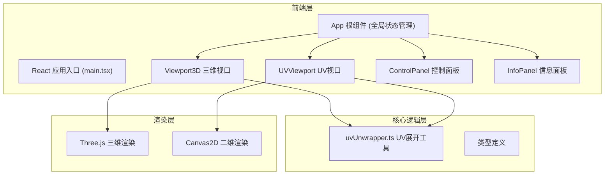

## 1. 架构设计



## 2. 技术选型

| 分类 | 技术 | 版本 | 说明 |
|------|------|------|------|
| 框架 | React | 18.x | UI组件框架 |
| 语言 | TypeScript | 5.x | 类型安全 |
| 构建工具 | Vite | 5.x | 快速开发构建 |
| 3D渲染 | three | ^0.160.0 | WebGL三维渲染引擎 |
| 加载器 | OBJLoader | three内置 | OBJ模型解析加载 |
| 状态管理 | React useState/useRef | - | 轻量状态，无Redux |
| 样式方案 | CSS Modules / 内联样式 | - | 组件化样式 |

## 3. 目录结构

```
src/
├── main.tsx              # 应用入口
├── App.tsx               # 根组件，全局状态
├── components/
│   ├── Viewport3D.tsx    # 三维视口组件
│   ├── UVViewport.tsx    # UV展开视口组件
│   ├── ControlPanel.tsx  # 参数控制面板
│   └── InfoPanel.tsx     # 面片信息面板
├── utils/
│   └── uvUnwrapper.ts    # UV展开核心逻辑
└── types/
    └── index.ts          # 类型定义
```

## 4. 数据模型

### 4.1 核心类型定义

```typescript
// 顶点
interface Vertex {
  x: number;
  y: number;
  z: number;
}

// UV坐标
interface UVCoord {
  u: number;
  v: number;
}

// 三角面片
interface Face {
  vertexIndices: [number, number, number];
  uvIndices: [number, number, number];
  area: number;
  color: string;
}

// 模型数据
interface ModelData {
  vertices: Vertex[];
  uvs: UVCoord[];
  faces: Face[];
}

// UI参数
interface UIParams {
  checkerboardDensity: number;  // 4 ~ 32
  borderWidth: number;          // 1 ~ 5
  showWireframe: boolean;
}

// 选中状态
interface SelectionState {
  selectedFaceIndices: number[];
  selectedVertexIndex: number | null;
  isDragging: boolean;
}
```

### 4.2 状态流向

单向数据流：
1. App 组件持有全局状态（modelData, uiParams, selection）
2. 子组件通过 props 接收状态
3. 子组件通过回调函数向上传递变更
4. 状态变更触发重新渲染

## 5. 核心算法

### 5.1 UV展开算法
- 采用平面投影展开（Planar Projection）
- 基于面片法向量选择最佳投影平面
- 归一化UV坐标至 [0, 1] 空间
- 按面片索引分配HSL渐变色

### 5.2 三角形合法性校验
- 面积校验：面积 > 阈值（非退化）
- 方向校验：叉积方向一致
- 自交校验：边不自相交

### 5.3 面片拾取（三维）
- Three.js Raycaster 射线检测
- 计算射线与三角面的交点

## 6. 性能优化

- 使用 requestAnimationFrame 驱动渲染循环
- Three.js 材质与几何体复用
- Canvas2D 脏矩形重绘（可选优化）
- 顶点拖拽时节流处理（requestAnimationFrame）
- 缓存计算结果（面片面积、颜色等）
