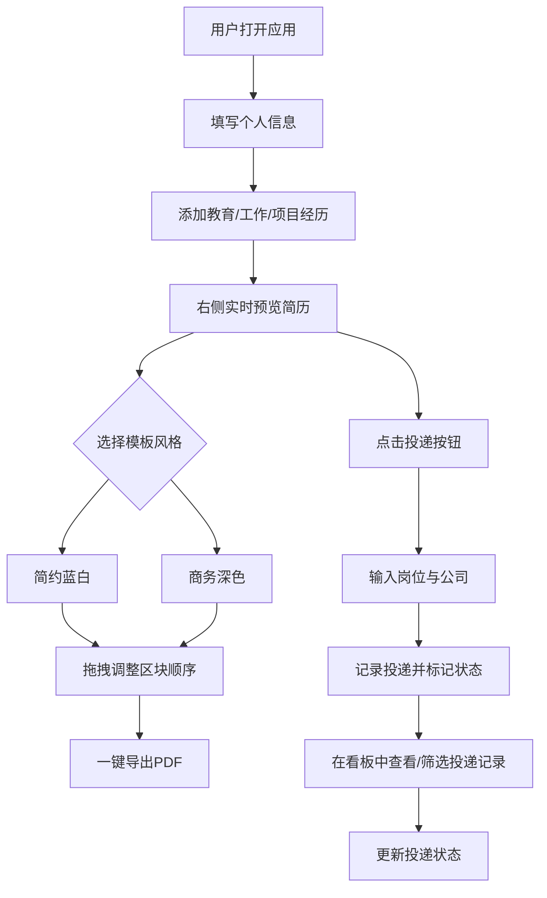

## 1. 产品概述

在线简历制作与投递追踪工具，帮助求职者通过表单输入快速生成定制化简历，同时记录投递历史与反馈状态。目标用户为活跃求职者，核心价值在于"所见即所得"的简历编辑体验和结构化的投递追踪管理。

- 主用途：快速生成两种风格的专业简历，实时预览并导出PDF
- 辅助用途：轻量级投递记录看板，追踪岗位投递全流程状态

## 2. 核心功能

### 2.1 用户角色

| 角色 | 注册方式 | 核心权限 |
|------|----------|----------|
| 普通用户 | 无需注册，本地使用 | 简历编辑、预览、导出、投递追踪 |

### 2.2 功能模块

1. **简历编辑页**：左侧个人信息表单 + 右侧实时预览，双模板切换，拖拽排序，PDF导出
2. **投递看板页**：投递记录列表，状态管理，筛选过滤

### 2.3 页面详情

| 页面名称 | 模块名称 | 功能描述 |
|----------|----------|----------|
| 简历编辑页 | 个人信息表单 | 输入姓名、电话、邮箱、个人简介等基本信息 |
| 简历编辑页 | 教育经历表单 | 支持多条教育经历，含学校、专业、起止时间 |
| 简历编辑页 | 工作经历表单 | 支持多条工作经历，含公司、职位、起止时间、工作描述 |
| 简历编辑页 | 项目经验表单 | 支持多条项目经验，含项目名、角色、描述 |
| 简历编辑页 | 模板选择器 | 简约蓝白 / 商务深色 两种预制模板切换 |
| 简历编辑页 | 简历实时预览 | 右侧渲染简历卡片，表单数据变更50ms内同步更新 |
| 简历编辑页 | 拖拽排序 | 简历区块可拖拽调整顺序（如项目经验上移） |
| 简历编辑页 | PDF导出 | 一键导出当前预览为PDF，排版与屏幕一致 |
| 投递看板页 | 投递记录列表 | 按日期倒序展示所有投递记录 |
| 投递看板页 | 新增投递 | 点击"投递"按钮记录岗位名称、公司名称 |
| 投递看板页 | 状态管理 | 标记投递状态：投递中/已查看/已面试/已拒绝 |
| 投递看板页 | 状态筛选 | 按状态过滤投递记录 |
| 投递看板页 | 详情展开 | 点击列表项展开详情，平滑高度动画 |

## 3. 核心流程

## 4. 用户界面设计

### 4.1 设计风格

- 主色调：淡蓝灰 (#F0F4F8) 背景，深蓝 (#1E3A5F) 标题与按钮
- 辅助色：白色卡片底色，浅灰 (#E2E8F0) 分割线，中蓝 (#3B82F6) 交互高亮
- 按钮样式：圆角 (8px)，深蓝填充 + 白色文字，悬浮微上浮 + 阴影加深
- 字体：标题 18-24px 加粗，正文 14px 常规，辅助文字 12px
- 布局：桌面端左30%右70%两栏，移动端上下堆叠
- 阴影：卡片柔和阴影 (0 2px 12px rgba(30,58,95,0.08))，悬浮上浮 (translateY(-2px) + 阴影加深)
- 动画：简历卡片悬浮上浮过渡 (0.3s ease)，输入框聚焦边框高亮 + 轻微缩放 (scale(1.01))，看板详情展开平滑高度动画

### 4.2 页面设计概览

| 页面名称 | 模块名称 | UI元素 |
|----------|----------|--------|
| 简历编辑页 | 左栏表单 | 白色卡片容器，分组标题深蓝色，输入框淡灰底+聚焦蓝边+缩放，添加按钮虚线框 |
| 简历编辑页 | 右栏预览 | 简历卡片白底+阴影，模板选择器顶部切换，拖拽手柄左侧显示，导出按钮右下角 |
| 简历编辑页 | 模板简约蓝白 | 白底+浅蓝头部渐变，深蓝标题，灰色正文 |
| 简历编辑页 | 模板商务深色 | 深蓝(#1E3A5F)底+白字，金色(#D4A574)强调色 |
| 投递看板页 | 看板列表 | 白色卡片行项，左侧状态色条，悬浮阴影加深，点击展开详情区 |
| 投递看板页 | 状态筛选 | 顶部标签栏，选中态深蓝底白字，未选中灰字 |

### 4.3 响应式设计

- 桌面端 (≥1024px)：左右两栏，表单30% + 预览70%
- 平板端 (768px-1023px)：左右两栏，表单35% + 预览65%
- 移动端 (<768px)：上下堆叠，表单在上，预览在下，全宽
- 触控优化：移动端拖拽手柄增大点击区域，按钮最小44px触控目标

### 4.4 3D场景指引

不适用
