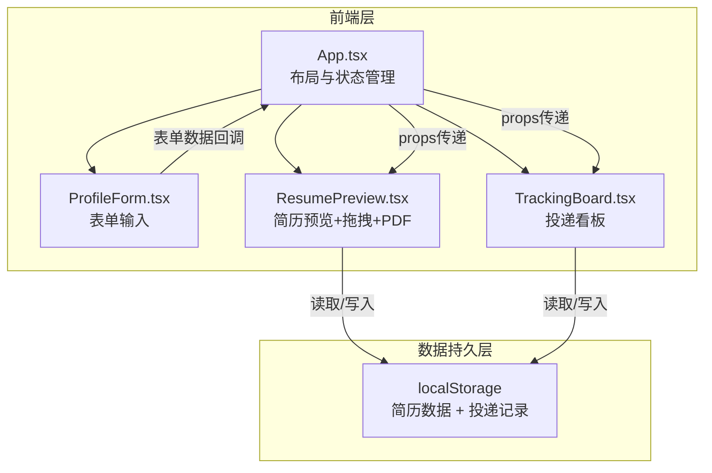
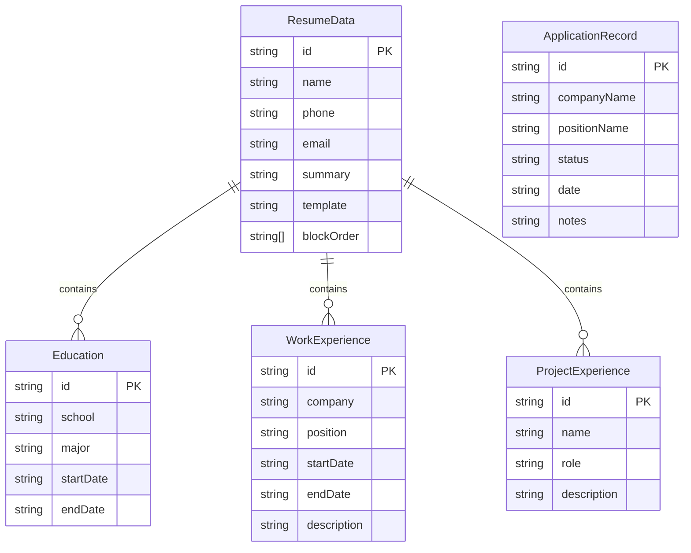

## 1. 架构设计



## 2. 技术说明

- 前端：React@18 + TypeScript + Vite
- 初始化工具：vite-init (react-ts 模板)
- 后端：无（纯前端应用）
- 数据库：无（使用 localStorage 本地存储）
- 状态管理：React useState + useCallback（组件级状态），zustand（全局共享状态）
- 样式：Tailwind CSS + 全局CSS变量
- 拖拽：react-beautiful-dnd
- PDF导出：jspdf + html2canvas
- 唯一ID：uuid

## 3. 路由定义

| 路由 | 用途 |
|------|------|
| / | 简历编辑主页面（表单 + 预览 + 看板） |

说明：本项目为单页面应用，简历编辑和投递看板在同一页面通过标签页切换或上下排列展示。

## 4. API定义

不适用（纯前端，无后端API）

## 5. 服务端架构图

不适用

## 6. 数据模型

### 6.1 数据模型定义



### 6.2 数据定义语言

```typescript
interface ResumeData {
  id: string;
  name: string;
  phone: string;
  email: string;
  summary: string;
  template: 'light' | 'dark';
  blockOrder: string[];
  education: Education[];
  workExperience: WorkExperience[];
  projectExperience: ProjectExperience[];
}

interface Education {
  id: string;
  school: string;
  major: string;
  startDate: string;
  endDate: string;
}

interface WorkExperience {
  id: string;
  company: string;
  position: string;
  startDate: string;
  endDate: string;
  description: string;
}

interface ProjectExperience {
  id: string;
  name: string;
  role: string;
  description: string;
}

type ApplicationStatus = 'applied' | 'viewed' | 'interviewed' | 'rejected';

interface ApplicationRecord {
  id: string;
  companyName: string;
  positionName: string;
  status: ApplicationStatus;
  date: string;
  notes: string;
}
```

localStorage 键设计：
- `resume_data`：存储 ResumeData JSON
- `application_records`：存储 ApplicationRecord[] JSON
