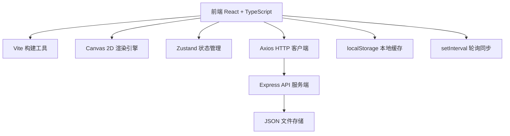
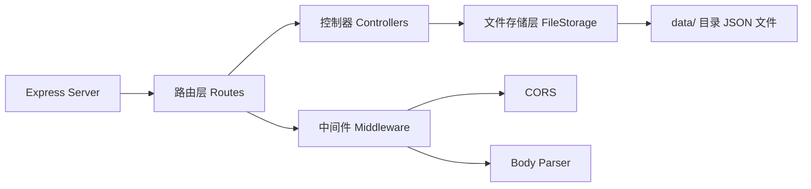

## 1. 架构设计



## 2. 技术栈说明

- **前端框架**：React 18 + TypeScript（严格模式，目标 ES2020）
- **构建工具**：Vite + @vitejs/plugin-react
- **画布渲染**：原生 Canvas 2D API（高性能节点和连线绘制）
- **状态管理**：React useState/useReducer（历史栈管理撤销重做）
- **后端服务**：Express 4 + cors + body-parser
- **数据存储**：JSON 文件（服务端） + localStorage（客户端本地缓存）
- **实时同步**：setInterval 轮询模拟（500ms 间隔）
- **HTTP 客户端**：Axios
- **唯一 ID**：uuid
- **虚拟列表**：react-window（节点列表优化，备用）

## 3. 路由定义

| 路由 | 用途 |
|------|------|
| `/` | 首页 - 图谱列表、创建/加入图谱 |
| `/graph/:id` | 编辑页 - 图谱画布和工具栏 |

前端通过 React Router 或简单的状态路由实现页面切换。

## 4. API 定义

### 4.1 类型定义

```typescript
// 节点类型
interface GraphNode {
  id: string;
  title: string;
  description: string;
  tags: string[];
  color: string;
  x: number;
  y: number;
  createdAt: number;
  updatedAt: number;
}

// 连线类型
type EdgeType = 'derived' | 'dependency' | 'related';

interface GraphEdge {
  id: string;
  source: string;
  target: string;
  type: EdgeType;
  createdAt: number;
}

// 图谱类型
interface KnowledgeGraph {
  id: string;
  name: string;
  roomCode: string;
  nodes: GraphNode[];
  edges: GraphEdge[];
  createdAt: number;
  updatedAt: number;
  version: number;
}

// 协作者类型
interface Collaborator {
  id: string;
  name: string;
  color: string;
  activeNodeId: string | null;
  lastSeen: number;
}

// 操作历史
interface HistoryAction {
  type: 'add' | 'update' | 'delete' | 'move';
  payload: any;
  prevState?: any;
}
```

### 4.2 接口列表

| 方法 | 路径 | 描述 | 请求体 | 响应 |
|------|------|------|--------|------|
| GET | `/api/graphs` | 获取所有图谱列表 | - | `KnowledgeGraph[]` |
| GET | `/api/graphs/:id` | 获取单个图谱详情 | - | `KnowledgeGraph` |
| POST | `/api/graphs` | 创建新图谱 | `{ name: string }` | `KnowledgeGraph` |
| PUT | `/api/graphs/:id` | 更新图谱（全量） | `KnowledgeGraph` | `KnowledgeGraph` |
| GET | `/api/graphs/:id/poll?version=X` | 轮询获取最新版本 | - | `{ version: number, graph?: KnowledgeGraph, collaborators: Collaborator[] }` |
| POST | `/api/graphs/:id/join` | 加入协作房间 | `{ roomCode: string, userName: string }` | `{ collaboratorId: string, graph: KnowledgeGraph }` |
| POST | `/api/graphs/:id/activity` | 更新用户活跃状态 | `{ collaboratorId: string, activeNodeId: string \| null }` | `{ success: boolean }` |

## 5. 服务端架构



服务端采用单文件 Express 应用，数据以 JSON 文件存储在 `data/` 目录下，每个图谱一个文件。

## 6. 前端文件结构

```
d:\Pro\tasks\auto82/
├── package.json
├── vite.config.js
├── tsconfig.json
├── index.html
├── server.js                 # Express 后端入口
├── data/                     # JSON 文件存储目录
└── src/
    ├── App.tsx               # 主应用：路由、状态、工具栏
    ├── GraphCanvas.tsx       # 画布：渲染、拖拽、缩放、撤销重做
    ├── NodePanel.tsx         # 节点详情面板：毛玻璃、滑入动画
    ├── api.ts                # API 调用、轮询同步逻辑
    └── data.d.ts             # TypeScript 类型定义
```

## 7. 性能优化策略

1. **Canvas 渲染优化**：
   - 使用 requestAnimationFrame 循环渲染
   - 视口裁剪：只渲染可见区域内的节点
   - 离屏 Canvas 预绘制静态元素（网格）
   - 节点缓存：非变化节点不重绘

2. **状态管理优化**：
   - 批量更新：合并短时间内的多次操作为一次渲染
   - 不可变数据：浅比较避免不必要重渲染
   - 历史栈限制：最多保留 50 步撤销记录

3. **数据同步优化**：
   - 增量更新：只传输变化部分（轮询版本号对比）
   - 防抖保存：操作停止 500ms 后才写入存储
   - 本地优先：先写 localStorage，后台异步同步服务端

4. **目标指标**：
   - 30 人同时在线：帧率 ≥ 45fps
   - 单图谱：500 节点 + 1000 连线不卡顿
