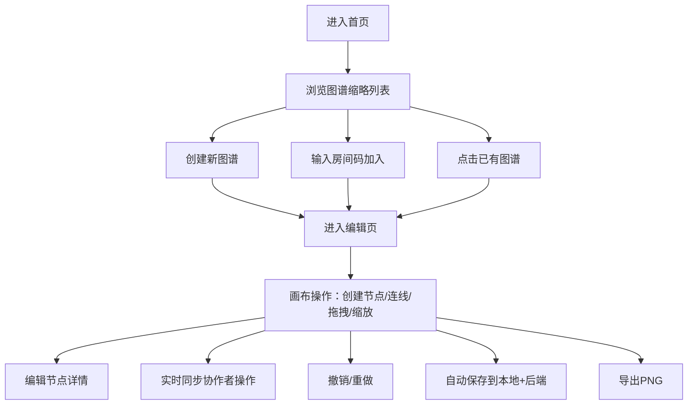

## 1. 产品概述

在线团队知识图谱协作工具，通过节点和连线帮助小团队共同构建和编辑可视化知识结构图，方便理解项目概念之间的关系。

- 核心价值：将团队的隐性知识显性化，通过可视化图谱促进知识共享与协作
- 目标用户：产品团队、技术团队、研究小组等需要梳理概念关系的小型协作团队

## 2. 核心功能

### 2.1 用户角色
| 角色 | 注册方式 | 核心权限 |
|------|----------|----------|
| 协作用户 | 输入房间码加入 | 创建/编辑/删除节点和连线、导出图谱 |

### 2.2 功能模块
1. **首页**：图谱列表展示、缩略预览、创建/加入图谱
2. **编辑页**：无限画布、节点管理、连线管理、工具栏、节点详情面板、多人协作

### 2.3 页面详情
| 页面名称 | 模块名称 | 功能描述 |
|----------|----------|----------|
| 首页 | 图谱列表 | Canvas 绘制缩略预览，悬停显示图名和节点数，点击进入编辑页 |
| 首页 | 操作区 | 创建新图谱、输入房间码加入已有图谱 |
| 编辑页 | 无限画布 | 节点创建/拖拽/选择，连线绘制，缩放平移，网格吸附，弹性辅助线 |
| 编辑页 | 节点详情面板 | 从右侧滑入，毛玻璃效果，展示/编辑节点信息和关联关系 |
| 编辑页 | 顶部工具栏 | 添加节点、连线模式、删除模式、导出PNG、缩放、重置视图、撤销重做 |
| 编辑页 | 协作功能 | 房间码分享、实时同步、协作者编辑高亮 |

## 3. 核心流程

用户打开首页 → 浏览已有图谱或创建/加入图谱 → 进入编辑页 → 在画布上创建节点和连线 → 编辑节点属性 → 多人实时协作 → 导出或自动保存

## 4. 用户界面设计

### 4.1 设计风格
- **主题**：深色赛博朋克风格，科技感与现代感结合
- **主色调**：背景 `#1a1a2e`，节点卡片 `#16213e`，文字 `#e0e0e0`
- **连线颜色**：衍生-实线蓝色 `#4fc3f7`，依赖-虚线橙色 `#ffb74d`，相关-点线绿色 `#81c784`
- **节点边框**：霓虹光晕动画，悬停时光晕增强
- **按钮**：悬停颜色渐变 + 微缩放动画（scale 1.03）
- **字体**：现代无衬线字体，清晰易读
- **布局**：画布全屏，顶部工具栏悬浮，右侧面板滑入

### 4.2 页面设计概述
| 页面名称 | 模块名称 | UI 元素 |
|----------|----------|----------|
| 首页 | 图谱网格 | 响应式卡片网格，每张卡片含 Canvas 缩略图、图名、节点数、悬停效果 |
| 首页 | 顶部操作栏 | Logo、创建按钮、房间码输入框、加入按钮 |
| 编辑页 | 画布背景 | 径向渐变 + 微弱网格线 |
| 编辑页 | 节点 | 圆角卡片，标题 + 标签，霓虹边框光晕，中心放大出现动画 |
| 编辑页 | 连线 | 带动态流动光点，不同线型区分关系类型 |
| 编辑页 | 工具栏 | 玻璃拟态风格，图标按钮，分组排列 |
| 编辑页 | 详情面板 | 右侧滑入，毛玻璃背景（backdrop-filter），表单编辑区 |

### 4.3 响应式
- 桌面端（> 1200px）：完整工具栏 + 侧边面板
- 宽屏平板（768px - 1200px）：工具栏紧凑排列，面板占屏 60%
- 触控优化：节点拖拽区域扩大，按钮最小触控尺寸 44px

### 4.4 动效设计
- 节点创建：中心缩放 + 淡入（0.3s ease-out）
- 节点悬停：光晕强度增强（0.2s transition）
- 连线光点：从起点沿路径流动到终点（循环动画）
- 面板滑入：translateX 过渡 + 透明度渐变（0.25s ease）
- 按钮悬停：背景色渐变 + scale 1.03（0.15s ease）
