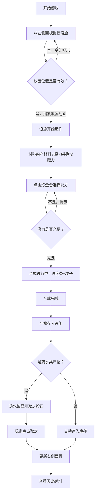

## 1. 产品概述

魔法炼金工坊是一款浏览器端策略模拟游戏，玩家通过在8x8网格地图上布置各类炼金设施，组合材料合成药水与魔法物品，体验资源管理与工坊布局的策略乐趣。

- 核心目标：解决资源合成与工坊布局策略结合不够直观的问题，提供可视化的布局与合成体验
- 目标用户：喜欢策略模拟、资源管理类游戏的休闲玩家
- 市场价值：轻量级Web游戏，无需下载，即开即玩，具备深度策略性

## 2. 核心功能

### 2.1 用户角色

| 角色 | 注册方式 | 核心权限 |
|------|----------|----------|
| 玩家 | 无需注册，本地存储 | 放置设施、合成材料、查看统计、保存/加载进度 |

### 2.2 功能模块

1. **设施面板**：展示可放置的设施类型，支持拖拽放置
2. **网格游戏区**：8x8网格地图，实时渲染设施、粒子效果、合成进度
3. **库存与统计面板**：展示玩家库存、合成历史、生产效率统计
4. **设施自定义面板**：点击设施打开，设置产出队列或存储策略
5. **游戏引擎**：管理网格状态、资源生产、合成逻辑、事件通信

### 2.3 页面详情

| 页面名称 | 模块名称 | 功能描述 |
|-----------|-------------|---------------------|
| 主游戏界面 | 设施面板（左侧） | 展示5种设施（炼金台、材料架、熔炉、药水架、魔力井），支持拖拽放置，显示设施说明 |
| 主游戏界面 | 网格游戏区（中间） | 8x8半透明青色网格，设施渲染，鼠标跟随预览，放置动画，合成粒子效果与进度条 |
| 主游戏界面 | 库存与统计面板（右侧） | 最新5种物品库存展示，历史合成时间线，生产效率柱状图，时间颗粒度切换 |
| 设施自定义弹窗 | 产出队列设置 | 设置炼金台/熔炉/药水架的合成配方队列 |
| 设施自定义弹窗 | 存储策略设置 | 设置材料架/药水架的存储优先级 |

## 3. 核心流程

玩家从左侧面板拖拽设施到中间网格 → 设施放置成功后开始自动运作（材料架产生材料、魔力井恢复魔力）→ 玩家点击炼金台打开面板选择配方 → 合成开始后显示进度条与粒子特效 → 合成完成后产物进入对应存储设施 → 药水架产出药水后显示取走按钮 → 玩家取走药水进入库存 → 右侧面板实时更新库存、历史记录与效率统计。

## 4. 用户界面设计

### 4.1 设计风格

- **主色调**：深紫色 `#1a0a2e` 作为背景主色，金色 `#d4af37` 作为强调色
- **辅助色**：青色 `#00ffff` 用于网格线和高亮，半透明紫色用于面板
- **按钮风格**：圆角矩形，金色边框，悬停时发光效果
- **字体**：使用Cinzel Decorative（标题）和Crimson Text（正文），营造魔法古籍风格
- **布局风格**：三栏布局，左右面板半透明浮于星空背景之上
- **图标风格**：等距像素风格（16x16像素），配合金色发光边框

### 4.2 页面设计概述

| 页面名称 | 模块名称 | UI元素 |
|-----------|-------------|-------------|
| 主游戏界面 | 星空背景 | Canvas动态粒子背景，缓慢旋转与闪烁效果 |
| 主游戏界面 | 设施面板 | 半透明深紫面板，金色标题栏，设施卡片带悬浮发光效果 |
| 主游戏界面 | 网格区 | 8x8青色半透明网格线，设施图标带缩放淡入动画，鼠标预览半透明跟随 |
| 主游戏界面 | 库存面板 | 侧边栏滚动区域，物品卡片带最新标识，时间线记录带连线动画 |
| 主游戏界面 | 统计面板 | 横向柱状图从下向上填充动画，数字标注悬浮显示 |
| 设施弹窗 | 自定义面板 | 模态框，金色装饰边框，队列列表可拖拽排序 |

### 4.3 响应式设计

- 桌面端（≥768px）：三栏布局，左侧设施面板240px，中间游戏区自适应，右侧库存统计面板280px
- 移动端（<768px）：侧边栏收起为底部悬浮按钮（设施/库存两个圆形按钮），点击后弹出全屏面板
- 网格区始终保持正方形，根据可用空间自适应缩放
- 触摸优化：拖拽放置支持触屏，按钮最小点击区域44x44px

### 4.4 Canvas场景指导

- **环境**：深紫色星空背景，50-100个粒子缓慢漂移并闪烁
- **光照**：全局金色环境光，设施周围有微妙的辉光效果
- **粒子系统**：合成时产生彩色粒子从炼金台向上飘散，放置设施时产生金色光环扩散
- **动画帧率**：目标30FPS以上，使用requestAnimationFrame，计算与渲染分离
