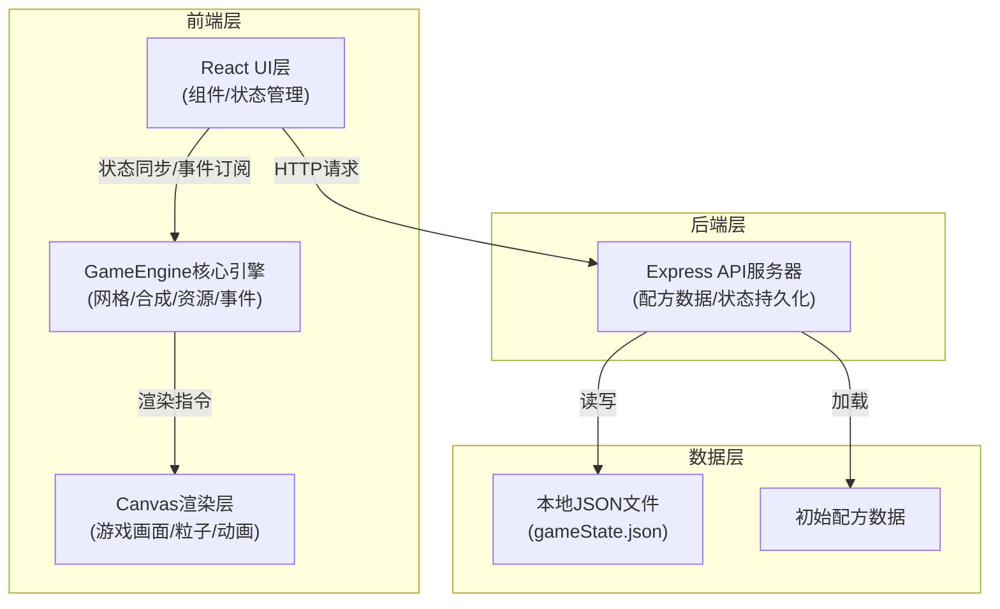
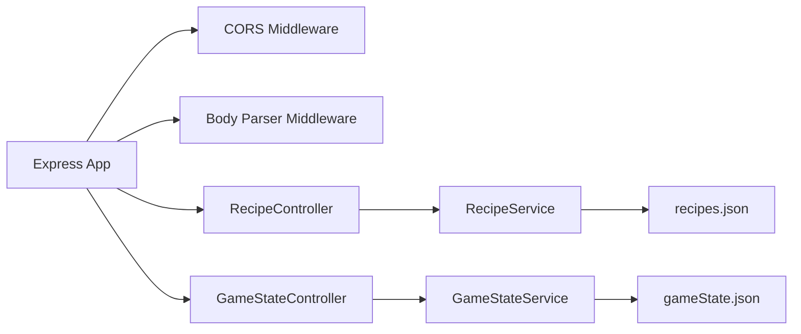
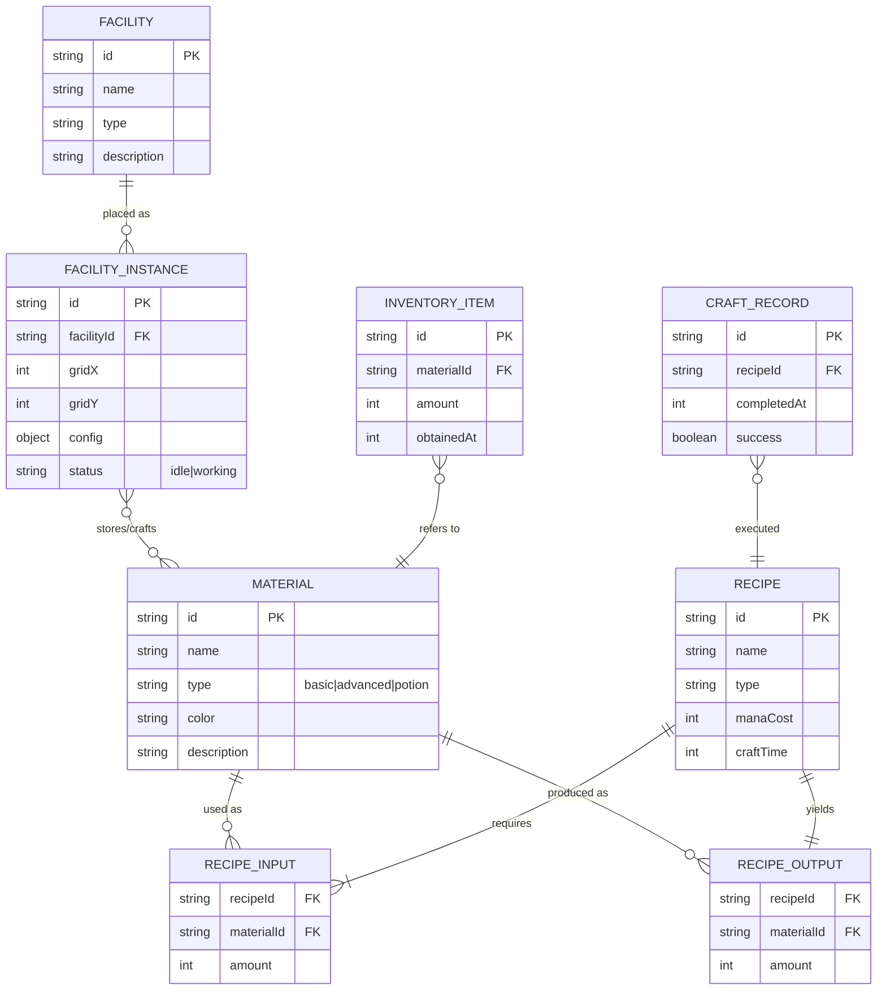

## 1. 架构设计



## 2. 技术描述

- **前端框架**：React@18 + TypeScript@5 + Vite@5
- **游戏渲染**：原生HTML5 Canvas 2D API
- **状态管理**：GameEngine内部状态 + React useState/useEffect + 事件总线模式
- **HTTP客户端**：原生fetch API
- **后端**：Node.js + Express@4
- **数据存储**：本地JSON文件（server/data/gameState.json）
- **构建工具**：Vite + @vitejs/plugin-react
- **其他依赖**：uuid（唯一ID）、body-parser（请求解析）、cors（跨域）、date-fns（日期格式化）

## 3. 路由定义

| 路由 | 目的 |
|-------|---------|
| / | 游戏主页面 |
| GET /api/recipes | 获取初始配方数据 |
| POST /api/game/save | 保存游戏状态 |
| POST /api/game/load | 加载游戏状态 |

## 4. API定义

### 4.1 获取配方数据

**GET /api/recipes**

响应：
```typescript
interface Recipe {
  id: string;
  name: string;
  type: 'advanced' | 'potion';
  inputs: { materialId: string; amount: number }[];
  output: { materialId: string; amount: number };
  manaCost: number;
  craftTime: number; // ms
}

interface RecipesResponse {
  materials: Material[];
  facilities: Facility[];
  recipes: Recipe[];
}
```

### 4.2 保存游戏状态

**POST /api/game/save**

请求体：
```typescript
interface GameState {
  grid: (FacilityInstance | null)[][];
  inventory: InventoryItem[];
  mana: number;
  maxMana: number;
  craftHistory: CraftRecord[];
  statistics: Statistics;
  timestamp: number;
}
```

响应：`{ success: boolean; message: string }`

### 4.3 加载游戏状态

**POST /api/game/load**

响应：`{ success: boolean; data?: GameState; message: string }`

## 5. 服务端架构图



## 6. 数据模型

### 6.1 数据模型定义



### 6.2 类型定义（TypeScript）

```typescript
type MaterialType = 'basic' | 'advanced' | 'potion';
type FacilityType = 'alchemy_table' | 'material_rack' | 'furnace' | 'potion_rack' | 'mana_well';

interface Material {
  id: string;
  name: string;
  type: MaterialType;
  color: string;
  icon: string; // pixel art key
  description: string;
}

interface Facility {
  id: FacilityType;
  name: string;
  description: string;
  color: string;
}

interface FacilityInstance {
  id: string;
  type: FacilityType;
  x: number;
  y: number;
  craftQueue: CraftTask[];
  storage: { [materialId: string]: number };
  config: FacilityConfig;
  currentCraft?: CraftTask;
  craftProgress: number; // 0-1
}

interface CraftTask {
  recipeId: string;
  startTime: number;
  endTime: number;
}

interface CraftRecord {
  id: string;
  recipeId: string;
  inputs: { materialId: string; amount: number }[];
  output: { materialId: string; amount: number };
  completedAt: number;
  facilityType: FacilityType;
}

interface InventoryItem {
  id: string;
  materialId: string;
  amount: number;
  obtainedAt: number;
}

interface Statistics {
  facilityWorkTime: { [type: string]: number };
  totalCrafts: number;
  totalPotions: number;
}
```
