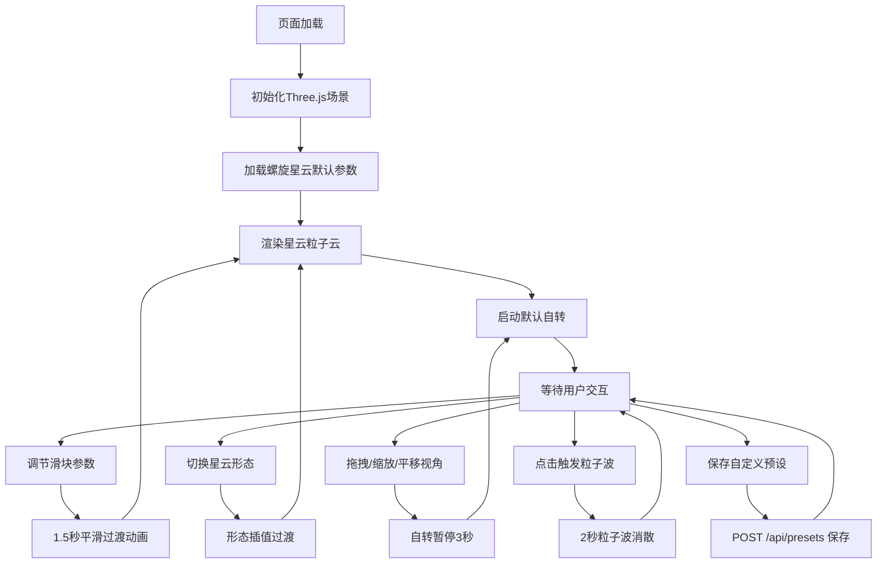

## 1. 产品概述

三维星云粒子系统交互演化平台，面向科技爱好者和艺术创作者，提供沉浸式的宇宙星云可视化体验。用户可以通过实时参数调节探索星云的物理演化过程，在螺旋、椭圆、不规则三种星云形态之间自由切换，感受引力、湍流、消散等物理规律对粒子云的动态影响。

- 目标用户：天文爱好者、数字艺术家、教育工作者
- 产品价值：将抽象的天体物理概念转化为直观可交互的视觉艺术，兼具教育性与审美性

## 2. 核心功能

### 2.1 用户角色

| 角色 | 注册方式 | 核心权限 |
|------|----------|----------|
| 普通用户 | 无需注册 | 浏览星云、调节参数、切换形态、保存预设 |

### 2.2 功能模块

1. **三维星云渲染主场景**：Three.js驱动的实时粒子系统，深邃星空背景，8000基准粒子，物理运动模拟
2. **参数控制面板**：五个实时滑块（粒子数量、引力强度、湍流强度、消散速率、颜色偏移），形态下拉切换，重置与保存按钮
3. **视角交互系统**：鼠标拖拽旋转、滚轮缩放、右键平移、默认缓慢自转、点击粒子波反馈
4. **预设管理系统**：三种内置星云形态预设，支持用户自定义参数保存为本地预设

### 2.3 页面详情

| 页面名称 | 模块名称 | 功能描述 |
|----------|----------|----------|
| 主页面 | 星空背景层 | 深蓝到紫黑径向渐变，细小闪烁星光粒子点缀，营造深空氛围 |
| 主页面 | 星云粒子系统 | BufferGeometry管理的8000粒子，螺旋/椭圆/不规则三形态，引力湍流消散物理模拟 |
| 主页面 | 左侧控制面板 | 毛玻璃半透明面板，五个发光滑块，形态下拉，重置/保存按钮，可折叠收起 |
| 主页面 | 视角控制器 | OrbitControls驱动的3D交互，默认自转（30秒一圈），拖拽暂停3秒后恢复 |
| 主页面 | 粒子波特效 | 点击星云触发彩色粒子波，从点击位置向外扩散，2秒后消散 |

## 3. 核心流程

用户打开页面 → 自动加载螺旋星云默认预设 → 场景自动渲染并开始缓慢自转
→ 用户可选择：调节滑块参数（1.5秒平滑过渡）/ 切换形态 / 拖拽旋转视角 / 滚轮缩放 / 点击触发粒子波 / 保存自定义预设
→ 所有交互实时反馈到三维场景

## 4. 用户界面设计

### 4.1 设计风格
- **主色调**：深空黑 `#0a0a1a` → 星夜蓝 `#0d1033` → 星云紫 `#1a0a2e` 的径向渐变背景
- **强调色**：粒子核心橙色 `#ff6b35` → 外圈蓝色 `#2196f3` 渐变；控制面板发光边 `#6366f1`
- **字体**：标题使用 Orbitron（科技感等宽字体），正文使用 Space Mono（代码风格字体）
- **按钮风格**：毛玻璃半透明（backdrop-filter: blur），微光边框，hover时发光扩散
- **滑块风格**：发光轨道（glow track），圆形拖拽头带脉冲光晕，滑动时数值实时显示
- **整体氛围**：暗色系宇宙主题，通过半透明、发光、粒子、渐变营造神秘深邃的空间感

### 4.2 页面设计概览

| 页面名称 | 模块名称 | UI元素 |
|----------|----------|--------|
| 主页面 | 星空背景层 | 径向渐变（中心深紫→四角深蓝黑），1000个随机细小白色粒子（随机闪烁动画） |
| 主页面 | 星云粒子系统 | 圆形发光Points，AdditiveBlending混合，橙色→蓝色径向渐变，透明度抖动，螺旋/椭圆/不规则三形态 |
| 主页面 | 左侧控制面板 | 默认展开宽度280px，毛玻璃（rgba(15,15,35,0.75)+blur(20px)），1px发光边框（rgba(99,102,241,0.3)），圆角12px，可折叠按钮在右上角 |
| 主页面 | 滑块组件 | 发光轨道（box-shadow: 0 0 8px #6366f1），圆形拖拽头（16px，带脉冲光晕），数值实时显示在滑块右侧 |
| 主页面 | 形态下拉 | 自定义下拉菜单，毛玻璃风格，hover选项发光 |
| 主页面 | 重置/保存按钮 | 圆角6px，毛玻璃底，发光边框，hover发光增强，active按压反馈 |
| 主页面 | 移动端按钮 | <768px时控制面板收起，左下角显示圆形发光按钮（直径56px），点击弹出全屏浮层面板 |

### 4.3 响应式设计
- **桌面端（≥1280px）**：左侧固定280px控制面板，右侧Three画布区域自适应，整体居中
- **平板（768px-1279px）**：控制面板宽度240px，保持左右布局
- **移动端（<768px）**：控制面板自动收起为左下角图标按钮，点击后弹出全屏毛玻璃浮层（从底部滑入动画），Three画布占满全屏

### 4.4 3D场景指引
- **环境氛围**：无外部HDRI，使用自定义ShaderMaterial创建的程序化星空背景，营造纯黑深空氛围
- **光照设置**：场景无传统光源，粒子使用自发光材质（AdditiveBlending），通过颜色和透明度控制视觉层次
- **相机设置**：PerspectiveCamera，fov=60，near=0.1，far=1000，初始位置(0, 0, 15)，看向原点
- **相机动画**：默认围绕Y轴缓慢自转（角速度=2π/30 rad/s），用户交互后暂停3秒再恢复
- **构图焦点**：粒子云中心始终位于屏幕中央，相机距离保证粒子云占屏幕60%-70%视觉空间
- **交互动画**：参数变化时使用GSAP在1.5秒内对position/color属性进行tween插值，实现平滑形态过渡
- **点击特效**：Raycaster检测点击位置，生成临时粒子波（额外BufferGeometry），2秒生命周期，半径从0线性扩展到5，透明度从1降到0
- **性能预算**：粒子数量10000时≥35FPS，20000时≥25FPS；使用BufferGeometry+TypedArray直接操作GPU内存，避免每帧创建新对象
