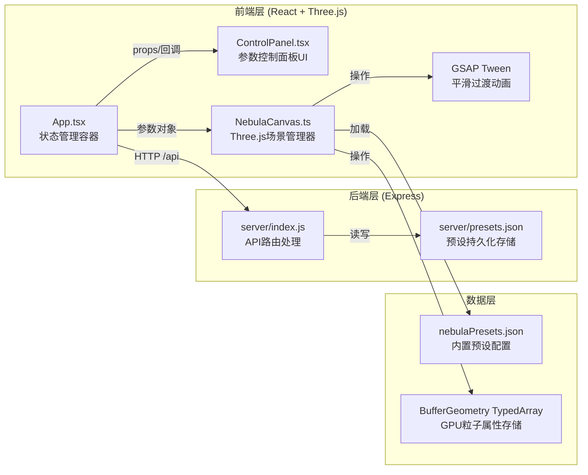
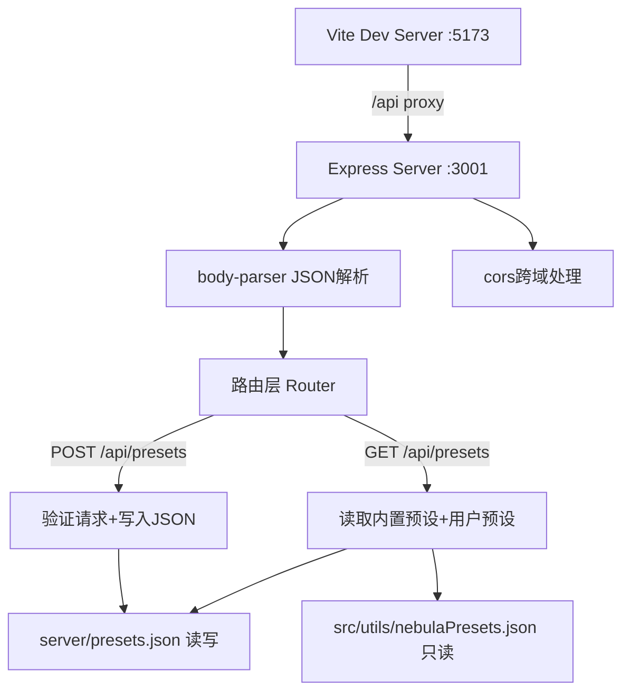
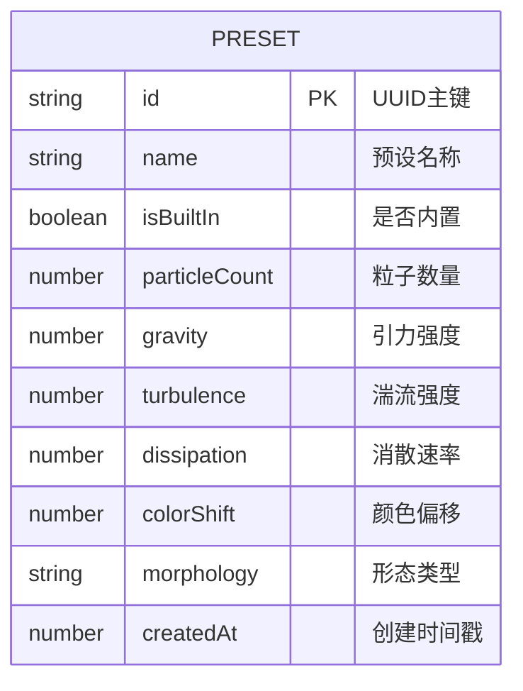

## 1. 架构设计



## 2. 技术描述

- **前端框架**：React 18 + TypeScript（严格模式）
- **构建工具**：Vite 5 + @vitejs/plugin-react
- **3D渲染**：Three.js 0.160 + BufferGeometry + PointsMaterial + ShaderMaterial
- **动画引擎**：GSAP 3（TweenMax）负责1.5秒参数平滑过渡
- **UI样式**：原生CSS（styled-components风格的CSS-in-JS，使用CSS变量管理主题色）
- **状态管理**：React useState/useCallback（组件本地状态，轻量级场景无需Zustand）
- **后端框架**：Express 4 + body-parser + cors
- **数据存储**：本地JSON文件（server/presets.json）
- **开发服务器**：Vite前端dev server（端口5173）+ Express后端（端口3001），通过Vite proxy实现/api请求转发

## 3. 路由定义

| 路由 | 用途 |
|------|------|
| / | 主应用页面，Three.js场景+控制面板 |
| GET /api/presets | 获取所有星云预设列表（内置+用户自定义） |
| POST /api/presets | 保存用户自定义预设到本地JSON |

## 4. API定义

### 4.1 TypeScript类型定义

```typescript
interface NebulaParams {
  particleCount: number;      // 1000-20000
  gravity: number;            // 0-5
  turbulence: number;         // 0-3
  dissipation: number;        // 0-0.1
  colorShift: number;         // 0-1 (0=暖色, 1=冷色)
  morphology: 'spiral' | 'elliptical' | 'irregular';
}

interface NebulaPreset {
  id: string;                 // uuid
  name: string;               // 预设名称
  isBuiltIn: boolean;         // 是否内置预设
  params: NebulaParams;
  createdAt: number;          // 时间戳
}

interface PresetsResponse {
  presets: NebulaPreset[];
}

interface SavePresetRequest {
  name: string;
  params: NebulaParams;
}

interface SavePresetResponse {
  success: boolean;
  preset: NebulaPreset;
}
```

### 4.2 请求/响应Schema

**GET /api/presets**
- Response Body:
```json
{
  "presets": [
    {
      "id": "uuid-string",
      "name": "螺旋星云",
      "isBuiltIn": true,
      "params": {
        "particleCount": 8000,
        "gravity": 1.5,
        "turbulence": 0.8,
        "dissipation": 0.01,
        "colorShift": 0.3,
        "morphology": "spiral"
      },
      "createdAt": 0
    }
  ]
}
```

**POST /api/presets**
- Request Body:
```json
{
  "name": "我的自定义星云",
  "params": {
    "particleCount": 12000,
    "gravity": 2.5,
    "turbulence": 1.5,
    "dissipation": 0.02,
    "colorShift": 0.6,
    "morphology": "elliptical"
  }
}
```
- Response Body:
```json
{
  "success": true,
  "preset": {
    "id": "new-uuid",
    "name": "我的自定义星云",
    "isBuiltIn": false,
    "params": { "...": "..." },
    "createdAt": 1718880000000
  }
}
```

## 5. 服务器架构图



## 6. 数据模型

### 6.1 数据模型定义



### 6.2 数据存储格式

**src/utils/nebulaPresets.json**（内置预设，部署后只读）：
```json
[
  {
    "id": "builtin-spiral",
    "name": "螺旋星云",
    "isBuiltIn": true,
    "params": {
      "particleCount": 8000,
      "gravity": 1.5,
      "turbulence": 0.8,
      "dissipation": 0.01,
      "colorShift": 0.3,
      "morphology": "spiral"
    }
  },
  {
    "id": "builtin-elliptical",
    "name": "椭圆星云",
    "isBuiltIn": true,
    "params": {
      "particleCount": 8000,
      "gravity": 2.0,
      "turbulence": 0.4,
      "dissipation": 0.005,
      "colorShift": 0.5,
      "morphology": "elliptical"
    }
  },
  {
    "id": "builtin-irregular",
    "name": "不规则星云",
    "isBuiltIn": true,
    "params": {
      "particleCount": 8000,
      "gravity": 0.8,
      "turbulence": 2.0,
      "dissipation": 0.02,
      "colorShift": 0.7,
      "morphology": "irregular"
    }
  }
]
```

**server/presets.json**（用户自定义预设，初始为空数组）：
```json
[]
```
