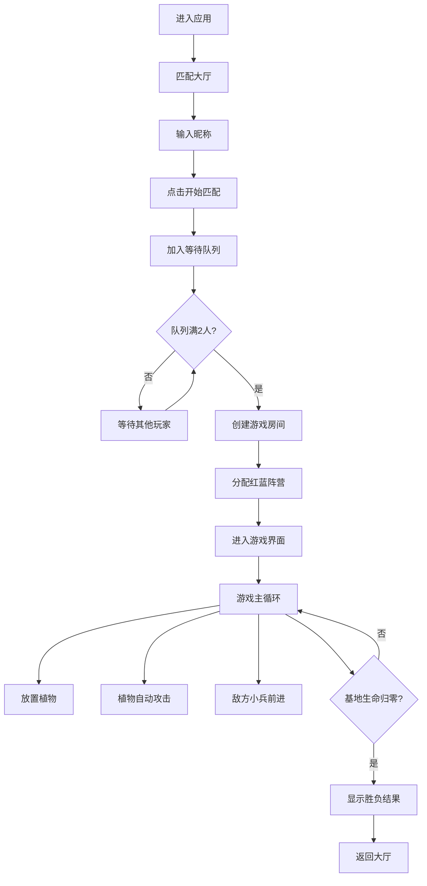

## 1. 产品概述

魔法花园战争是一款实时对战手游，玩家通过种植和派遣魔法植物来攻占对方基地。游戏融合了塔防与卡牌策略元素，支持双人实时对战。

- 核心玩法：玩家在6×8网格中布置魔法植物，植物自动攻击敌方单位，通过策略性布局摧毁对方基地
- 目标用户：喜欢策略对战和塔防类游戏的移动端玩家
- 产品价值：提供快节奏、策略性强的实时对战体验，结合精美的魔法主题视觉效果

## 2. 核心功能

### 2.1 用户角色

| 角色 | 注册方式 | 核心权限 |
|------|----------|----------|
| 玩家 | 输入昵称即可 | 匹配对战、布置植物、实时对战 |

### 2.2 功能模块

1. **匹配大厅**：昵称输入、匹配队列、房间分配
2. **游戏对战**：10×8网格战场、植物放置、自动攻击、胜负判定
3. **卡牌系统**：4种魔法植物卡牌、拖拽放置、魔法值消耗
4. **实时同步**：WebSocket数据同步、断线重连、状态恢复

### 2.3 页面详情

| 页面名称 | 模块名称 | 功能描述 |
|----------|----------|----------|
| 匹配大厅 | 昵称输入 | 玩家输入昵称，验证非空 |
| 匹配大厅 | 匹配按钮 | 点击后加入等待队列，显示匹配状态 |
| 游戏界面 | 基地状态栏 | 显示双方基地生命值、当前魔法值、游戏时间 |
| 游戏界面 | 游戏画布 | 10×8网格、植物渲染、弹道动画、敌方单位 |
| 游戏界面 | 卡牌面板 | 4张植物卡牌、拖拽交互、魔法值不足显示禁用 |
| 游戏界面 | 胜负弹窗 | 胜利/失败动画、粒子效果、奖杯图标 |

## 3. 核心流程

玩家进入游戏后，在匹配大厅输入昵称并点击开始匹配。后端将玩家加入等待队列，当有两名玩家时创建游戏房间并分配红蓝阵营。匹配成功后进入游戏界面，玩家通过拖拽卡牌到己方网格放置植物，植物自动攻击敌方单位。每15秒敌方生成一波小兵沿中路前进。当一方基地生命值归零时，游戏结束并显示胜负结果。

## 4. 用户界面设计

### 4.1 设计风格

- **主题风格**：暗色奇幻风格，深紫色到深绿色的径向渐变背景
- **主色调**：深紫色(#1a0a2e)、深绿色(#0a2e1a)、银白色网格线
- **阵营配色**：己方蓝绿色光晕(#00ffaa33)，敌方淡红色光晕(#ff336633)
- **植物配色**：蘑菇战士紫色(#9b59b6)、荆棘射手橙色(#e67e22)、向日葵补给黄色(#f1c40f)、樱桃炸弹红色(#e74c3c)
- **字体**：使用特殊奇幻风格字体作为标题，正文使用清晰易读的无衬线字体
- **按钮风格**：圆角矩形按钮，带有发光边框和悬停放大效果
- **动画风格**：植物放置缩放动画、弹道拖尾粒子、命中炸裂效果、胜利金色粒子爆炸

### 4.2 页面设计概述

| 页面名称 | 模块名称 | UI元素 |
|----------|----------|--------|
| 匹配大厅 | 主容器 | 径向渐变背景、居中卡片、发光边框 |
| 匹配大厅 | 输入区域 | 昵称输入框、魔法图标装饰、占位符动画 |
| 匹配大厅 | 匹配按钮 | 渐变按钮、悬停发光、加载动画 |
| 匹配大厅 | 状态显示 | 匹配中动画、等待玩家提示 |
| 游戏界面 | 顶部状态栏 | 双方基地生命值条、魔法值显示、时间计数器 |
| 游戏界面 | 游戏画布 | 10×8网格、分区光晕、植物渲染、弹道动画 |
| 游戏界面 | 卡牌面板 | 底部横向滑动、卡牌放大悬停、拖拽半透明效果 |
| 游戏界面 | 胜负弹窗 | 全屏遮罩、奖杯图标、金色粒子、重玩按钮 |

### 4.3 响应式设计

- **设计原则**：桌面优先，移动端自适应
- **移动端适配**：网格自动缩小保持可触控区域，卡牌面板改为横向滑动选择
- **触控优化**：增大触控区域，支持触摸拖拽操作
- **屏幕适配**：使用vh/vw单位，保证全屏自适应布局

### 4.4 性能优化

- **Canvas渲染**：游戏主画面使用Canvas 2D绘制，保证30fps以上帧率
- **动画优化**：战斗特效使用CSS动画或Canvas绘制，避免重排重绘
- **消息处理**：WebSocket消息处理时间控制在10ms以内
- **状态管理**：合理使用React状态，避免不必要的重渲染
