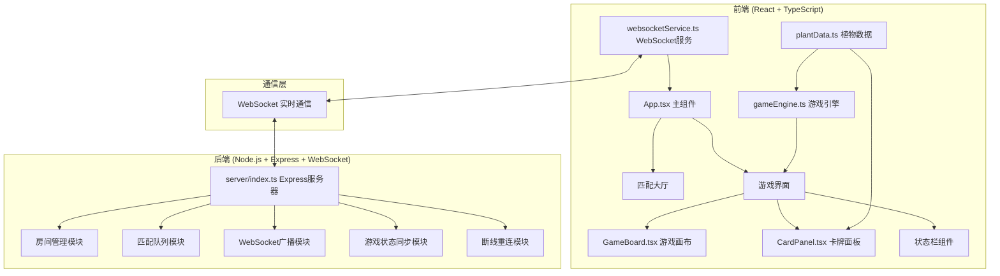
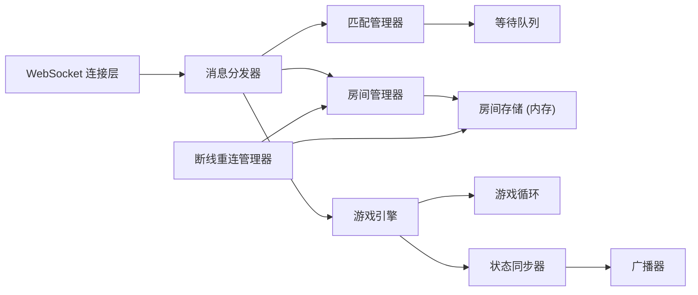

## 1. 架构设计



## 2. 技术描述

- **前端框架**：React 18 + TypeScript + Vite
- **状态管理**：React Hooks (useState, useEffect, useRef)
- **样式方案**：CSS Modules + CSS Variables
- **游戏渲染**：Canvas 2D API
- **后端框架**：Express 4 + TypeScript
- **实时通信**：ws (WebSocket库)
- **工具库**：uuid (唯一ID生成), date-fns (时间处理), cors (跨域处理), body-parser (请求解析)
- **构建工具**：Vite 5 + @vitejs/plugin-react
- **包管理器**：npm

## 3. 项目结构

```
auto87/
├── package.json
├── vite.config.js
├── tsconfig.json
├── index.html
├── server/
│   └── index.ts
├── src/
│   ├── App.tsx
│   ├── main.tsx
│   ├── services/
│   │   └── websocketService.ts
│   ├── game/
│   │   ├── gameEngine.ts
│   │   └── plantData.ts
│   ├── components/
│   │   ├── GameBoard.tsx
│   │   ├── CardPanel.tsx
│   │   ├── Lobby.tsx
│   │   ├── StatusBar.tsx
│   │   └── GameOverModal.tsx
│   ├── types/
│   │   └── index.ts
│   └── styles/
│       └── global.css
```

## 4. 核心数据类型定义

```typescript
// 植物类型
type PlantType = 'mushroom' | 'thorn' | 'sunflower' | 'cherry';

// 植物数据
interface PlantData {
  id: string;
  type: PlantType;
  name: string;
  cost: number;
  attack: number;
  health: number;
  maxHealth: number;
  range: number;
  attackSpeed: number;
  description: string;
  color: string;
}

// 植物实例
interface Plant extends PlantData {
  instanceId: string;
  gridX: number;
  gridY: number;
  owner: 'red' | 'blue';
  lastAttackTime: number;
}

// 小兵单位
interface Minion {
  instanceId: string;
  owner: 'red' | 'blue';
  x: number;
  y: number;
  health: number;
  maxHealth: number;
  attack: number;
  speed: number;
  lastAttackTime: number;
}

// 弹道
interface Projectile {
  instanceId: string;
  fromX: number;
  fromY: number;
  toX: number;
  toY: number;
  currentX: number;
  currentY: number;
  targetId: string;
  damage: number;
  color: string;
  speed: number;
  createdAt: number;
}

// 爆炸效果
interface Explosion {
  instanceId: string;
  x: number;
  y: number;
  radius: number;
  maxRadius: number;
  color: string;
  createdAt: number;
  duration: number;
}

// 粒子效果
interface Particle {
  instanceId: string;
  x: number;
  y: number;
  vx: number;
  vy: number;
  color: string;
  size: number;
  life: number;
  maxLife: number;
}

// 基地
interface Base {
  owner: 'red' | 'blue';
  health: number;
  maxHealth: number;
  gridX: number;
  gridY: number;
}

// 玩家
interface Player {
  id: string;
  nickname: string;
  faction: 'red' | 'blue';
  mana: number;
  maxMana: number;
  lastManaRegen: number;
  connected: boolean;
  disconnectedAt?: number;
}

// 游戏房间
interface GameRoom {
  id: string;
  players: Player[];
  plants: Plant[];
  minions: Minion[];
  projectiles: Projectile[];
  explosions: Explosion[];
  particles: Particle[];
  bases: Base[];
  gridWidth: number;
  gridHeight: number;
  turnInterval: number;
  lastTurnTime: number;
  lastMinionSpawn: number;
  minionSpawnInterval: number;
  gameStartTime: number;
  status: 'waiting' | 'playing' | 'finished';
  winner?: 'red' | 'blue';
}

// WebSocket消息类型
type MessageType = 
  | 'match' 
  | 'cancel_match' 
  | 'room_created' 
  | 'game_state' 
  | 'place_plant' 
  | 'plant_placed' 
  | 'attack' 
  | 'minion_spawn' 
  | 'game_over' 
  | 'reconnect' 
  | 'reconnect_success'
  | 'error';

// WebSocket消息
interface GameMessage<T = any> {
  type: MessageType;
  payload: T;
  timestamp: number;
}
```

## 5. API 定义

### HTTP 接口

| 方法 | 路径 | 描述 | 请求参数 | 响应格式 |
|------|------|------|----------|----------|
| GET | /api/health | 健康检查 | 无 | `{ status: 'ok', timestamp: number }` |
| POST | /api/match | 加入匹配队列 | `{ nickname: string, playerId?: string }` | `{ success: boolean, message: string }` |
| POST | /api/cancel-match | 取消匹配 | `{ playerId: string }` | `{ success: boolean }` |

### WebSocket 消息

| 消息类型 | 方向 | 负载数据 | 描述 |
|----------|------|----------|------|
| match | 客户端→服务端 | `{ nickname: string, playerId?: string }` | 请求匹配 |
| cancel_match | 客户端→服务端 | `{ playerId: string }` | 取消匹配 |
| room_created | 服务端→客户端 | `{ roomId: string, player: Player, opponent: Player }` | 房间创建成功 |
| game_state | 服务端→客户端 | `GameRoom` | 游戏状态全量同步 |
| place_plant | 客户端→服务端 | `{ roomId: string, playerId: string, plantType: PlantType, gridX: number, gridY: number }` | 放置植物请求 |
| plant_placed | 服务端→客户端 | `{ plant: Plant, playerId: string, remainingMana: number }` | 植物放置成功 |
| attack | 服务端→客户端 | `{ projectile: Projectile, targetId: string, damage: number }` | 攻击事件 |
| minion_spawn | 服务端→客户端 | `{ minion: Minion }` | 小兵生成 |
| game_over | 服务端→客户端 | `{ winner: 'red' \| 'blue', roomId: string }` | 游戏结束 |
| reconnect | 客户端→服务端 | `{ playerId: string, roomId: string }` | 断线重连请求 |
| reconnect_success | 服务端→客户端 | `{ room: GameRoom, player: Player }` | 重连成功 |
| error | 服务端→客户端 | `{ code: number, message: string }` | 错误信息 |

## 6. 服务端架构



### 核心模块说明

1. **匹配管理器**：维护等待队列，玩家加入后等待配对，满2人时创建房间
2. **房间管理器**：管理所有游戏房间的生命周期，包括创建、销毁、状态存储
3. **游戏引擎**：
   - 游戏主循环 (每2秒一回合)
   - 植物攻击逻辑
   - 小兵生成与移动
   - 碰撞检测与伤害计算
   - 胜负判定
4. **状态同步器**：每回合结束后广播完整游戏状态，保证客户端同步
5. **断线重连管理器**：记录玩家断线时间，10秒内允许重连并恢复游戏状态

## 7. 游戏核心逻辑

### 7.1 网格系统

- 总网格：10列 × 8行
- 红方区域：列0-5 (左侧6列)
- 蓝方区域：列4-9 (右侧6列)
- 分界线：列4-5之间
- 基地位置：己方区域最后一列中央 (行3-4)

### 7.2 游戏循环

```
每2秒执行一次：
1. 魔法值恢复 (每10秒+50)
2. 小兵生成 (每15秒一波)
3. 所有植物检查射程内目标并攻击
4. 所有小兵向敌方基地移动并攻击路径上的植物
5. 弹道移动与碰撞检测
6. 爆炸/粒子效果更新
7. 检查胜负条件
8. 广播游戏状态
```

### 7.3 植物数据

| 植物类型 | 名称 | 消耗 | 攻击力 | 生命值 | 射程 | 攻速 | 技能描述 |
|----------|------|------|--------|--------|------|------|----------|
| mushroom | 蘑菇战士 | 50 | 25 | 200 | 1.5格 | 1.5秒 | 近战高血量，适合前排防御 |
| thorn | 荆棘射手 | 75 | 35 | 100 | 4格 | 1秒 | 远程高伤害，后排输出 |
| sunflower | 向日葵补给 | 40 | 10 | 80 | 2格 | 2秒 | 每3秒为周围友军恢复20生命 |
| cherry | 樱桃炸弹 | 100 | 150 | 50 | 0.5格 | 3秒 | 范围爆炸，对3x3区域造成伤害 |

## 8. 性能优化

1. **前端**：
   - Canvas分层渲染：静态网格层 + 动态单位层 + 特效层
   - requestAnimationFrame 游戏循环
   - 脏矩形渲染，只更新变化区域
   - 对象池复用粒子和弹道对象

2. **后端**：
   - 增量状态同步，只发送变化数据
   - 消息批量处理
   - 内存游戏状态，无数据库IO
   - 连接池管理

3. **网络**：
   - 二进制消息编码 (可选)
   - 消息节流，最多每50ms发送一次状态
   - 丢包重传机制
