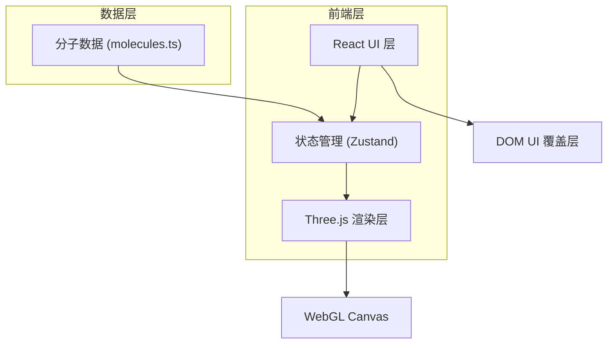
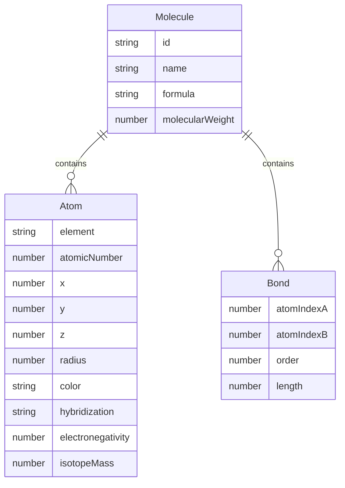

## 1. 架构设计

## 2. 技术说明

- 前端：React 18 + TypeScript + Three.js + Vite
- 初始化工具：vite-init (react-ts 模板)
- 状态管理：Zustand
- 后端：无
- 数据库：无，使用静态分子数据文件

## 3. 路由定义

| 路由 | 用途 |
|------|------|
| / | 主页面，包含三维场景和控制面板 |

## 4. API 定义

无后端 API，所有数据为前端静态数据。

## 5. 服务器架构图

无后端服务器。

## 6. 数据模型

### 6.1 数据模型定义

### 6.2 数据定义语言

分子数据以 TypeScript 常量导出，包含五个预设分子（甲烷 CH₄、水 H₂O、苯 C₆H₆、乙醇 C₂H₅OH、葡萄糖 C₆H₁₂O₆），每个分子包含原子坐标数组（含元素符号、坐标、半径、CPK 配色、扩展属性）和键连接数组（含两端原子索引、键级、键长）。
