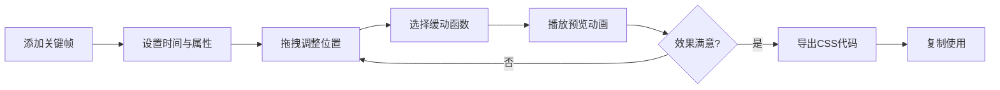

## 1. 产品概述
CSS动画关键帧制作工具，帮助前端开发者在浏览器中直观地创建、预览和导出CSS @keyframes动画。解决编写复杂CSS动画时无法直观看到时间轴与关键帧变化曲线的痛点，提升动画开发效率。

## 2. 核心功能

### 2.1 功能模块
1. **主页面**: 三栏布局（关键帧列表、时间轴、预览舞台）
2. **关键帧编辑器**: 添加、删除、编辑关键帧属性
3. **时间轴组件**: 可视化关键帧位置、拖拽调整、贝塞尔曲线显示
4. **动画预览**: 实时播放动画、缓动函数切换、播放控制
5. **代码导出**: 生成可直接使用的CSS @keyframes代码

### 2.2 页面详情
| 页面名称 | 模块名称 | 功能描述 |
|-----------|-------------|---------------------|
| 主页面 | 关键帧列表 | 可滚动列表，每个关键帧可展开/折叠编辑，支持删除 |
| 主页面 | 时间轴 | 显示关键帧圆点、贝塞尔插值曲线、扫描线、播放控制按钮 |
| 主页面 | 预览舞台 | 300x300动画展示区域，彩色方块动画主体 |
| 主页面 | 缓动选择器 | 预设缓动函数和自定义cubic-bezier |
| 主页面 | 导出面板 | CSS代码生成、一键复制功能 |

## 3. 核心流程

用户添加关键帧 → 设置时间点和CSS属性 → 拖拽调整关键帧位置 → 选择缓动函数 → 点击播放预览 → 调整参数直至满意 → 导出CSS代码

## 4. 用户界面设计

### 4.1 设计风格
- 深色主题：背景#1a1a2e，表面#16213e，主色#e94560，辅助色#0f3460
- 关键帧圆点：默认14px，选中18px带发光动画
- 按钮：悬停背景渐变+缩放反馈
- 时间轴：1px浅灰网格背景，扫描线带淡蓝色尾迹
- 字体：现代无衬线字体，清晰的层级关系

### 4.2 页面设计概述
| 页面名称 | 模块名称 | UI元素 |
|-----------|-------------|-------------|
| 主页面 | 关键帧列表 | 卡片式设计，展开/折叠动画，删除按钮，属性编辑表单 |
| 主页面 | 时间轴 | 网格背景，彩色关键帧圆点，贝塞尔曲线，垂直扫描线，播放进度数字 |
| 主页面 | 预览舞台 | 300x300带阴影圆角容器，居中彩色方块，可自定义颜色和形状 |
| 主页面 | 控制栏 | 播放/暂停/重置按钮，缓动函数下拉，导出按钮 |

### 4.3 响应式
- 桌面端（≥900px）：左中右三栏布局
- 移动端（<900px）：预览舞台移至下方，两列布局
- 触控优化：关键帧圆点触控区域放大，按钮最小尺寸44px

### 4.4 交互细节
- 关键帧拖拽：实时更新位置和曲线
- 悬停效果：按钮缩放+背景渐变，圆点发光
- 播放过程：扫描线平滑移动，当前关键帧属性悬浮窗
- 复制成功：短暂提示动画
