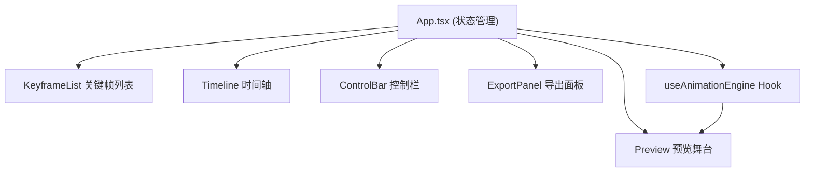

## 1. 架构设计



## 2. 技术描述
- **前端**: React@18 + TypeScript + Vite
- **状态管理**: React useState/useReducer (轻量级场景，无需额外状态管理库)
- **样式**: CSS Modules + 全局CSS变量
- **依赖库**: uuid (唯一ID生成), lodash (工具函数)
- **初始化工具**: vite-init

## 3. 数据模型

### 3.1 类型定义

```typescript
interface CSSProperty {
  name: string;
  value: string;
}

interface Keyframe {
  id: string;
  time: number; // 0-100 百分比
  properties: CSSProperty[];
  color: string; // 圆点颜色
}

type EasingType = 'ease' | 'ease-in' | 'ease-out' | 'ease-in-out' | 'linear' | 'cubic-bezier';

interface AnimationState {
  isPlaying: boolean;
  currentTime: number; // 0-100 百分比
  duration: number; // 毫秒
}
```

## 4. 文件结构

```
src/
├── main.tsx              # 应用入口
├── App.tsx               # 主组件，状态管理
├── types/
│   └── index.ts          # 类型定义
├── components/
│   ├── KeyframeList.tsx  # 关键帧列表组件
│   ├── KeyframeItem.tsx  # 单个关键帧项
│   ├── Timeline.tsx      # 时间轴组件
│   ├── Preview.tsx       # 预览舞台组件
│   ├── ControlBar.tsx    # 播放控制栏
│   ├── EasingSelector.tsx # 缓动函数选择器
│   └── ExportPanel.tsx   # 导出面板
├── hooks/
│   └── useAnimationEngine.ts # 动画引擎Hook
├── utils/
│   ├── easing.ts         # 缓动函数计算
│   ├── interpolation.ts  # 属性插值计算
│   └── cssGenerator.ts   # CSS代码生成
└── styles/
    └── app.css           # 全局样式
```

## 5. 核心算法

### 5.1 缓动函数
- 支持标准CSS缓动函数
- cubic-bezier通过数值计算实现
- 所有缓动函数输入输出均为0-1范围

### 5.2 属性插值
- transform: 分解为translate/rotate/scale分别插值
- opacity: 数值线性插值
- color: RGB通道分别插值
- 其他数值属性: 线性插值

### 5.3 贝塞尔曲线绘制
- 关键帧间使用三次贝塞尔曲线连接
- 控制点根据缓动函数动态计算
- SVG路径渲染

## 6. 性能优化
- 使用requestAnimationFrame实现60fps动画
- 关键帧拖拽时使用requestAnimationFrame节流
- CSS transforms开启硬件加速
- 避免不必要的重渲染（React.memo）
