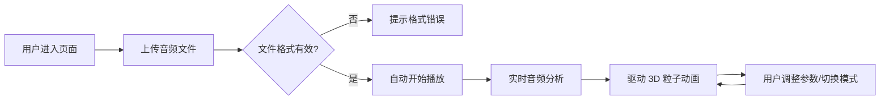

## 1. 产品概述

三维声波可视化工具是一款将音频文件实时转换为动态 3D 波形粒子动画的 Web 应用。用户可以上传或录制音频文件，通过 Three.js 渲染的粒子系统沉浸式感受音乐的可视化表达。

- 主要用途：音乐可视化、音频分析展示、创意艺术表达
- 目标用户：音乐爱好者、视觉艺术家、教育工作者
- 产品价值：将抽象的音频信号转化为直观的三维视觉体验，提供丰富的交互和定制选项

## 2. 核心功能

### 2.1 用户角色

| 角色 | 注册方式 | 核心权限 |
|------|----------|----------|
| 普通用户 | 无需注册 | 上传音频、播放控制、调整可视化参数 |

### 2.2 功能模块

1. **音频上传模块**：文件上传、拖拽上传、格式支持（MP3/WAV）
2. **3D 可视化模块**：粒子系统、三种可视化模式、平滑过渡动画
3. **播放控制模块**：播放/暂停、进度条、时间显示
4. **参数调节模块**：粒子数量、大小、颜色、旋转速度、背景色
5. **响应式界面**：桌面端侧边栏、移动端顶部下拉菜单

### 2.3 页面详情

| 页面名称 | 模块名称 | 功能描述 |
|----------|----------|----------|
| 主页面 | 3D 场景区域 | 全屏 Three.js 粒子动画渲染，占据主要视觉空间 |
| 主页面 | 左侧控制面板 | 毛玻璃效果半透明面板，包含所有控制选项 |
| 主页面 | 右上角播放控制 | 进度条、时间显示、播放暂停按钮 |
| 主页面 | 文件上传区域 | 虚线边框拖拽区，支持点击和拖拽上传 |

## 3. 核心流程

## 4. 用户界面设计

### 4.1 设计风格

- **主色调**：深空蓝到黑色渐变背景（#0a0a1a → #000000）
- **强调色**：粒子颜色按频率映射（低频红 #ff4444、中频绿 #44ff44、高频蓝 #4444ff）
- **毛玻璃效果**：控制面板背景半透明 + backdrop-filter: blur(10px)
- **按钮风格**：圆角、半透明背景、hover 时轻微放大和亮度提升
- **字体**：现代无衬线字体，标题使用等宽科技感字体
- **布局风格**：左侧固定控制面板 + 全屏 3D 场景 + 右上角浮动播放控件
- **动画过渡**：所有交互 0.3s ease-in-out 平滑过渡

### 4.2 页面设计概述

| 页面名称 | 模块名称 | UI 元素 |
|----------|----------|---------|
| 主页面 | 3D 场景 | 全屏粒子系统、深空背景、发光粒子、辉光效果 |
| 主页面 | 控制面板 | 文件上传区、模式切换按钮、参数滑块组、背景色选择器 |
| 主页面 | 播放控制 | 进度条（可点击跳转）、当前时间/总时长、播放/暂停按钮 |
| 主页面 | 移动端适配 | 顶部下拉菜单、折叠式控制面板 |

### 4.3 响应式设计

- **桌面端（>768px）**：左侧固定控制面板（约 320px 宽），右侧全屏 3D 场景
- **移动端（≤768px）**：控制面板折叠为顶部下拉菜单，点击展开，3D 场景占满全屏
- **触控优化**：增大按钮点击区域，滑块触控友好

### 4.4 3D 场景指引

- **环境**：深空渐变背景，微弱星空粒子点缀
- **光照**：粒子自发光，无需额外光源，使用 PointsMaterial + blending
- **相机**：PerspectiveCamera，初始位置在场景前方，可随鼠标轻微摆动
- **粒子系统**：
  - BufferGeometry 优化性能
  - 至少 5000 个粒子
  - 发光粒子带辉光效果（半透明圆形纹理）
  - 颜色按频率分段映射
- **可视化模式**：
  1. 波形曲面模式：粒子沿 Z 轴时间轴排列，Y 轴为振幅
  2. 频谱柱状模式：按频率分段排列成柱状，柱高随能量变化
  3. 环绕模式：粒子在球体表面按音频特征分布
- **过渡动画**：模式切换时粒子位置平滑插值过渡
- **性能优化**：使用 BufferGeometry、实例化渲染、60fps 目标
