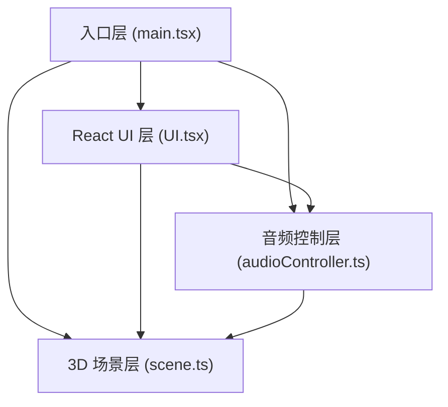

## 1. 架构设计



## 2. 技术栈说明

- **前端框架**：React 18 + TypeScript
- **构建工具**：Vite + @vitejs/plugin-react
- **3D 渲染**：Three.js
- **音频处理**：Web Audio API + Tone.js
- **状态管理**：React useState/useRef（轻量级场景）
- **样式方案**：原生 CSS + CSS 变量（暗色主题、毛玻璃效果）
- **工具库**：uuid（唯一标识）

## 3. 项目文件结构

```
auto90/
├── package.json
├── vite.config.js
├── tsconfig.json
├── index.html
└── src/
    ├── main.tsx          # React 入口，挂载场景和控制面板
    ├── scene.ts          # Three.js 场景管理
    ├── audioController.ts # 音频控制与分析
    └── UI.tsx            # React 控制面板组件
```

## 4. 核心模块定义

### 4.1 audioController.ts

**职责**：音频文件读取、播放控制、实时频率/时域数据分析

**主要接口**：
```typescript
interface AudioController {
  loadFile(file: File): Promise<void>;
  play(): void;
  pause(): void;
  seek(time: number): void;
  getFrequencyData(): Uint8Array;
  getTimeDomainData(): Uint8Array;
  getCurrentTime(): number;
  getDuration(): number;
  isPlaying(): boolean;
  onUpdate(callback: () => void): void;
}
```

**内部实现**：
- `AudioContext` + `AnalyserNode` 进行音频分析
- `Tone.js` 辅助音频播放和调度
- fftSize: 2048，提供高质量频域分析
- 提供 `frequencyBinCount` 个频率数据点

### 4.2 scene.ts

**职责**：Three.js 场景管理、粒子系统创建与更新、渲染循环

**主要接口**：
```typescript
interface SceneManager {
  init(container: HTMLElement): void;
  setAudioData(frequencyData: Uint8Array, timeDomainData: Uint8Array): void;
  setMode(mode: 'waveform' | 'spectrum' | 'sphere'): void;
  setParticleCount(count: number): void;
  setParticleSize(size: number): void;
  setSaturation(value: number): void;
  setRotationSpeed(speed: number): void;
  setBackgroundColor(color: string | 'deepspace' | 'black'): void;
  setPaused(paused: boolean): void;
  dispose(): void;
}
```

**内部实现**：
- `THREE.Scene` + `THREE.PerspectiveCamera` + `THREE.WebGLRenderer`
- `THREE.BufferGeometry` + `THREE.PointsMaterial` 粒子系统
- `AdditiveBlending` 实现发光效果
- 圆形渐变纹理实现辉光
- 三种模式的粒子位置计算逻辑
- 平滑插值过渡动画
- `requestAnimationFrame` 渲染循环

### 4.3 UI.tsx

**职责**：React 控制面板组件，用户交互入口

**主要组件**：
- 文件上传区（支持拖拽）
- 可视化模式切换
- 参数滑块组
- 播放控制（进度条、播放/暂停）
- 背景色选择

**状态管理**：
- 使用 React Hooks 管理 UI 状态
- 通过回调与 audioController 和 sceneManager 通信

## 5. 性能优化策略

1. **粒子系统优化**：
   - 使用 `BufferGeometry` 而非 `Geometry`
   - 单次 `Points` 渲染所有粒子
   - 位置数组复用，避免频繁 GC

2. **渲染优化**：
   - 60fps 渲染循环
   - 暂停时降低渲染频率
   - 使用 `PixelRatio` 限制高 DPI 设备渲染压力

3. **音频分析优化**：
   - 合理的 fftSize（2048）
   - 分析数据缓存，避免重复计算

4. **内存管理**：
   - 组件卸载时 dispose Three.js 资源
   - 正确清理 AudioContext
