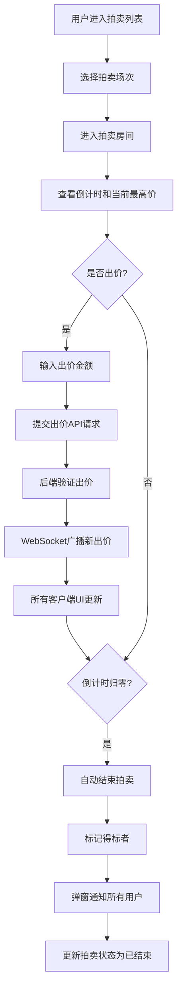

## 1. 产品概述

一个轻量级的在线二手商品实时拍卖平台，为个人卖家和买家提供高效的拍卖交易服务。
- 解决手动记录出价和计时的低效问题，实现拍卖全流程自动化管理
- 目标用户：小型跳蚤市场运营者、个人二手交易者
- 市场价值：降低拍卖运营成本，提升交易效率和用户体验

## 2. 核心功能

### 2.1 用户角色

| 角色 | 注册方式 | 核心权限 |
|------|----------|----------|
| 卖家 | 系统预置用户 | 创建拍卖场次、上架商品、查看拍卖记录 |
| 买家 | 系统预置用户 | 浏览拍卖、实时出价、查看历史记录 |

### 2.2 功能模块

1. **拍卖列表页**：展示活跃拍卖场次、商品缩略图、起拍价、当前最高价、剩余倒计时
2. **拍卖房间页**：商品详情、出价历史、实时出价、大数字倒计时、结束通知
3. **创建拍卖页**：商品信息填写、起拍价设置、加价幅度、拍卖时长
4. **个人中心页**：参与过的拍卖记录、得标状态高亮、最终成交价

### 2.3 页面详情

| 页面名称 | 模块名称 | 功能描述 |
|----------|----------|----------|
| 拍卖列表页 | 拍卖卡片列表 | 交错淡入动画展示、点击跳转拍卖房间 |
| 拍卖列表页 | 导航栏 | 品牌标识、创建拍卖按钮、个人中心入口 |
| 拍卖房间页 | 商品详情区 | 商品大图、名称、描述、卖家信息 |
| 拍卖房间页 | 出价区 | 当前最高价显示、出价输入框、出价按钮 |
| 拍卖房间页 | 倒计时区 | 大字体等宽倒计时、<30秒红色闪烁 |
| 拍卖房间页 | 出价历史 | 实时更新的出价记录列表、交错动画 |
| 拍卖房间页 | 结束弹窗 | 醒目提示框展示得标者和最终价格 |
| 创建拍卖页 | 表单区 | 商品名称、描述、图片URL、起拍价、加价幅度、时长 |
| 个人中心页 | 拍卖记录列表 | 买家/卖家身份标识、得标高亮金色边框 |

## 3. 核心流程

用户浏览拍卖列表 → 点击进入感兴趣的拍卖房间 → 查看商品详情和当前出价 → 输入出价金额并提交 → 系统验证出价合法性 → 通过WebSocket实时广播给所有用户 → 倒计时归零自动结束 → 标记得标者并发送通知 → 用户在个人中心查看历史记录

## 4. 用户界面设计

### 4.1 设计风格
- 主色调：浅米色背景 (#faf3e0)，暖棕色点缀 (#8b6914)
- 强调色：金色得标高亮 (#d4af37)，倒计时红色警示 (#e74c3c)
- 按钮风格：圆角矩形，悬停上浮效果，柔和阴影
- 字体：正文使用优雅衬线字体，倒计时使用等宽字体 (monospace)
- 布局：卡片式布局，圆角矩形，背景模糊叠加渐变遮罩
- 图标：使用 lucide-react 线性图标风格

### 4.2 页面设计概述

| 页面名称 | 模块名称 | UI元素 |
|----------|----------|--------|
| 拍卖列表页 | 拍卖卡片 | 图片模糊背景、半透明渐变遮罩、起拍价¥、当前最高价¥、倒计时等宽字体、悬停上浮3px+加深阴影 |
| 拍卖房间页 | 倒计时 | 大数字、等宽字体、<30秒渐变为红色并闪烁、数字跳动动画 |
| 拍卖房间页 | 出价输入框 | 聚焦淡蓝色光晕、验证反馈 |
| 拍卖房间页 | 出价历史 | 交错淡入动画、时间戳、出价者、金额 |
| 拍卖房间页 | 结束弹窗 | 金色边框、大号字体、动画弹出 |
| 个人中心页 | 得标记录 | 金色边框高亮、"已拍下"标签 |

### 4.3 响应式
- 桌面端优先设计，拍卖卡片多列网格布局
- 移动端适配：卡片单列布局，触控优化按钮尺寸
- 断点：768px以下切换为单列

### 4.4 动效设计
- 页面加载：卡片交错淡入 (staggered fade-in)
- 悬停交互：卡片上浮3px + 阴影加深过渡
- 倒计时：每秒数字跳动微动画，<30秒红色闪烁
- 出价更新：新出价滑入动画，列表项重新排列
- 拍卖结束：弹窗缩放弹出动画 + 金色光晕
