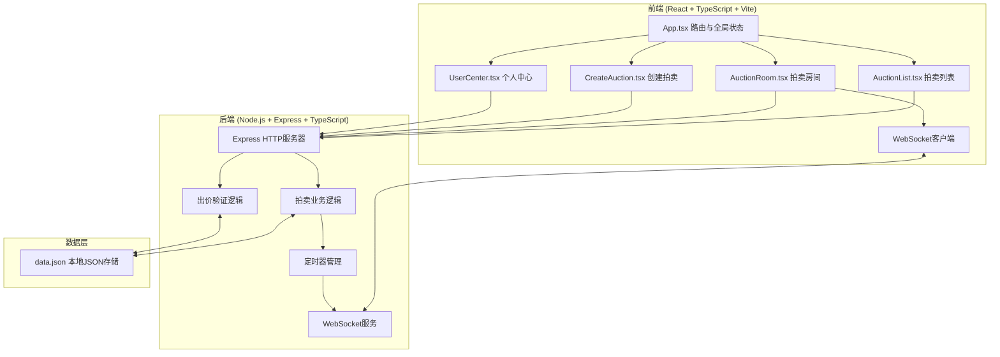
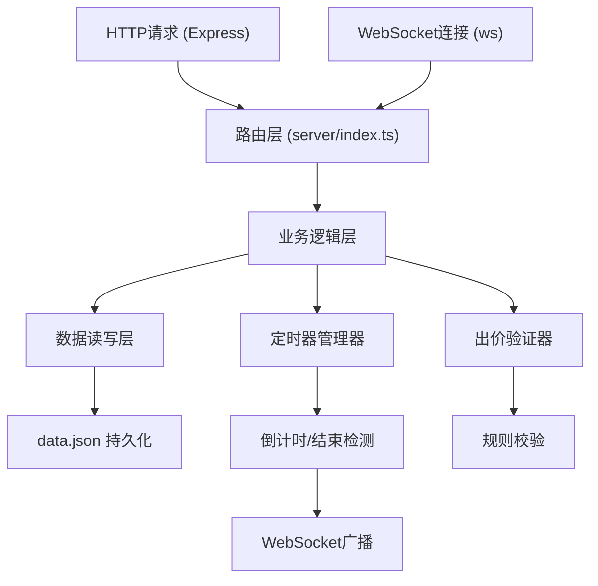
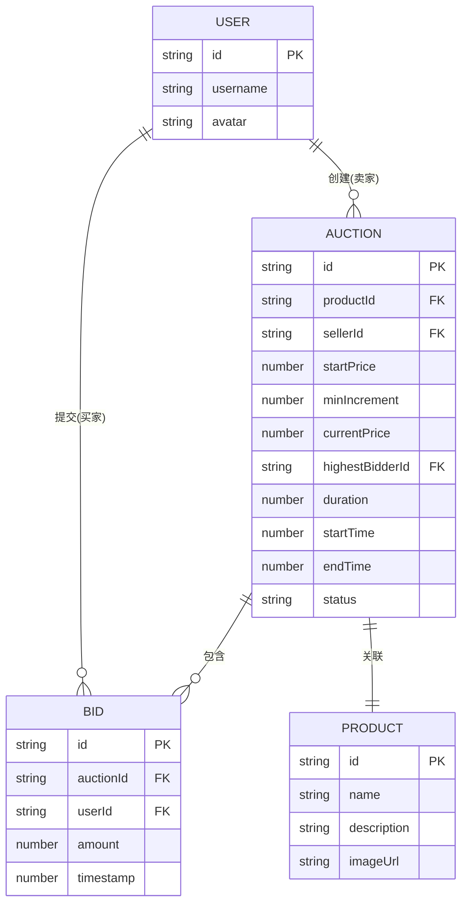

## 1. 架构设计



## 2. 技术描述

- 前端：React@18 + TypeScript + Vite
- 后端：Node.js + Express@4 + TypeScript + ws (WebSocket)
- 构建工具：Vite
- 数据存储：本地JSON文件 (data.json)
- 工具库：uuid (ID生成)、date-fns (日期处理)、body-parser (请求解析)、cors (跨域)
- 状态管理：React useState/useEffect + 自定义hooks

## 3. 路由定义

| 路由 | 用途 |
|------|------|
| / | 拍卖列表首页 |
| /auction/:id | 单个拍卖房间 |
| /create | 创建拍卖场次 |
| /user | 个人中心 |

## 4. API定义

### 4.1 TypeScript类型定义

```typescript
interface User {
  id: string;
  username: string;
  avatar: string;
}

interface Product {
  id: string;
  name: string;
  description: string;
  imageUrl: string;
}

interface Bid {
  id: string;
  auctionId: string;
  userId: string;
  username: string;
  amount: number;
  timestamp: number;
}

interface Auction {
  id: string;
  product: Product;
  sellerId: string;
  sellerName: string;
  startPrice: number;
  minIncrement: number;
  currentPrice: number;
  highestBidderId: string | null;
  highestBidderName: string | null;
  duration: number;
  startTime: number;
  endTime: number;
  status: 'active' | 'ended';
  bids: Bid[];
}
```

### 4.2 RESTful API

| 方法 | 路径 | 描述 | 请求体 | 响应 |
|------|------|------|--------|------|
| GET | /api/auctions | 获取所有拍卖列表 | - | Auction[] |
| GET | /api/auctions/:id | 获取单个拍卖详情 | - | Auction |
| POST | /api/auctions | 创建新拍卖 | {product, startPrice, minIncrement, duration, sellerId} | Auction |
| POST | /api/auctions/:id/bid | 提交出价 | {userId, username, amount} | {success: boolean, bid?: Bid, message?: string} |
| GET | /api/users/:id/auctions | 获取用户参与的拍卖 | - | {asSeller: Auction[], asBuyer: Auction[]} |

### 4.3 WebSocket消息

```typescript
// 客户端发送
interface BidMessage {
  type: 'bid';
  auctionId: string;
  userId: string;
  username: string;
  amount: number;
}

interface JoinMessage {
  type: 'join';
  auctionId: string;
}

// 服务端广播
interface BidUpdateMessage {
  type: 'bid_update';
  auctionId: string;
  bid: Bid;
  currentPrice: number;
  highestBidderId: string;
  highestBidderName: string;
}

interface AuctionEndMessage {
  type: 'auction_end';
  auctionId: string;
  winnerId: string;
  winnerName: string;
  finalPrice: number;
}

interface CountdownUpdateMessage {
  type: 'countdown';
  auctionId: string;
  remainingSeconds: number;
}
```

## 5. 服务端架构图



## 6. 数据模型

### 6.1 数据模型定义



### 6.2 data.json初始数据结构

```json
{
  "users": [
    { "id": "user-1", "username": "小明", "avatar": "" },
    { "id": "user-2", "username": "小红", "avatar": "" },
    { "id": "user-3", "username": "小李", "avatar": "" }
  ],
  "auctions": [],
  "bids": []
}
```
