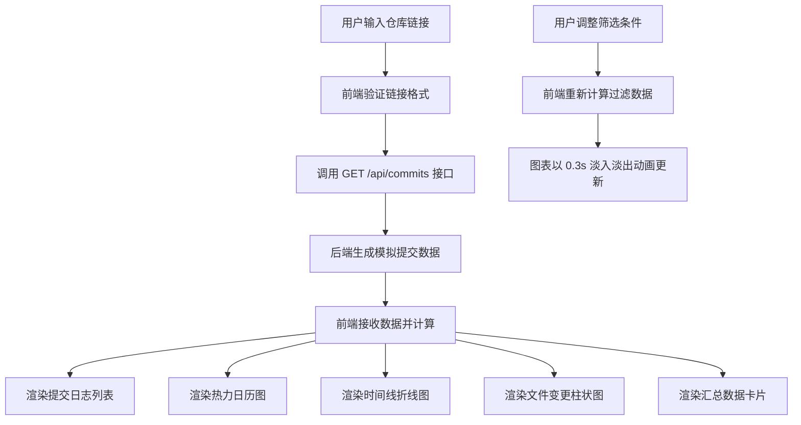

## 1. 产品概述

代码贡献者活动数据可视化仪表盘，帮助小型开源项目团队自动收集和分析代码仓库贡献者活动数据，以可视化时间线形式展示团队协作频率、代码提交模式和个人工作量分布。

- 解决项目经理难以快速掌握团队在多个仓库间协作情况的问题
- 提供直观的多维度数据可视化，支持数据筛选和图表联动

## 2. 核心功能

### 2.1 功能模块
1. **仓库输入模块**：支持 GitHub/GitLab 仓库 HTTPS 链接输入，多仓库管理切换
2. **提交日志模块**：滚动日志列表展示原始提交数据，颜色标签区分提交人，点击展开详情
3. **热力日历图**：Canvas 绘制日历热力图，颜色深浅代表提交次数，支持周/月切换
4. **贡献者时间线**：SVG 绘制多贡献者折线图，X 轴日期 Y 轴提交数，悬停显示数值
5. **文件变更分布图**：按文件扩展名分组柱状图，支持点击筛选
6. **数据汇总卡片**：总提交数、活跃贡献者数、平均每日提交数、最多提交贡献者
7. **控制栏模块**：日期范围选择、贡献者筛选、仓库切换

### 2.2 页面详情
| 页面名称 | 模块名称 | 功能描述 |
|-----------|-------------|---------------------|
| 仪表盘首页 | 控制栏 | 仓库输入、日期范围（7/14/30/90天）、贡献者多选筛选、仓库切换 |
| 仪表盘首页 | 提交日志 | 滚动列表展示提交记录，颜色标签，展开详情显示变更文件 |
| 仪表盘首页 | 热力日历图 | Canvas 绘制，周/月切换，悬停 tooltip 显示提交数 |
| 仪表盘首页 | 时间线折线图 | SVG 多折线，悬停显示数值，0.3s 淡入淡出更新动画 |
| 仪表盘首页 | 文件变更柱状图 | 按扩展名分组，点击筛选联动其他图表 |
| 仪表盘首页 | 汇总卡片 | 四个关键指标，数字滚动计数器动画 |

## 3. 核心流程

用户输入仓库链接 → 系统调用后端 API 获取模拟提交数据 → 前端计算处理数据 → 渲染所有图表和卡片 → 用户操作筛选条件 → 图表以动画形式更新

## 4. 用户界面设计

### 4.1 设计风格
- 深色主题：主背景 #1a1d23，卡片背景 #242833，主文本色 #e0e2e8
- 图表边框：白色细边框（1px solid rgba(255,255,255,0.1)），微弱投影
- 贡献者颜色：高饱和度 Pastel 色系（#ff7f7f、#7fbfff、#7fff7f、#ffff7f、#ff7fff、#7fffff 等）
- 按钮选中状态：渐变色（#6c63ff 到 #a855f7），未选中：透明细边框
- 字体：图表内部使用等宽字体（Consolas, Monaco, monospace）

### 4.2 页面设计概述
| 页面名称 | 模块名称 | UI 元素 |
|-----------|-------------|-------------|
| 仪表盘首页 | 控制栏 | 固定顶部，输入框+按钮组+下拉框，渐变选中效果 |
| 仪表盘首页 | 图表区域 | 三栏自适应布局，占 70% 高度，2:1 宽高比，白色细边框，投影 |
| 仪表盘首页 | 卡片区域 | 固定底部，四张卡片并排，数字滚动动画 |
| 仪表盘首页 | 提交日志 | 滚动列表，颜色标签，展开动画 |

### 4.3 响应式
- Desktop-first 设计，宽度小于 768px 时切换为单列垂直布局
- 所有图表保持 2:1 宽高比
- 触控优化：下拉框、按钮点击区域 >= 44x44px

### 4.4 动画效果
- 图表更新：0.3s 淡入淡出过渡
- 数字卡片：滚动计数器动画
- 下拉框展开：带弹性 easing 的下滑动画
- 勾选动画：选项选中/取消时的勾选动画
- 提交日志展开：平滑高度过渡

### 4.5 性能要求
- 数据加载后前端计算和渲染总时长 <= 500ms（10 贡献者 200 条提交）
- 页面滚动和图表交互帧率 >= 50FPS
