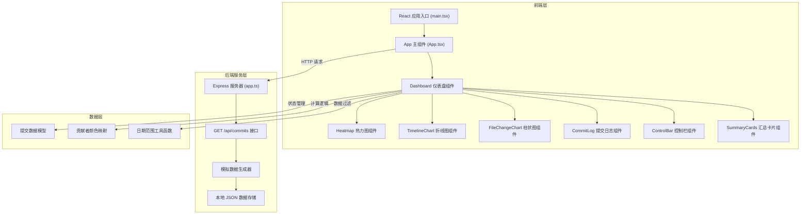
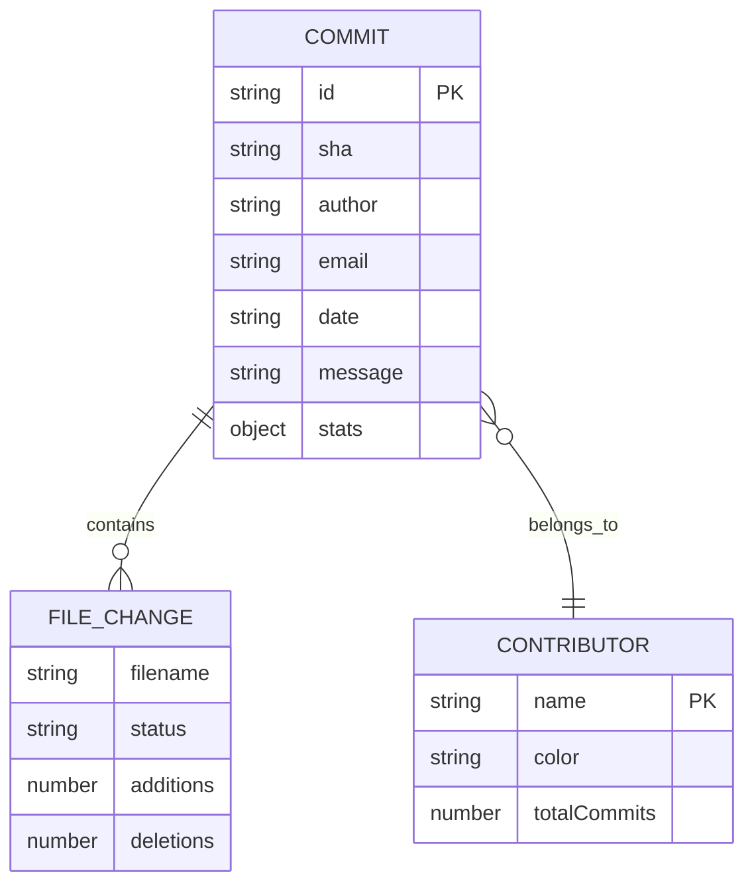

## 1. 架构设计



## 2. 技术描述

- **前端**：React 18 + TypeScript 5 + Vite 5
- **初始化工具**：Vite + @vitejs/plugin-react
- **后端**：Express 4 + TypeScript
- **数据存储**：本地 JSON 文件（模拟数据）
- **图表实现**：纯 Canvas 2D / SVG，不使用任何第三方图表库
- **工具库**：date-fns（日期处理）、uuid（唯一 ID）、cors（跨域）

## 3. 项目文件结构

```
auto94/
├── package.json
├── vite.config.js
├── tsconfig.json
├── index.html
├── src/
│   ├── main.tsx
│   ├── App.tsx
│   ├── types/
│   │   └── index.ts
│   ├── utils/
│   │   ├── colors.ts
│   │   └── dateUtils.ts
│   ├── hooks/
│   │   └── useCommits.ts
│   └── components/
│       ├── Dashboard.tsx
│       ├── ControlBar.tsx
│       ├── CommitLog.tsx
│       ├── Heatmap.tsx
│       ├── TimelineChart.tsx
│       ├── FileChangeChart.tsx
│       └── SummaryCards.tsx
├── server/
│   ├── app.ts
│   └── data/
│       └── mockData.ts
└── .trae/
    └── documents/
        ├── prd.md
        └── technical-architecture.md
```

## 4. API 定义

### 4.1 获取提交数据

**接口**：`GET /api/commits`

**请求参数**：
| 参数 | 类型 | 必填 | 说明 |
|------|------|------|------|
| repo | string | 是 | 仓库 HTTPS 链接 |
| days | number | 否 | 数据范围天数，默认 30 |

**响应数据类型**：
```typescript
interface Commit {
  id: string;
  sha: string;
  author: string;
  email: string;
  date: string;
  message: string;
  files: FileChange[];
  stats: {
    additions: number;
    deletions: number;
    total: number;
  };
}

interface FileChange {
  filename: string;
  status: 'added' | 'modified' | 'deleted';
  additions: number;
  deletions: number;
}

interface CommitsResponse {
  success: boolean;
  data: Commit[];
  repo: string;
  days: number;
  generatedAt: string;
}
```

## 5. 数据模型

### 5.1 核心数据结构



### 5.2 前端状态数据

```typescript
interface DashboardState {
  commits: Commit[];
  filteredCommits: Commit[];
  repos: string[];
  currentRepo: string;
  dateRange: number;
  selectedContributors: string[];
  selectedFileExtension: string | null;
  isLoading: boolean;
}

interface HeatmapData {
  date: string;
  count: number;
  week: number;
  dayOfWeek: number;
}

interface TimelineData {
  date: string;
  contributors: Record<string, number>;
}

interface FileExtensionData {
  extension: string;
  count: number;
  color: string;
}
```

## 6. 关键技术实现要点

### 6.1 图表绘制

- **热力图**：使用 Canvas 2D 绘制，按周/月分组，计算每个格子的颜色透明度
- **折线图**：使用 SVG path 绘制贝塞尔曲线，支持鼠标事件检测
- **柱状图**：使用 Canvas 2D 绘制，支持点击检测和高亮

### 6.2 动画实现

- **图表更新**：使用 CSS `opacity` 配合 `transition: opacity 0.3s ease`
- **数字滚动**：使用 `requestAnimationFrame` 实现计数器动画
- **下拉框弹性动画**：使用 CSS `cubic-bezier(0.68, -0.55, 0.265, 1.55)` 缓动函数

### 6.3 性能优化

- **数据缓存**：使用 React.memo 避免不必要的重渲染
- **防抖处理**：用户输入时添加防抖
- **Canvas 离屏渲染**：复杂图表使用离屏 Canvas 预渲染
- **requestAnimationFrame**：所有动画使用 RAF 确保流畅
