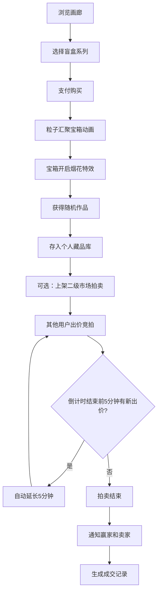

## 1. 产品概述

数字艺术盲盒拍卖平台是一个集盲盒购买、藏品收藏与二级拍卖于一体的在线数字艺术交易平台。创作者可发布系列作品，用户通过购买盲盒随机获取艺术品，并可在二级市场进行拍卖交易。

- 目标用户：数字艺术创作者、收藏家、加密艺术爱好者
- 产品价值：通过盲盒机制增加收藏趣味性，二级拍卖市场赋予艺术品流通价值

## 2. 核心功能

### 2.1 用户角色
| 角色 | 注册方式 | 核心权限 |
|------|----------|----------|
| 普通用户 | 系统内置 | 购买盲盒、收藏管理、上架拍卖、出价竞拍 |
| 创作者 | 系统内置 | 创建盲盒系列、上传作品 |

### 2.2 功能模块
1. **画廊首页**：盲盒系列3D翻转卡片展示、交错入场动画、详情面板
2. **二级市场**：拍卖列表、实时出价、跑马灯最高价展示、倒计时
3. **个人中心**：藏品库网格展示、放大预览、成交记录

### 2.3 页面详情
| 页面名称 | 模块名称 | 功能描述 |
|-----------|-------------|---------------------|
| 画廊首页 | 盲盒卡片区 | 3D翻转卡片阵列、悬停显示库存、点击弹窗详情（轮播图、编码列表、描述） |
| 画廊首页 | 开启动画 | 粒子汇聚宝箱、烟花特效、胜利弹窗展示抽到作品 |
| 二级市场 | 拍卖列表 | 交替行变色、悬停高亮、跑马灯最高价、渐变进度条、动态倒计时 |
| 二级市场 | 出价功能 | 实时出价、自动延长倒计时（最后5分钟内出价延长5分钟） |
| 个人中心 | 藏品库 | 网格布局、点击放大预览、查看出价记录 |
| 个人中心 | 成交记录 | 历史拍卖成交信息列表 |

## 3. 核心流程

用户浏览画廊 → 选择盲盒系列 → 支付购买 → 观看开启动画 → 获得作品 → 查看藏品 → 可选上架拍卖 → 其他用户出价竞拍 → 拍卖结束 → 自动通知双方

## 4. 用户界面设计

### 4.1 设计风格
- **主色调**：深灰(#0a0a0f)到暗紫(#1a0a2e)径向渐变背景
- **强调色**：霓虹蓝(#00f0ff)、荧光粉(#ff00aa)
- **按钮样式**：圆角矩形，边缘发光动效
- **字体**：Orbitron（未来感无衬线标题字体）、Inter（正文字体）
- **布局**：卡片式布局，顶部导航栏
- **视觉特效**：毛玻璃弹窗、发光边框、粒子动画

### 4.2 页面设计概述
| 页面名称 | 模块名称 | UI元素 |
|-----------|-------------|-------------|
| 画廊首页 | 盲盒卡片 | 3D翻转效果、悬停背面信息、交错淡入上浮动画、发光边框 |
| 画廊首页 | 详情弹窗 | 毛玻璃背景、轮播图、编码列表、系列描述 |
| 二级市场 | 拍卖行 | 交替变色、悬停高亮、跑马灯文字、渐变进度条、倒计时 |
| 个人中心 | 藏品网格 | 网格布局、点击放大预览、发光悬停效果 |

### 4.3 响应式
桌面优先设计，适配移动端触摸交互

### 4.4 3D场景指导
- 盲盒卡片使用Three.js实现3D翻转效果
- 开启动画使用粒子系统：彩色粒子从卡片汇聚形成旋转宝箱，开启时爆炸为烟花特效
- 光照：霓虹蓝和荧光粉环境光，营造赛博朋克氛围
