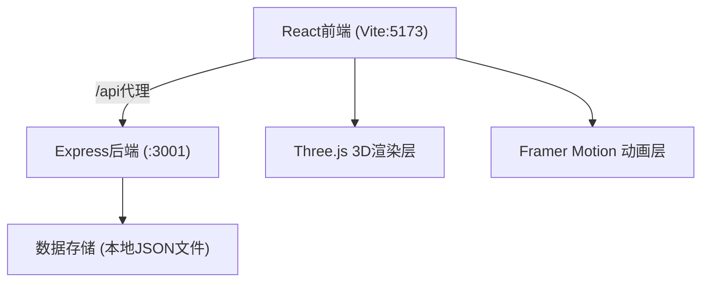
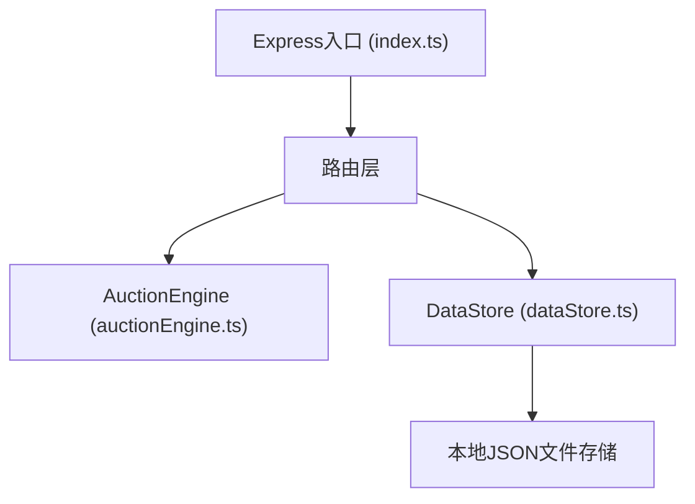
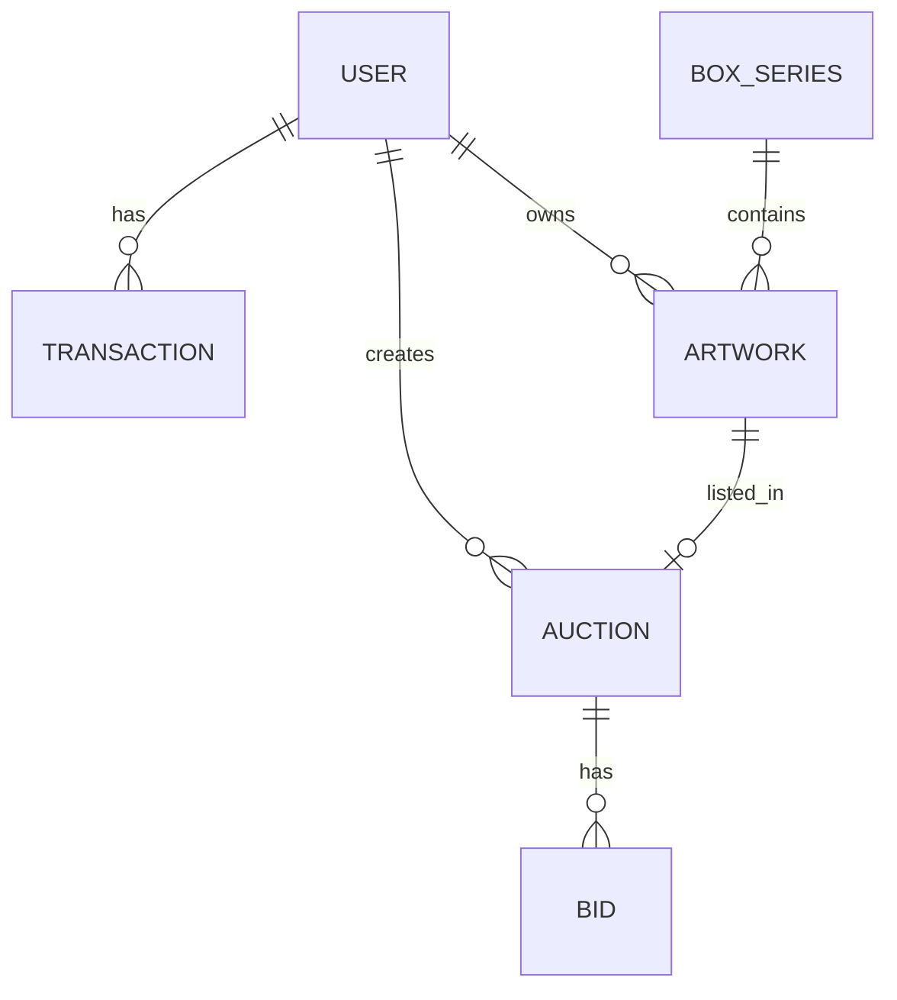

## 1. 架构设计



## 2. 技术描述
- 前端：React@18 + TypeScript + Vite
- 3D渲染：three + @react-three/fiber + @react-three/drei
- 动画：framer-motion
- 路由：react-router-dom
- HTTP通信：axios
- 状态管理：zustand
- 后端：Express@4 + TypeScript
- 数据存储：本地JSON文件
- 唯一ID生成：uuid

## 3. 路由定义
| Route | Purpose |
|-------|---------|
| / | 画廊首页，展示盲盒系列 |
| /auctions | 二级市场拍卖列表 |
| /profile | 个人中心（藏品库+成交记录） |

## 4. API定义

```typescript
// 数据类型定义
interface Artwork {
  id: string;
  code: string; // ART-XXXX-YYYY
  title: string;
  description: string;
  previewImage: string;
  thumbnail: string; // canvas生成的艺术化卡片
  startingPrice: number;
  seriesId: string;
}

interface BoxSeries {
  id: string;
  name: string;
  description: string;
  price: number;
  totalCount: number;
  soldCount: number;
  artworks: Artwork[];
}

interface User {
  id: string;
  name: string;
  balance: number;
  collection: string[]; // artwork ids
}

interface Auction {
  id: string;
  artworkId: string;
  sellerId: string;
  startingPrice: number;
  currentPrice: number;
  highestBidderId: string | null;
  startTime: number;
  endTime: number;
  duration: 24 | 48 | 72;
  bids: Bid[];
  status: 'active' | 'ended';
}

interface Bid {
  id: string;
  userId: string;
  amount: number;
  timestamp: number;
}

interface Transaction {
  id: string;
  type: 'box_purchase' | 'auction_win' | 'auction_sell';
  userId: string;
  artworkId?: string;
  auctionId?: string;
  amount: number;
  timestamp: number;
}

// API接口
// POST /api/boxes/buy { seriesId, userId }
// POST /api/auctions { artworkId, sellerId, startingPrice, duration }
// POST /api/auctions/:id/bid { userId, amount }
// GET /api/auctions/:id
// GET /api/series
// GET /api/users/:id
// GET /api/users/:id/transactions
```

## 5. 服务器架构图



## 6. 数据模型

### 6.1 数据模型定义


### 6.2 初始数据
- 预置2个盲盒系列，每个系列包含6件作品
- 预置1个测试用户（余额10000）
- JSON存储文件：data/series.json, data/users.json, data/auctions.json, data/transactions.json
