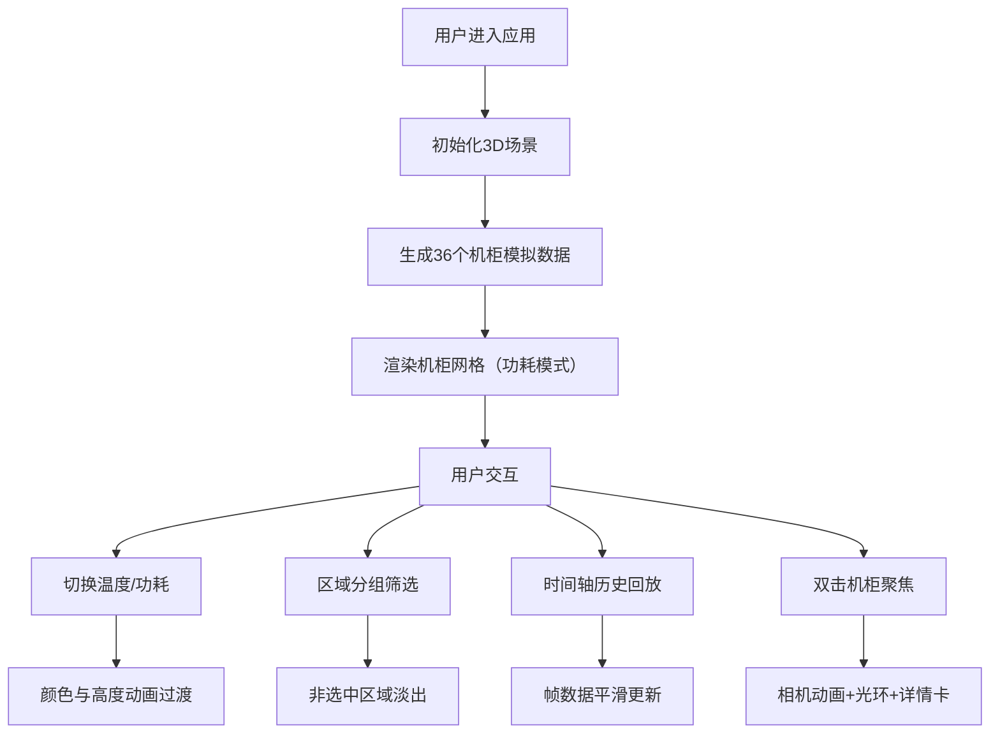

## 1. 产品概述

数据中心机柜功耗与温度3D热力图监控应用，为运维人员提供直观的三维可视化界面，实时感知数据中心内机柜的功耗与温度分布状态，支持历史数据回放和热点区域自动聚焦。

- **核心目的**：通过3D可视化技术，帮助运维人员快速定位高功耗、高温机柜，提升数据中心运维效率
- **目标用户**：数据中心运维人员、设施管理人员
- **产品价值**：将抽象的数值数据转化为直观的三维热力图，降低认知负荷，提高故障响应速度

## 2. 核心功能

### 2.1 功能模块

1. **3D机柜场景**：6×6机柜网格布局，半透明立方体表示机柜，颜色与高度映射功耗/温度值
2. **数据维度切换**：温度/功耗一键切换，颜色渐变与高度映射同步转换
3. **分组筛选**：A/B/C三个区域分组筛选，非选中区域机柜淡出
4. **历史回放**：时间轴滑块控制，支持12帧历史数据回放
5. **自动聚焦**：双击机柜自动聚焦，显示详细信息卡片
6. **交互工具**：轨道控制、悬停提示、选中光环

### 2.2 页面详情

| 页面名称 | 模块名称 | 功能描述 |
|---------|---------|---------|
| 主界面 | 3D场景区 | 左侧80%区域，三维机柜展示，支持旋转/缩放/平移 |
| 主界面 | 控制面板 | 右侧320px固定宽度，数据切换、分组筛选、时间轴、详情卡片 |
| 主界面 | 悬停提示 | 鼠标悬停机柜时显示机柜ID、数值、所属区域 |
| 主界面 | 聚焦详情 | 双击机柜后展开详细信息卡片 |

## 3. 核心流程

### 3.1 主流程

用户进入应用 → 3D场景自动渲染36个机柜 → 默认显示功耗数据 → 用户可切换温度/功耗 → 可按区域筛选 → 可拖动时间轴回放历史 → 双击机柜聚焦查看详情

### 3.2 流程图

## 4. 用户界面设计

### 4.1 设计风格

- **设计主题**：深色科技感 / 数据中心运维风格
- **主色调**：背景 #1a1a2e，面板 #16213e，主色 #0f3460，强调色 #e94560
- **文字颜色**：#e0e0e0
- **功耗渐变**：红色（低）→ 绿色（高）
- **温度渐变**：蓝色（低）→ 红色（高）
- **字体**：现代无衬线字体，标题24px粗体
- **按钮风格**：圆角胶囊形，选中状态强调色填充
- **整体布局**：左侧80% 3D场景 + 右侧320px控制面板

### 4.2 页面设计概述

| 页面名称 | 模块名称 | UI元素 |
|---------|---------|--------|
| 主界面 | 3D场景 | 半透明立方体机柜、白色顶部小灯、网格地面、阴影投射、柔和环境光 |
| 主界面 | 控制面板 | flex列布局、分割线分隔、无滚动条、深色背景 |
| 主界面 | 切换按钮 | 胶囊形圆角、强调色选中态、悬停过渡 |
| 主界面 | 时间轴 | 细长导轨、白色刻度点、滑块拖拽、时间戳显示 |
| 主界面 | 悬停提示 | 圆角背景、浅阴影、跟随鼠标、右侧淡出 |
| 主界面 | 详情卡片 | 展开动画、机柜ID/功耗/温度/区域信息 |

### 4.3 3D场景设计

- **环境**：深色背景 #1a1a2e，半透明方格地面，微弱网格线
- **光照**：柔和环境光 + 方向光投射阴影
- **相机**：透视相机，初始视角45度俯视
- **控制**：OrbitControls，支持旋转/缩放/平移
- **机柜材质**：MeshStandardMaterial带光泽，半透明
- **机柜顶部**：白色点状小灯，亮度随机柜高度变化
- **选中效果**：半透明黄色光环，2秒持续
- **动画**：颜色/高度0.3秒easeInOut过渡，分组切换0.5秒淡出，聚焦1秒相机动画

### 4.4 响应式设计

桌面端优先设计，控制面板固定宽度320px，3D场景自适应剩余空间。

### 4.5 性能要求

- 36个机柜场景帧率 ≥ 50fps
- 机柜材质更新（颜色+高度）不造成帧率抖动
- 历史回放每帧数据更新耗时 ≤ 15ms
