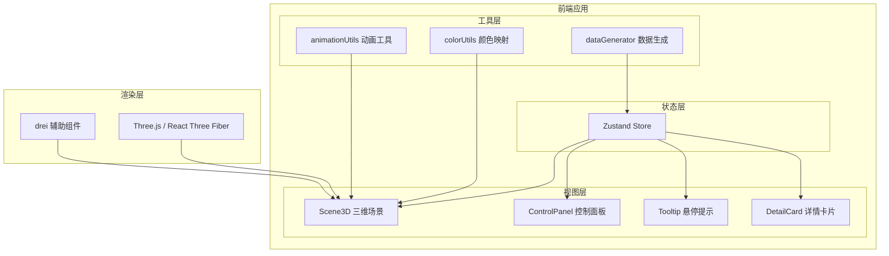

## 1. 架构设计

### 1.1 架构图



### 1.2 数据流向

1. `dataGenerator.ts` → 生成模拟数据 → `store.ts` 初始化状态
2. `store.ts` → 状态更新 → `Scene3D.tsx` 重新渲染机柜
3. `ControlPanel.tsx` → 用户交互 → `store.setFilter/setProgress` → 状态更新
4. `Scene3D.tsx` → 双击事件 → `store.setSelected` → `DetailCard` 展开

## 2. 技术描述

### 2.1 技术栈

| 技术 | 版本 | 用途 |
|-----|-----|-----|
| React | 18.x | UI框架 |
| TypeScript | 5.x | 类型安全 |
| Vite | 5.x | 构建工具 |
| Three.js | 0.160.x | 3D渲染引擎 |
| @react-three/fiber | 8.x | React Three.js 渲染器 |
| @react-three/drei | 9.x | Three.js 辅助组件库 |
| zustand | 4.x | 状态管理 |
| d3-scale | 7.x | 数值缩放与颜色映射 |
| uuid | 9.x | 唯一ID生成 |

### 2.2 文件结构

```
src/
├── main.tsx              # 应用入口
├── App.tsx               # 根组件
├── store.ts              # Zustand 全局状态
├── components/
│   ├── Scene3D.tsx       # 3D场景组件
│   ├── ControlPanel.tsx  # 控制面板组件
│   ├── Cabinet.tsx       # 单机柜组件
│   ├── Tooltip.tsx       # 悬停提示组件
│   ├── DetailCard.tsx    # 详情卡片组件
│   └── Ground.tsx        # 地面网格组件
├── utils/
│   ├── dataGenerator.ts  # 模拟数据生成
│   ├── colorMapping.ts   # 颜色映射工具
│   └── constants.ts      # 常量配置
└── types/
    └── index.ts          # 类型定义
```

### 2.3 调用关系

- `main.tsx` → 渲染 `App.tsx`
- `App.tsx` → 组合 `Scene3D` + `ControlPanel` + `Tooltip` + `DetailCard`
- `Scene3D.tsx` → 使用 `Cabinet`、`Ground`、`drei` 组件
- `Cabinet.tsx` → 调用 `colorMapping.ts` 计算颜色
- `ControlPanel.tsx` → 调用 `store` 的 action 方法
- `store.ts` → 初始化时调用 `dataGenerator.ts`

## 3. 数据模型

### 3.1 机柜数据结构

```typescript
interface CabinetData {
  id: string;
  cabinetId: number;
  x: number;
  z: number;
  power: number;      // 功耗 200-800W
  temperature: number; // 温度 20-60°C
  zone: 'A' | 'B' | 'C';
  history: FrameData[]; // 历史帧数据
}

interface FrameData {
  timestamp: number;
  power: number;
  temperature: number;
}
```

### 3.2 全局状态

```typescript
interface AppState {
  items: CabinetData[];
  filter: 'all' | 'A' | 'B' | 'C';
  mode: 'power' | 'temperature';
  progress: number;     // 0-1 时间轴进度
  selectedId: string | null;
  hoveredId: string | null;
  setData: (items: CabinetData[]) => void;
  setFilter: (filter: 'all' | 'A' | 'B' | 'C') => void;
  setMode: (mode: 'power' | 'temperature') => void;
  setProgress: (progress: number) => void;
  setSelectedId: (id: string | null) => void;
  setHoveredId: (id: string | null) => void;
  getCurrentFrameData: (id: string) => FrameData;
}
```

## 4. 核心技术方案

### 4.1 3D渲染方案

- 使用 `@react-three/fiber` 声明式渲染 Three.js 场景
- 使用 `@react-three/drei` 的 `OrbitControls` 实现相机控制
- 使用 `useFrame` 钩子实现动画循环
- 机柜使用 `MeshStandardMaterial` 实现光泽材质
- 使用 `drei` 的 `Html` 组件实现 3D 空间中的 DOM 元素

### 4.2 动画方案

- 颜色/高度过渡：使用 `useFrame` + `THREE.MathUtils.lerp` 实现平滑插值
- 相机动画：使用 `drei` 的 `CameraControls` 或自定义 tween 动画
- UI 动画：CSS transition 实现淡入淡出、展开收起

### 4.3 性能优化

- 复用材质实例，避免重复创建
- 使用 `instancedMesh` 优化大量重复几何体（如机柜）
- 动画仅在需要时触发，避免无效渲染
- 使用 `useMemo` 缓存计算结果

### 4.4 颜色映射

- 功耗模式：`d3.scaleLinear` 从红色到绿色渐变
- 温度模式：`d3.scaleLinear` 从蓝色到红色渐变
- 数值范围映射到颜色空间
