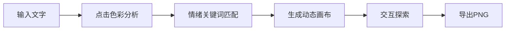

## 1. 产品概述

编织情绪笔记是一款将文字情绪视觉化的创新型情绪记录应用，让用户在记录心情的同时，通过动态艺术画布直观呈现文字背后的情感色彩。

- 主要功能：文字情绪分析、动态视觉呈现、交互探索
- 目标用户：喜欢写日记、关注情绪健康的大众用户
- 产品价值：让日记不再是枯燥的文字记录，而是一幅会呼吸的情绪艺术作品

## 2. 核心功能

### 2.1 用户角色

| 角色 | 注册方式 | 核心权限 |
|------|----------|----------|
| 普通用户 | 无需注册 | 使用全部功能 |

### 2.2 功能模块

1. **写笔记页面**：文字输入区、情绪分析引擎、动态艺术画布、情绪结果展示
2. **情绪日历页面**：日历网格、历史情绪占比可视化
3. **探索画廊页面**：展示精选情绪艺术作品

### 2.3 页面详情

| 页面名称 | 模块名称 | 功能描述 |
|---------|----------|----------|
| 写笔记 | 文字输入面板 | 支持输入/粘贴最多1000字文字，分段处理 |
| 写笔记 | 色彩分析按钮 | 触发情绪分析，生成对应视觉效果 |
| 写笔记 | 动态画布 | 渲染粒子、线条、波形等动态艺术元素 |
| 写笔记 | 交互提示卡 | 鼠标悬停显示情绪关键词和置信度 |
| 写笔记 | 导出按钮 | 导出当前画布为PNG图片 |
| 写笔记 | 情绪结果卷轴 | 底部弹出详细情绪占比条形图 |
| 情绪日历 | 日历网格 | 按日期展示历史情绪 |
| 探索画廊 | 作品展示 | 展示精选情绪艺术 |

## 3. 核心流程

用户在写笔记页面输入文字 → 点击色彩分析 → 系统分析每段文字情绪 → 画布生成动态视觉 → 用户交互探索 → 导出为艺术画布 → 保存或浏览历史记录

## 4. 用户界面设计

### 4.1 设计风格

- 主色调：深灰(#1e1e2e）、炭黑(#11111b)、纯黑(#000000)
- 强调色：淡紫(#cba6f7)、浅蓝(#89b4fa)
- 情绪色：暖橙(喜悦)、冷蓝(悲伤)、红色(愤怒)、柔和绿(宁静)
- 布局：左右分栏布局，底部三标签导航
- 字体：现代无衬线字体，深色主题
- 圆角毛玻璃效果、渐变边框动画

### 4.2 页面设计概述

| 页面名称 | 模块名称 | UI元素 |
|---------|----------|--------|
| 写笔记 | 文字输入面板 | 深灰背景，炭黑输入区，渐变聚焦边框 |
| 写笔记 | 动态画布 | 纯黑背景，动态粒子/线条/波形 |
| 写笔记 | 交互提示卡 | 毛玻璃背景，圆角8px，0.2s入场 |
| 写笔记 | 情绪卷轴 | 底部300px高度，0.5s上滑 |
| 情绪日历 | 日历网格 | 每格颜色按主导情绪渐变 |
| 底部导航 | 三标签 | 水平滑动0.3s切换 |

### 4.3 响应式设计

- 桌面优先设计，支持窗口变化自适应

### 4.4 动态效果规范

- 喜悦：暖橙色渐变 + 向上飘动圆形粒子（6-12px随机，2-4s周期
- 悲伤：冷蓝色渐变 + 缓慢下落细长线条（2px宽度，0.5透明度
- 愤怒：红色锯齿波形 + 快速闪烁三角形粒子（0.5s频率）
- 段落切换：0.8s淡入淡出过渡
- 导出闪光：0.3s白色全屏遮罩
