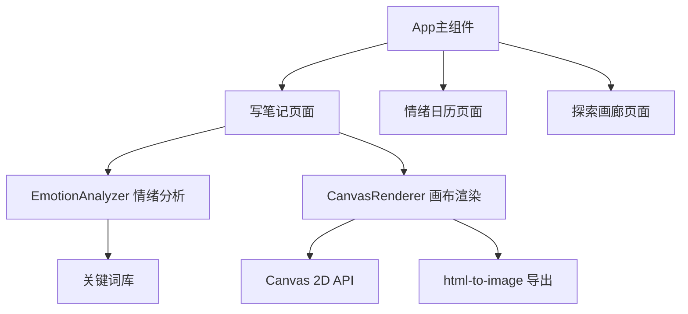

## 1. 架构设计



## 2. 技术描述

- 前端框架：React 18 + TypeScript
- 构建工具：Vite
- 画布渲染：Canvas 2D API
- 图片导出：html-to-image
- 状态管理：React useState/useRef

## 3. 项目文件结构

```
package.json
vite.config.js
tsconfig.json
index.html
src/
  App.tsx              主组件
  EmotionAnalyzer.ts   情绪分析
  CanvasRenderer.tsx  画布渲染
  EmotionCalendar.tsx 情绪日历
```

## 4. 数据模型

### 4.1 情绪类型定义

```typescript
interface EmotionResult {
  keyword: string;      // 情绪关键词
  confidence: number;   // 置信度 0-1
  color: string;         // 主题色
}

interface ParagraphAnalysis {
  paragraph: string;
  emotions: EmotionResult[];
  dominant: EmotionResult;
}
```

### 4.2 情绪关键词库

- 喜悦：开心、快乐、高兴、愉快、幸福、欣喜、兴奋、欢乐
- 悲伤：难过、伤心、痛苦、忧伤、失落、沮丧、绝望、哭泣
- 愤怒：生气、愤怒、恼火、气愤、暴怒、愤慨、恼怒、怒火
- 宁静：平静、安宁、宁静、平和、安静、舒缓、淡定、从容
