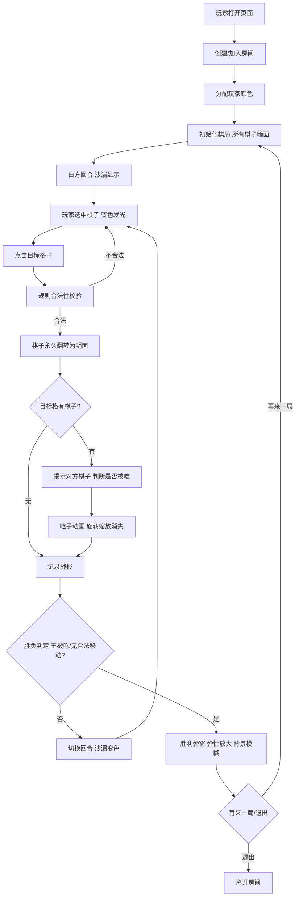

## 1. 产品概述

暗影棋局是一款融合国际象棋与暗棋规则的双人策略对战游戏，玩家需记忆与推理隐藏棋子信息，每一步都可能反转战局，专为喜欢烧脑对决的玩家设计。

- 核心价值：将传统国际象棋的深度策略与暗棋的信息不对称结合，创造全新的推理对战体验
- 目标用户：喜欢策略游戏、国际象棋爱好者、追求烧脑挑战的双人玩家

## 2. 核心功能

### 2.1 用户角色

| 角色 | 加入方式 | 核心权限 |
|------|----------|----------|
| 白方玩家 | 房间链接加入，自动分配颜色 | 操作白方棋子，查看战报 |
| 黑方玩家 | 房间链接加入，自动分配颜色 | 操作黑方棋子，查看战报 |

### 2.2 功能模块

1. **游戏主界面**：木质棋盘、回合指示器、左右信息栏、战报区域
2. **棋盘交互系统**：棋子选中高亮、合法落子提示、移动揭示逻辑、吃子动画
3. **游戏规则引擎**：国际象棋走法校验、暗棋揭示机制、胜负判定
4. **网络同步系统**：双人实时对战、WebSocket状态广播、房间管理
5. **胜利结算系统**：胜利弹窗、再来一局、退出功能

### 2.3 页面详情

| 页面名称 | 模块名称 | 功能描述 |
|----------|----------|----------|
| 游戏主界面 | 木质棋盘 | 8x8交替色格子，60px每格，3px深棕阴影边框 |
| 游戏主界面 | 暗面棋子 | 灰色圆形(40px)带问号，颜色#757575 |
| 游戏主界面 | 回合指示器 | 顶部沙漏图标，金色(#FFD700)到红色(#F44336)渐变显示时间流逝 |
| 游戏主界面 | 棋子选中效果 | 2px亮蓝色(#2196F3)发光边框，0.3s动画 |
| 游戏主界面 | 明面棋子 | 国际象棋符号，白方#FFFFFF带1px黑描边，黑方#212121 |
| 游戏主界面 | 吃子动画 | 0.5s旋转缩放消失效果 |
| 游戏主界面 | 战报区域 | 右下角200x160px，半透明黑底#00000040，圆角8px，显示时间戳和胜负信息 |
| 游戏主界面 | 胜利弹窗 | 中央300x200px，#1A237E到#283593渐变，圆角16px，0.4s弹性放大动画，背景模糊6px |
| 游戏主界面 | 再来一局按钮 | 填充色#4CAF50，按下位移2px |
| 游戏主界面 | 退出按钮 | 边框色#F44336 |
| 游戏主界面 | 白方信息栏 | 左侧15%宽度，#F5F5F5背景，圆角8px，内边距12px，显示已揭示棋子 |
| 游戏主界面 | 黑方信息栏 | 右侧对称样式 |
| 游戏主界面 | 总步数标签 | 右下角12px字体#9E9E9E |
| 游戏主界面 | 悬停高亮 | 渐变#E0E0E0，0.2s过渡 |
| 游戏主界面 | 落子冲击波 | 白色圆形扩散，1.5倍格宽，透明度0.4到0 |

## 3. 核心流程

玩家打开页面后自动加入房间（或创建房间），系统分配白方/黑方身份。白方先手，双方轮流操作：选中己方棋子→选择目标格→执行移动→棋子揭示→判断吃子→检查胜负→切换回合。当一方王被吃或无合法移动时，游戏结束，显示胜利弹窗。

## 4. 用户界面设计

### 4.1 设计风格

- **主色调**：木质棋盘色 #DEB887（浅棕）、#8B4513（深棕）交替，边框阴影 #5D4037
- **辅助色**：
  - 白方棋子 #FFFFFF（带1px黑色描边）
  - 黑方棋子 #212121
  - 暗面棋子灰色 #757575
  - 选中高亮蓝色 #2196F3
  - 沙漏金色 #FFD700 → 红色 #F44336
  - 信息栏背景 #F5F5F5
  - 胜利弹窗渐变 #1A237E → #283593
  - 再来一局 #4CAF50，退出按钮边框 #F44336
  - 悬停高亮 #E0E0E0
- **按钮样式**：圆角矩形，填充按钮有按下位移效果，边框按钮有描边
- **字体**：国际象棋符号使用 Unicode 象棋字符，普通文字使用无衬线字体
- **布局风格**：棋盘居中占65%，左右各15%信息栏，顶部回合指示器
- **动效**：
  - 棋子选中：0.3s发光脉冲
  - 吃子：0.5s旋转+缩放消失
  - 胜利弹窗：0.4s从中心弹性放大
  - 落子：冲击波扩散
  - 悬停：0.2s渐变过渡

### 4.2 页面设计概述

| 页面名称 | 模块名称 | UI元素 |
|----------|----------|--------|
| 游戏主界面 | 棋盘容器 | 8x8网格div，60px每格，交替色背景，3px阴影边框，居中占65%宽度 |
| 游戏主界面 | 棋子渲染 | 绝对定位于格子中心，暗面灰色圆形+问号，明面Unicode符号 |
| 游戏主界面 | 选中效果 | CSS box-shadow + animation，0.3s脉冲循环 |
| 游戏主界面 | 回合指示器 | 顶部居中，SVG沙漏图标+渐变填充，旁边显示玩家名称 |
| 游戏主界面 | 信息栏卡片 | 圆角8px，#F5F5F5背景，内边距12px，文字#424242 |
| 游戏主界面 | 战报面板 | 固定右下角，position:fixed，半透明黑底，overflow-y滚动 |
| 游戏主界面 | 胜利弹窗 | position:fixed，z-index高层，backdrop-filter:blur(6px)，弹性动画 |

### 4.3 响应式设计

- **桌面端（≥900px）**：棋盘占65%，左右信息栏各15%，完整布局
- **移动端（<900px）**：棋盘缩至75%，隐藏左右信息栏，改用顶部可滑动面板显示双方信息

### 4.4 性能要求

- 操作延迟 < 200ms（点击到界面反馈）
- 帧率稳定 60fps
- CSS动画优先使用 transform 和 opacity 以保证硬件加速
