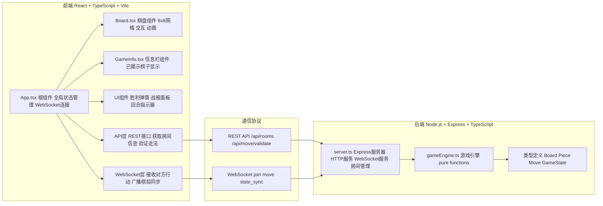
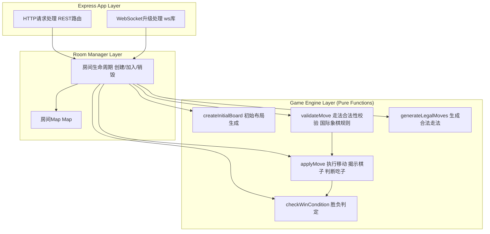
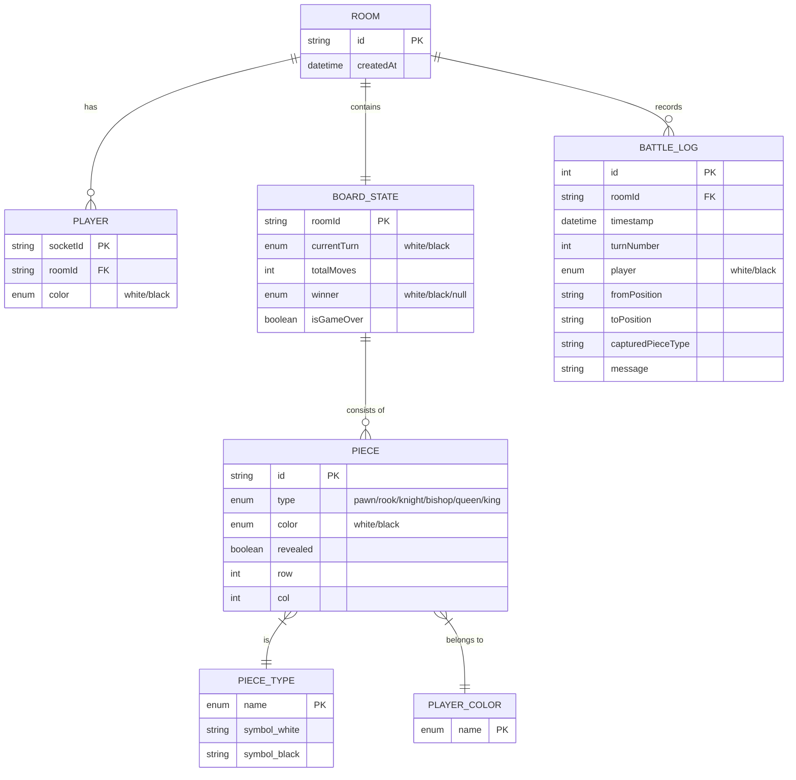

## 1. 架构设计



## 2. 技术描述

- **前端**：React 18 + TypeScript + Vite，CSS Modules/内联样式实现动画
- **后端**：Express 4 + TypeScript + ws (WebSocket) + uuid
- **数据存储**：内存缓存（Map存储房间状态），无需数据库
- **初始化工具**：Vite初始化React+TypeScript模板，手动添加Express后端

## 3. 路由定义

| 路由 | 方法 | 用途 |
|------|------|------|
| / | GET | 前端入口（Vite提供） |
| /api/rooms | POST | 创建新房间，返回roomId |
| /api/rooms/:roomId | GET | 获取房间信息（玩家状态、当前棋局） |
| /api/move/validate | POST | 验证走法合法性，返回校验结果 |
| /ws | Upgrade | WebSocket连接端点 |

## 4. API定义

### 4.1 TypeScript 类型定义

```typescript
// shared types - 前后端共用
type PlayerColor = 'white' | 'black';
type PieceType = 'pawn' | 'rook' | 'knight' | 'bishop' | 'queen' | 'king';

interface Piece {
  id: string;
  type: PieceType;
  color: PlayerColor;
  revealed: boolean;       // 是否已被揭示
  position: Position;      // 当前位置
}

interface Position {
  row: number;             // 0-7
  col: number;             // 0-7
}

interface Move {
  pieceId: string;
  from: Position;
  to: Position;
  capturedPieceId?: string; // 被吃棋子ID
}

interface BoardState {
  pieces: Piece[];
  currentTurn: PlayerColor;
  totalMoves: number;
  winner: PlayerColor | null;
  isGameOver: boolean;
}

interface Room {
  id: string;
  players: {
    white?: string;  // socketId
    black?: string;
  };
  board: BoardState;
  battleLog: BattleLogEntry[];
  createdAt: number;
}

interface BattleLogEntry {
  timestamp: number;
  turn: number;
  player: PlayerColor;
  move: Move;
  capturedPiece?: Piece;
  message: string;
}

// WebSocket事件
type WSClientMessage = 
  | { type: 'join'; roomId: string }
  | { type: 'move'; roomId: string; move: Move; playerColor: PlayerColor };

type WSServerMessage =
  | { type: 'room_joined'; roomId: string; playerColor: PlayerColor; board: BoardState }
  | { type: 'player_joined'; playerColor: PlayerColor }
  | { type: 'state_update'; board: BoardState; battleLog: BattleLogEntry[] }
  | { type: 'move_invalid'; reason: string }
  | { type: 'game_over'; winner: PlayerColor; board: BoardState };
```

### 4.2 REST API 输入输出

**POST /api/rooms**
- Request: `{}`
- Response: `{ roomId: string; playerColor: 'white' }`

**GET /api/rooms/:roomId**
- Response: `{ roomId: string; hasWhite: boolean; hasBlack: boolean; board: BoardState; battleLog: BattleLogEntry[] }`

**POST /api/move/validate**
- Request: `{ roomId: string; move: Move; playerColor: PlayerColor }`
- Response: `{ valid: boolean; reason?: string; capturedPiece?: Piece }`

## 5. 服务器架构图



## 6. 数据模型

### 6.1 数据模型定义



### 6.2 游戏引擎核心逻辑说明

**初始布局**：
- 与国际象棋相同，白方(0-1行)、黑方(6-7行)，兵2-5列各8个，底线车、马、象、后、王
- 初始所有棋子 revealed=false

**走法校验**：
- 按国际象棋标准规则（兵、车、马、象、后、王各走法）
- 特殊规则：王车易位、吃过路兵——为简化不实现
- 兵升变：到达底线升变为后

**揭示逻辑**：
- 任意棋子移动后永久 revealed=true
- 目标格有棋子时，双方均 revealed=true
- 判断目标棋子是否为对方颜色，是则被吃

**胜负判定**：
- 王被吃 → 对方胜利
- 当前玩家无任何合法可走棋子（所有已揭示+未揭示己方棋子均无合法走法）→ 对方胜利
