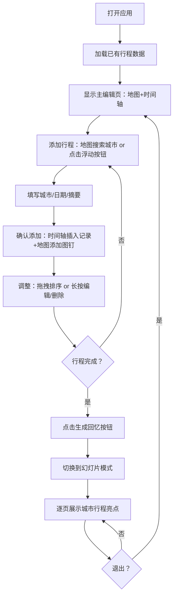

## 1. 产品概述
旅行足迹规划器 - 帮助旅行达人通过可视化方式规划行程、记录足迹并生成回忆时间轴的应用，解决多人结伴旅行时行程不统一、记忆碎片化难以回顾的问题。

- 目标用户：热爱旅行的个人或小团体用户，希望以可视化方式管理旅行计划并生成精美回忆
- 产品价值：将行程规划、位置可视化、回忆生成整合为一体，提供从规划到回顾的完整体验

## 2. 核心功能

### 2.1 用户角色
本产品为单用户设计，无需角色区分。

### 2.2 功能模块
1. **主编辑页面**：左侧交互式地图组件、右侧行程时间轴
2. **地图视图**：路网样式底图、城市搜索、彩色图钉标记、信息卡片弹出
3. **时间轴组件**：按天排列行程记录、拖拽排序、长按上下文菜单、新增/编辑/删除
4. **回忆幻灯片**：全屏幻灯片展示、城市渐变背景、自动翻页、手动导航、行程亮点动画展示

### 2.3 页面详情
| 页面名称 | 模块名称 | 功能描述 |
|-----------|-------------|---------------------|
| 主编辑页 | 顶部导航栏 | 包含应用标题和"生成回忆"按钮 |
| 主编辑页 | 地图视图（左35%） | Leaflet交互式地图，路网样式，支持城市搜索，点击城市添加图钉，图钉弹出信息卡片 |
| 主编辑页 | 时间轴（右60%） | 按天线性排列行程记录，每条显示日期、城市、摘要、缩略图，支持拖拽排序，长按弹出菜单 |
| 主编辑页 | 浮动添加按钮 | 右下角圆形按钮，点击弹出新增行程模态框 |
| 新增模态框 | 表单组件 | 城市下拉选择、日期选择器、摘要文本框、确认/取消按钮 |
| 回忆幻灯片 | 全屏播放器 | 每城市一页，渐变背景，城市名动画显示，行程亮点逐行出现，自动倒计时翻页，左右箭头手动翻页，退出按钮 |

## 3. 核心流程
用户打开应用后，在主编辑页查看已有行程。可通过地图搜索城市点击添加图钉，或通过右下角浮动按钮在时间轴新增行程记录。时间轴记录支持拖拽调整顺序、长按编辑或删除。所有行程完成后，点击顶部"生成回忆"按钮，切换到全屏幻灯片模式，以精美动画逐页展示每个城市的行程亮点，支持自动播放和手动导航。

## 4. 用户界面设计

### 4.1 设计风格
- **主背景色**：暖白 #FFF8F0
- **卡片背景**：白色 #FFFFFF，柔和阴影从 #0000000D 到 #0000001A
- **主色调（交互元素）**：绿色 #4CAF50
- **强调色（回忆按钮）**：渐变 #FF7043 到 #FFA726
- **图钉循环色**：#FF7043、#42A5F5、#66BB6A、#FFA726、#AB47BC
- **地图样式**：背景 #F5F5F5，道路 #E0E0E0，水域 #B3D4FC
- **字体**：系统默认无衬线字体，字号层级分明
- **圆角**：遵循 Material Design 规范（搜索框8px、模态框16px、图钉信息卡12px、浮动按钮50%）
- **过渡动画**：所有交互元素 0.2-0.3s 平滑过渡
- **设计层级**：遵循 Material Design z-index 规范

### 4.2 页面设计概述
| 页面名称 | 模块名称 | UI元素 |
|-----------|-------------|-------------|
| 主编辑页 | 顶部导航栏 | 应用标题居左，"生成回忆"按钮居右（渐变背景、圆角20px、悬停亮度1.1） |
| 主编辑页 | 地图视图 | 35%宽度，路网样式，顶部搜索框（高40px、圆角8px、聚焦绿边），彩色圆形图钉（12px带白边），弹出信息卡（220px宽、圆角12px、阴影） |
| 主编辑页 | 时间轴 | 60%宽度，左侧竖线#E0E0E0+节点圆点（与图钉同色），每条记录高80px，日期、城市名（16px/600字重）、摘要（14px/灰色#757575）、缩略图（80x60px/圆角4px） |
| 主编辑页 | 浮动按钮 | 直径56px圆形，#4CAF50背景，白色加号图标，点击缩放反馈0.3s |
| 新增模态框 | 表单 | 500px宽、白色、圆角16px、阴影，城市下拉（高44px、悬停#E8F5E9）、原生日期选择器、摘要文本框（高120px、圆角8px）、确认/取消按钮 |
| 回忆幻灯片 | 播放器 | 全屏视口，城市渐变背景，城市名（72px/300字重/白色）从底部上移渐显0.5s，三行亮点逐行延迟出现（0.3/0.6/0.9s），白色细线分隔，右下角倒计时（20px/白色0.6透明），左右边缘半透明箭头（80x80px），切换动画0.8s ease-in-out |

### 4.3 响应式
- **桌面端**：左侧地图35%、右侧时间轴60%水平布局
- **移动端（<768px）**：地图缩至顶部400px高度并隐藏图钉标签（仅圆点），时间轴占据下方全部宽度，模态框改为90%宽度
- **触控优化**：拖拽使用 requestAnimationFrame 和 CSS transform 保证流畅度

### 4.4 性能要求
- 地图渲染10+图钉时，移动端时间轴触控拖动卡顿≤100ms
- 幻灯片切换动画帧率≥50fps
