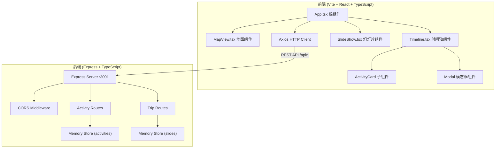
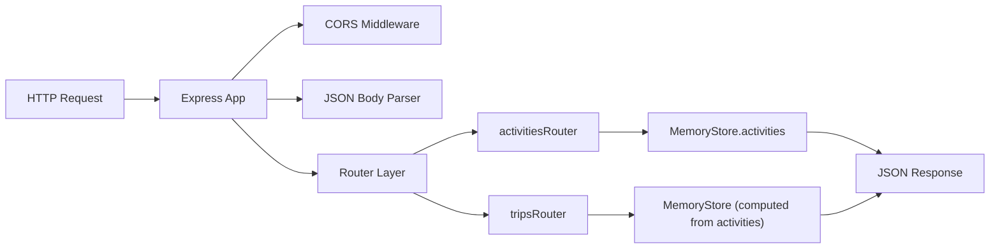
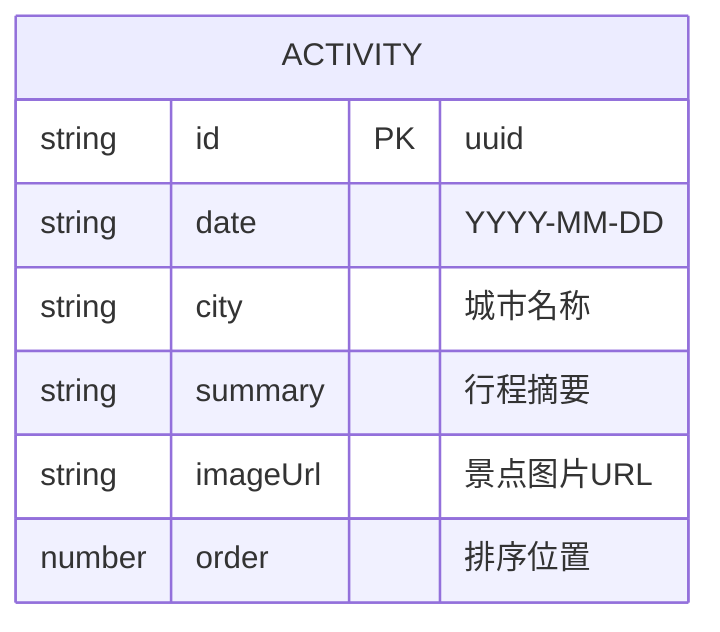

## 1. 架构设计



## 2. 技术描述

- **前端框架**：React 18 + TypeScript
- **构建工具**：Vite（端口5173，代理/api到localhost:3001）
- **状态管理**：React useState（App级全局状态，简单场景无需zustand）
- **地图组件**：Leaflet + react-leaflet（自定义DivIcon图钉）
- **HTTP客户端**：axios
- **后端框架**：Express 4 + TypeScript（ts-node热重载，端口3001）
- **后端中间件**：cors、express.json()
- **数据存储**：服务器内存数组（临时存储）
- **ID生成**：uuid
- **启动方式**：concurrently 同时启动 Vite 前端开发服务器和 Express 后端 ts-node 服务

## 3. 路由定义

| 路由 | 用途 |
|-------|---------|
| /（单页应用） | 主编辑视图（地图+时间轴）或幻灯片视图（通过mode状态切换） |

## 4. API 定义

```typescript
interface Activity {
  id: string;
  date: string;        // YYYY-MM-DD
  city: string;
  summary: string;
  imageUrl: string;
  order: number;
}

interface SlideData {
  city: string;
  gradientStart: string;
  gradientEnd: string;
  highlights: string[];
}

// POST /api/activities
// Request: { date: string, city: string, summary: string, imageUrl: string }
// Response: Activity

// GET /api/activities?tripId=xxx
// Response: Activity[]  （按日期/order排序）

// PUT /api/activities
// Request: { id: string, order: number }[]
// Response: { success: true }

// DELETE /api/activities/:id
// Response: { success: true }

// GET /api/trips/generate?tripId=xxx
// Response: SlideData[]
```

## 5. 服务器架构图



## 6. 数据模型

### 6.1 数据模型定义



### 6.2 内存数据结构

```typescript
// 服务器内存存储
const activities: Activity[] = [];  // 临时存储所有行程记录

// 城市渐变色映射（用于幻灯片生成）
const cityGradients: Record<string, { start: string; end: string }> = {
  '北京': { start: '#E53935', end: '#FF8A80' },
  '上海': { start: '#1E88E5', end: '#64B5F6' },
  '成都': { start: '#43A047', end: '#81C784' },
  // 其他城市使用默认循环渐变
};

// 中国主要城市坐标映射
const cityCoordinates: Record<string, { lat: number; lng: number }> = {
  '北京': { lat: 39.9042, lng: 116.4074 },
  '上海': { lat: 31.2304, lng: 121.4737 },
  '广州': { lat: 23.1291, lng: 113.2644 },
  // ...
};
```

## 7. 项目文件结构

```
auto103/
├── package.json            # 根目录（前端+后端依赖、concurrently脚本）
├── index.html              # Vite入口（div#root）
├── vite.config.js          # Vite配置（React插件、端口、API代理）
├── tsconfig.json           # TypeScript配置
├── server/
│   └── index.ts            # Express服务器（API路由、内存存储）
└── src/
    ├── App.tsx             # 根组件（全局状态、视图切换）
    ├── main.tsx            # React入口
    ├── index.css           # 全局样式（CSS变量、Leaflet样式覆盖、动画）
    ├── utils/
    │   ├── cities.ts       # 城市坐标与渐变映射数据
    │   └── api.ts          # Axios API封装
    └── components/
        ├── MapView.tsx     # react-leaflet地图组件
        ├── Timeline.tsx    # 时间轴（含ActivityCard、Modal）
        └── SlideShow.tsx   # 回忆幻灯片播放器
```
