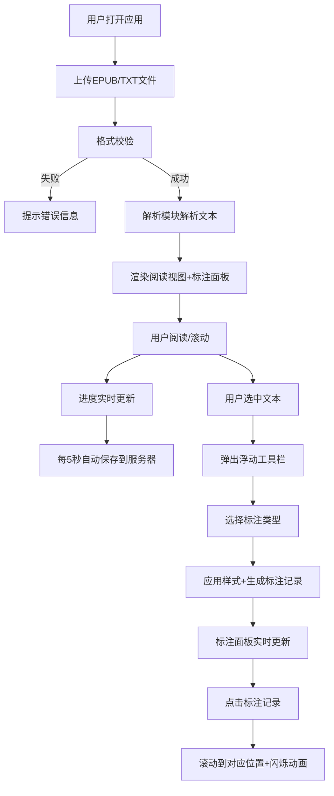

## 1. 产品概述

本产品是一款在线阅读进度追踪与标注应用，支持用户上传EPUB或TXT格式的电子书，在浏览器中直接阅读、标注重点段落，并自动同步阅读进度到云端。解决了传统阅读应用跨设备进度不同步、标注管理混乱的痛点，为深度阅读用户提供高效的知识管理工具。

## 2. 核心功能

### 2.1 用户角色
| 角色 | 注册方式 | 核心权限 |
|------|---------|---------|
| 普通用户 | 无需注册（本地存储） | 上传电子书、阅读、标注、本地进度保存 |

### 2.2 功能模块
1. **文件上传模块**：支持EPUB和TXT格式，拖拽或点击上传，格式校验
2. **文本解析模块**：解析电子书结构，提取章节、正文、图片
3. **阅读视图模块**：章节渲染、滚动阅读、进度计算、自动保存
4. **标注系统模块**：文本选中高亮、波浪线、添加评论、书签管理
5. **进度同步模块**：本地进度存储、云端API同步、状态指示器
6. **标注面板模块**：标注列表展示、分组管理、编辑删除、快速跳转

### 2.3 页面详情
| 页面名称 | 模块名称 | 功能描述 |
|---------|---------|---------|
| 主页面 | 文件上传区 | 虚线边框拖拽上传，支持EPUB/TXT格式校验 |
| 主页面 | 双栏阅读布局 | 左侧65%阅读区，右侧35%标注面板，可拖拽分隔条 |
| 主页面 | 顶部导航栏 | 书籍封面/书名、圆形进度环、保存状态指示器 |
| 阅读区 | 章节内容渲染 | Serif字体阅读体验，段落间距优化 |
| 阅读区 | 浮动工具栏 | 文本选中后弹出，支持高亮/波浪线/评论操作 |
| 阅读区 | 进度条 | 顶部显示阅读百分比，点击跳转 |
| 标注面板 | 标注列表 | 按类型分组显示，支持编辑删除，点击跳转 |
| 移动端 | 响应式布局 | <768px时单栏布局，底部浮动按钮弹出标注面板 |

## 3. 核心流程

## 4. 用户界面设计

### 4.1 设计风格
- **主色调**：#6366F1（靛蓝）
- **辅助色**：#FBBF24（黄色高亮）、#34D399（绿色波浪线）、#60A5FA（蓝色评论）、#7C3AED（紫色书签）
- **背景色**：#FAFAFA（整体）、#FFFEF7（阅读区暖白）、#F3F4F6（标注面板浅灰）
- **字体**：Inter/系统UI无衬线字体（界面），系统Serif字体（阅读正文）
- **卡片风格**：1px #E5E7EB边框，6px圆角，悬停背景#F9FAFB，阴影过渡0.25s
- **按钮过渡**：背景色0.2s，阴影0.15s

### 4.2 页面设计概述
| 页面名称 | 模块名称 | UI元素 |
|---------|---------|---------|
| 主页面 | 文件上传区 | 2px虚线边框#6366F1，拖拽高亮背景#EEF2FF，居中图标+提示文字 |
| 主页面 | 双栏布局 | 65%/35%分隔，4px分隔条#D1D5DB，悬停变#6366F1，可拖拽调整 |
| 阅读区 | 章节标题 | 20px字号，600字重，#1F2937颜色 |
| 阅读区 | 正文文本 | 16px字号，行高1.8，#374151颜色，段落间距8px |
| 阅读区 | 浮动工具栏 | 白色背景，2px圆角，#6366F1边框，28px按钮，4px圆角 |
| 阅读区 | 书签标记 | 左侧紫色#7C3AED三角，宽8px高12px，点击删除 |
| 标注面板 | 标注卡片 | 按类型分色块，原文30字截断省略号，编辑/删除图标按钮 |
| 顶部导航 | 圆形进度环 | 直径40px，stroke宽4px，#6366F1前景，#E5E7EB背景 |
| 顶部导航 | 保存指示器 | 灰色云朵（未保存）、蓝色旋转圆环（保存中）、绿色对勾（已保存） |

### 4.3 响应式设计
- **桌面端**（≥768px）：双栏布局，可拖拽分隔条，左栏最小40%，右栏最小25%
- **移动端**（<768px）：单栏布局，阅读区占满宽度，右下角48px圆形浮动按钮，点击弹出全屏标注模态框

### 4.4 动画效果
- **加载动画**：进度条平滑过渡
- **标注闪烁**：选中标注时，透明→黄色0.3s淡入→0.3s淡出，循环2次
- **悬停效果**：卡片阴影过渡0.25s，按钮背景色过渡0.2s
- **保存动画**：蓝色圆环旋转动画（保存中）
