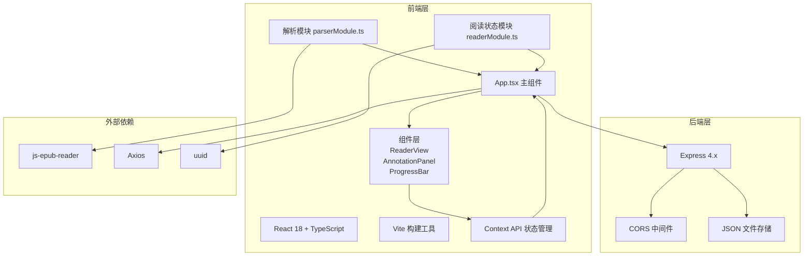
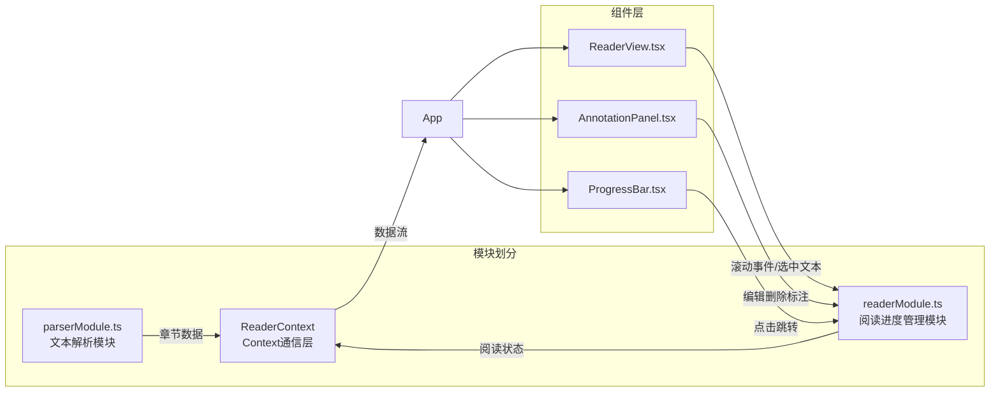
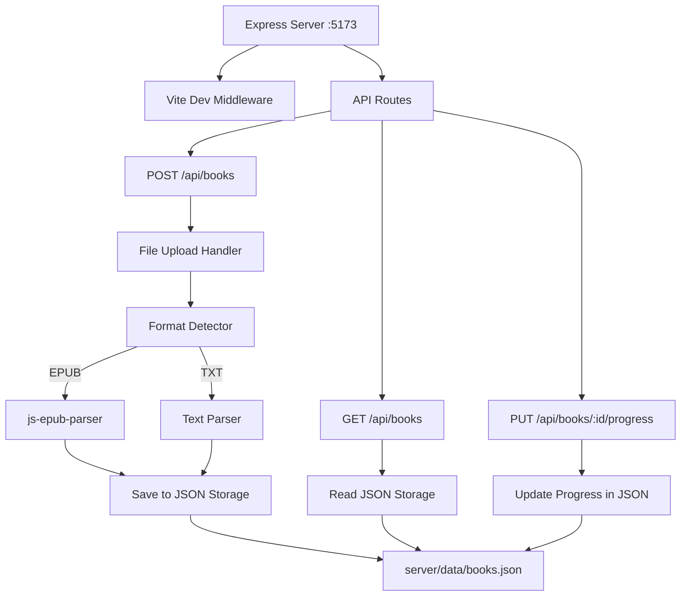

## 1. 架构设计



## 2. 技术描述

- **前端**：React 18 + TypeScript + Vite 5
- **状态管理**：React Context API（模块间通信）
- **后端**：Express 4.x + TypeScript
- **数据存储**：本地 JSON 文件（server/data/books.json）
- **EPUB解析**：js-epub-reader
- **HTTP客户端**：Axios
- **ID生成**：uuid

## 3. 前端模块架构



## 4. 核心数据结构

### 4.1 章节数据结构
```typescript
interface Chapter {
  id: string;
  title: string;
  content: string;
  images?: Array<{ src: string; alt?: string }>;
  index: number;
}
```

### 4.2 书籍数据结构
```typescript
interface Book {
  id: string;
  title: string;
  cover?: string;
  chapters: Chapter[];
  totalChapters: number;
  uploadedAt: number;
}
```

### 4.3 标注数据结构
```typescript
type AnnotationType = 'highlight' | 'underline' | 'comment';

interface Annotation {
  id: string;
  type: AnnotationType;
  chapterIndex: number;
  startOffset: number;
  endOffset: number;
  text: string;
  comment?: string;
  createdAt: number;
}
```

### 4.4 书签数据结构
```typescript
interface Bookmark {
  id: string;
  chapterIndex: number;
  scrollPosition: number;
  text: string;
  createdAt: number;
}
```

### 4.5 阅读状态数据结构
```typescript
interface ReadingState {
  currentChapter: number;
  scrollPercentage: number;
  annotations: Annotation[];
  bookmarks: Bookmark[];
  lastSavedAt?: number;
}
```

## 5. API 定义

### 5.1 上传书籍
```
POST /api/books
Content-Type: multipart/form-data

Request:
- file: EPUB/TXT 文件

Response:
{
  "success": true,
  "data": {
    "id": "uuid",
    "title": "书名",
    "cover": "封面图base64",
    "chapters": [...],
    "totalChapters": 12
  }
}
```

### 5.2 获取书籍列表
```
GET /api/books

Response:
{
  "success": true,
  "data": [
    {
      "id": "uuid",
      "title": "书名",
      "cover": "封面图base64",
      "totalChapters": 12,
      "uploadedAt": 1234567890,
      "progress": 35.5
    }
  ]
}
```

### 5.3 保存阅读进度
```
PUT /api/books/:id/progress
Content-Type: application/json

Request:
{
  "currentChapter": 3,
  "scrollPercentage": 45.2,
  "annotations": [...],
  "bookmarks": [...],
  "timestamp": 1234567890
}

Response:
{
  "success": true,
  "data": {
    "savedAt": 1234567890
  }
}
```

## 6. 服务器架构



## 7. 模块职责划分

### 7.1 parserModule.ts
- 接收 File 对象，检测文件格式（.epub/.txt）
- EPUB 格式：使用 js-epub-reader 解析章节、正文、图片
- TXT 格式：按标题正则匹配拆分章节
- 输出标准化的 Chapter[] 数组
- 提供解析进度回调

### 7.2 readerModule.ts
- 管理阅读状态：currentChapter、scrollPercentage
- 管理标注数据结构：annotations、bookmarks
- 提供 CRUD 方法：addAnnotation、updateAnnotation、deleteAnnotation、addBookmark、deleteBookmark
- 提供同步接口：syncToServer()、loadFromServer()
- 节流控制：每5秒合并差异数据发送

### 7.3 App.tsx
- 文件上传 UI 与校验
- 双栏布局与可拖拽分隔条
- 调用 parserModule 解析文件
- 初始化 readerModule 状态
- 通过 Context 向子组件传递状态和方法
- 协调组件间数据流

### 7.4 ReaderView.tsx
- 渲染当前章节 HTML 内容
- 文本选择事件监听，显示浮动工具栏
- 滚动事件监听，计算进度百分比
- 每5秒触发自动保存
- 标注样式应用（高亮、波浪线）
- 书签三角标记渲染与点击删除
- 接收跳转指令，滚动到指定位置+闪烁动画

### 7.5 AnnotationPanel.tsx
- 按类型分组展示标注列表
- 每条记录显示原文片段（30字截断）和评论
- 编辑功能：弹出输入框修改评论
- 删除功能：确认后删除标注
- 点击记录：向父组件发送跳转事件

### 7.6 ProgressBar.tsx
- 顶部进度条渲染
- 显示阅读百分比
- 点击进度条跳转对应位置

## 8. 性能优化策略

1. **解析优化**：
   - 20MB EPUB 解析 ≤ 3秒
   - 流式解析，避免内存溢出
   - 图片懒加载处理

2. **渲染优化**：
   - 10000字首屏渲染 ≤ 1秒
   - 虚拟滚动（长章节）
   - 标注样式使用 CSS class，避免内联样式

3. **数据同步优化**：
   - 滚动进度节流（每5秒）
   - 仅发送差异数据（diff）
   - 本地存储兜底，网络失败时重试

4. **列表渲染优化**：
   - 100条标注无卡顿
   - 使用 React.memo 优化子组件
   - 标注列表虚拟滚动

## 9. 项目结构

```
auto105/
├── package.json
├── index.html
├── vite.config.js
├── tsconfig.json
├── server.ts
├── server/
│   └── data/
│       └── books.json
└── src/
    ├── parserModule.ts
    ├── readerModule.ts
    ├── App.tsx
    ├── main.tsx
    ├── types.ts
    ├── context/
    │   └── ReaderContext.tsx
    └── components/
        ├── ReaderView.tsx
        ├── AnnotationPanel.tsx
        ├── ProgressBar.tsx
        ├── FloatingToolbar.tsx
        ├── TopNavbar.tsx
        └── FileUpload.tsx
```
