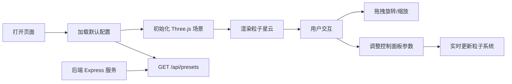

## 1. 产品概述
极光粒子沙盒是一款面向数字艺术家和前端爱好者的交互式粒子可视化创作工具，旨在解决现有粒子系统要么过于死板、要么需要复杂 GLSL 编程的痛点。用户可以通过直观的控制面板快速搭建极光般流动、色彩丰富的 3D 粒子场景。

- 目标用户：数字艺术家、前端开发爱好者、视觉创意工作者
- 产品价值：零代码门槛，快速生成高质量的极光风格动态粒子视觉效果

## 2. 核心特性

### 2.1 用户角色
| 角色 | 注册方式 | 核心权限 |
|------|----------|----------|
| 普通用户 | 无需注册，直接使用 | 创建、调整、观赏粒子场景 |

### 2.2 功能模块
1. **主画布区域**：深空背景 3D 粒子星云渲染画布
2. **控制面板**：粒子数量调节、速度控制、颜色主题切换、视角重置
3. **视角交互**：鼠标拖拽旋转、滚轮缩放、视角指示器

### 2.3 页面详情
| 页面名称 | 模块名称 | 功能描述 |
|----------|----------|----------|
| 主页面 | 3D 粒子画布 | 深空背景（#0A0A1A），5000个发光粒子组成的星云，粒子大小1-4px随机，三维球体分布，正弦波+柏林噪声驱动运动，粒子间连线 |
| 主页面 | 控制面板 | 粒子数量滑块（1000-10000）、速度倍数滑块（0.1-3.0）、颜色主题下拉（4套主题）、重置视角按钮 |
| 主页面 | 视角指示器 | 左上角半透明圆环，显示当前视角朝向的小点 |

## 3. 核心流程
用户打开页面后，自动加载默认粒子场景，通过拖拽旋转视角、滚轮缩放观察粒子运动，可通过右侧控制面板实时调整粒子数量、速度、颜色主题，点击重置视角回到初始视角。后端提供预设配置 API。

## 4. 用户界面设计

### 4.1 设计风格
- 主色调：深空蓝 `#0A0A1A` 背景、面板色 `#1A1A2E`、强调色 `#00BCD4`（青色）、辅助色 `#E91E63`（洋红）、`#9C27B0`（紫色）
- 文字色：`#E0E0E0`
- 圆角：统一 8px 圆角
- 控件反馈：悬停阴影、点击 0.1s 缩放过渡
- 面板效果：半透明磨砂玻璃质感
- 整体风格：深色科幻、极光流动、沉浸式

### 4.2 页面设计概览
| 页面名称 | 模块名称 | UI 元素 |
|----------|----------|---------|
| 主页面 | 3D 粒子画布 | 全屏 Canvas，深空渐变背景，发光粒子，半透明连线，极光色流动渐变 |
| 主页面 | 控制面板 | 220px 宽右侧面板，滑块（轨道高6px圆角3px，滑块头直径20px），下拉框，圆角按钮 |
| 主页面 | 视角指示器 | 左上角直径80px半透明圆环，内部4px白色视角朝向点 |

### 4.3 响应式
桌面端优先设计，保证 1920x1080 及以上分辨率完美显示。

### 4.4 3D 场景指南
- 环境：深空背景 `#0A0A1A`，无需 HDRI
- 光照：粒子自发光，PointsMaterial 使用 vertexColors，无需额外光源
- 相机：PerspectiveCamera，OrbitControls 控制，无阻尼平滑旋转
- 构图：粒子球体位于画面中央，右侧留出控制面板空间
- 交互：OrbitControls 拖拽旋转、滚轮缩放、禁用平移
- 后处理：粒子 AdditiveBlending 实现发光叠加效果
- 性能：BufferGeometry + ShaderMaterial 优化，10000 粒子在集成显卡上 30FPS+
