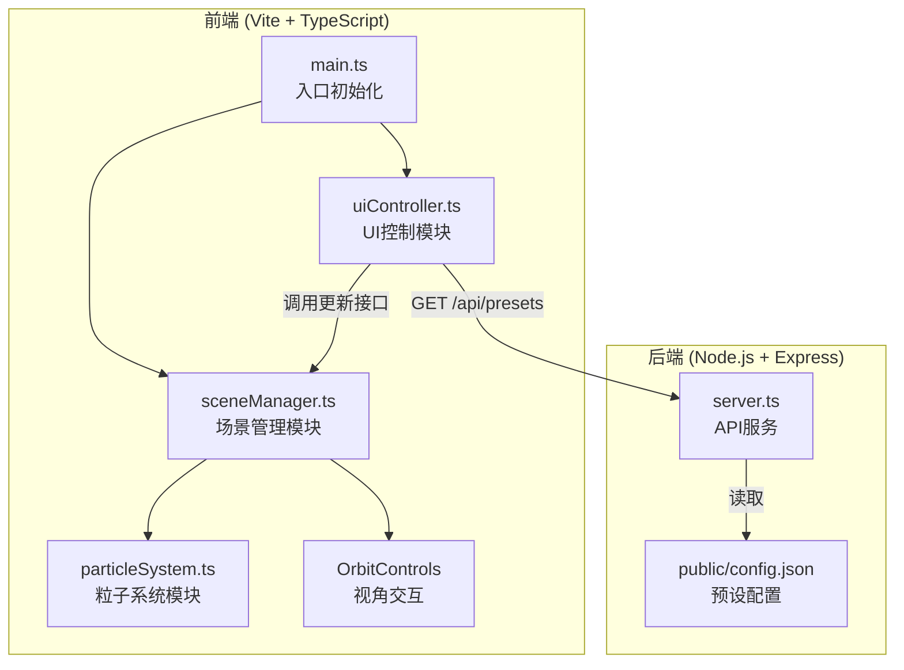

## 1. 架构设计



## 2. 技术说明

- **前端框架**：TypeScript + Three.js（原生），不使用 React，按用户要求拆分模块
- **构建工具**：Vite 5
- **后端服务**：Express 4，提供 REST API
- **3D 渲染**：Three.js 的 BufferGeometry + Points + LineSegments，WebGL 渲染
- **样式方案**：原生 CSS（内联在 index.html 中），实现磨砂玻璃和科幻 UI

### 技术选型说明
用户明确要求使用 TypeScript 和 Three.js 原生实现，按指定文件结构拆分模块，因此不引入 React。后端使用轻量 Express 服务提供预设配置。

## 3. 文件结构
| 文件路径 | 用途 |
|----------|------|
| package.json | 项目依赖与启动脚本 |
| index.html | 入口 HTML，包含 #root 容器 |
| vite.config.js | Vite 配置，使用 vite-plugin-static-copy |
| tsconfig.json | TypeScript 严格模式配置 |
| src/main.ts | 应用入口，初始化 Three.js 场景、启动动画循环 |
| src/sceneManager.ts | 场景管理模块，管理粒子系统与 OrbitControls |
| src/particleSystem.ts | 粒子生成与运动逻辑，柏林噪声 + 正弦波驱动 |
| src/uiController.ts | UI 控制面板，DOM 创建与事件监听 |
| src/server.ts | Express 后端，GET /api/presets 接口，监听 3001 端口 |
| public/config.json | 预设颜色主题和默认参数配置 |

## 4. API 定义

### GET /api/presets
获取预设颜色主题数组和默认参数。

**响应类型：**
```typescript
interface ColorTheme {
  name: string;
  colors: string[];  // 渐变颜色数组，如 ["#00BCD4", "#E91E63", "#9C27B0"]
}

interface PresetsResponse {
  themes: ColorTheme[];
  defaults: {
    particleCount: number;  // 5000
    speedMultiplier: number; // 1.0
    defaultThemeIndex: number; // 0
  };
}
```

## 5. 模块职责定义

### particleSystem.ts
- 生成粒子初始位置（半径10的球体内随机分布）
- 生成粒子大小（1-4px 随机）
- 生成粒子颜色（根据主题渐变 + 时间/位置偏移）
- 维护粒子运动轨迹（正弦波 + 柏林噪声）
- 维护粒子间连线（距离<3时）
- 提供 setParticleCount、setSpeed、setColorTheme 方法

### sceneManager.ts
- 管理 Three.js Scene、Camera、Renderer
- 创建并管理 ParticleSystem 实例
- 创建并管理 OrbitControls
- 提供 resetView() 方法重置视角
- 提供粒子参数更新接口，转发给 ParticleSystem
- 每帧更新：调用粒子系统更新 + 渲染

### uiController.ts
- 创建右侧 220px 控制面板 DOM
- 创建粒子数量滑块（1000-10000）
- 创建速度倍数滑块（0.1-3.0）
- 创建颜色主题下拉框（4个选项）
- 创建重置视角按钮
- 从后端获取预设配置填充 UI
- 监听控件事件，调用 sceneManager 更新

## 6. 性能优化策略
- 使用 BufferGeometry 而非 Geometry，减少 CPU→GPU 数据传输
- 使用 AdditiveBlending 实现粒子发光叠加，无需后处理
- 粒子连线采用 LineSegments + BufferGeometry，批量渲染
- 柏林噪声使用预生成 Lookup 纹理，避免每帧 JS 计算
- 动画循环使用 requestAnimationFrame，时间差驱动运动
- 避免在 animate 中创建新对象，复用已有数组和缓冲区
