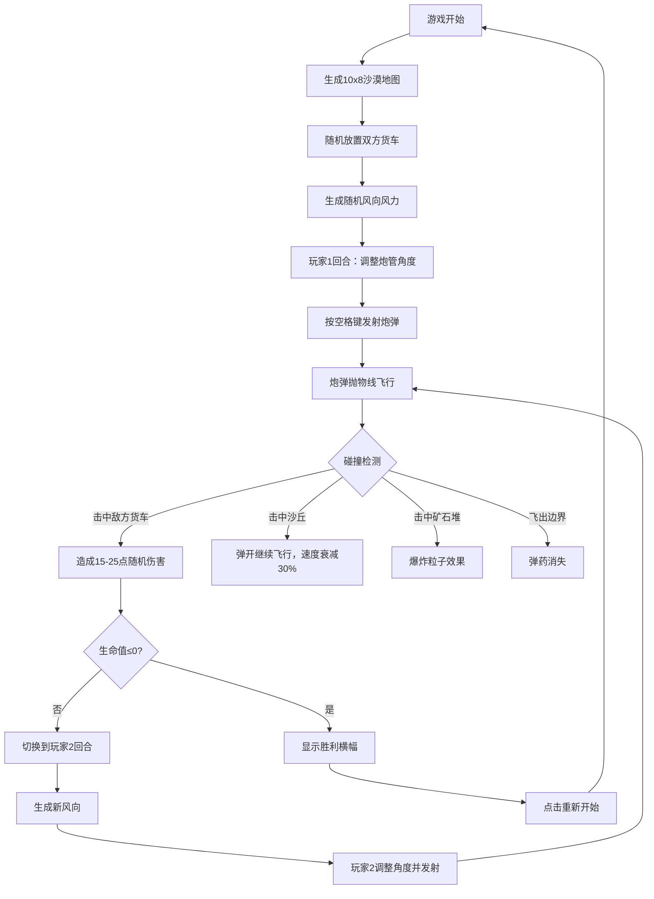

## 1. 产品概述

回合制沙漠货车对战游戏，两名玩家在随机生成的沙漠地图上各自控制武装货车进行炮弹对战。游戏采用西部沙漠风格，融合策略性和趣味性，通过抛物线射击和地形交互提供紧张刺激的对战体验。

- **核心玩法**：双人回合制炮弹对战，利用风力和地形策略性射击
- **目标用户**：休闲游戏玩家，喜欢策略对战类游戏的用户
- **产品价值**：提供即开即玩的轻量化对战体验，结合随机要素保证每局游戏的独特性

## 2. 核心功能

### 2.1 用户角色
| 角色 | 注册方式 | 核心权限 |
|------|----------|----------|
| 玩家1 / 玩家2 | 无需注册，本地双人对战 | 调整炮管角度、发射炮弹、重开游戏 |

### 2.2 功能模块
1. **游戏主界面**：地图区域、玩家数据面板、风向显示
2. **地图生成系统**：10x8网格随机生成，包含沙地、沙丘、矿石堆三种地形
3. **炮弹物理系统**：抛物线轨迹、风力影响、碰撞检测与反弹
4. **回合管理系统**：玩家轮流操作、胜负判定、游戏重置
5. **视觉效果系统**：命中特效、爆炸粒子、屏幕震动、胜利动画

### 2.3 页面详情
| 页面名称 | 模块名称 | 功能描述 |
|----------|----------|----------|
| 游戏主页面 | 地图区域 | 10x8网格地图显示，地形渲染，货车和炮弹实时位置 |
| 游戏主页面 | 玩家1面板 | 生命值条、弹药数、炮管角度、玩家标识 |
| 游戏主页面 | 玩家2面板 | 生命值条、弹药数、炮管角度、玩家标识 |
| 游戏主页面 | 风向指示器 | 显示当前风向角度和风力等级的矢量箭头 |
| 游戏主页面 | 胜利横幅 | 游戏结束时显示获胜方，提供重新开始按钮 |

## 3. 核心流程

### 游戏流程
游戏开始 → 生成随机地图 → 放置双方货车 → 生成随机风向 → 玩家1调整角度 → 发射炮弹 → 炮弹飞行与碰撞检测 → 伤害计算 → 切换玩家 → 循环直到一方生命值≤0 → 显示胜利结果 → 点击重开回到初始状态

## 4. 用户界面设计

### 4.1 设计风格
- **主色调**：深蓝黑背景 `#2C3E50`，沙漠黄 `#F4D03F`，沙丘橙 `#D35400`，矿石灰 `#7F8C8D`
- **强调色**：玩家1红 `#E74C3C`，玩家2蓝 `#3498DB`，金色 `#FFD700`，胜利绿 `#00FF00`
- **字体风格**：西部沙漠风格，粗犷有力的无衬线字体，数字清晰易读
- **布局方式**：三栏布局（左面板15% + 地图70% + 右面板15%），移动端折叠为顶部横条
- **视觉质感**：木纹边框、沙丘3D凸起效果、半透明面板、发光与粒子特效

### 4.2 页面设计概览
| 页面名称 | 模块名称 | UI元素 |
|----------|----------|--------|
| 游戏主页面 | 地图区域 | 60px格子网格，沙地黄色，沙丘橙色带阴影，矿石堆灰色多边形，货车20x30px带炮管 |
| 游戏主页面 | 玩家面板 | 半透明深灰背景圆角16px，红绿渐变生命条，圆形弹药图标，风向箭头 |
| 游戏主页面 | 胜利横幅 | 金色文字32px字重700，半透明深蓝背景圆角12px，从上滑入动画 |
| 游戏主页面 | 特效层 | 炮弹白色尾迹，伤害红色飘字，爆炸橙色粒子，屏幕震动效果 |

### 4.3 响应式设计
- **桌面端**（≥768px）：三栏布局，左右面板各占15%，地图居中70%
- **移动端**（<768px）：面板折叠为顶部横条，地图占满下方区域，触控优化
- **触控优化**：炮管角度可通过左右滑动调整，点击屏幕发射炮弹

### 4.4 动画与交互
- **格子加载**：从透明到不透明淡入0.3s，错峰出现
- **炮管高亮**：当前回合玩家炮管金色#FFD700描边2px，0.5s闪烁动画
- **炮弹飞行**：半透明白色尾迹，保留前10帧轨迹点，2px宽透明度0.6
- **命中效果**：红色伤害数字从碰撞点向上飘升0.5s后消失
- **爆炸效果**：半径20px橙色粒子，持续0.3s
- **胜利效果**：获胜方货车绿色光晕脉动1s循环，失败方灰色碎裂边线
- **屏幕震动**：炮弹发射时轻微偏移1px持续0.1s
