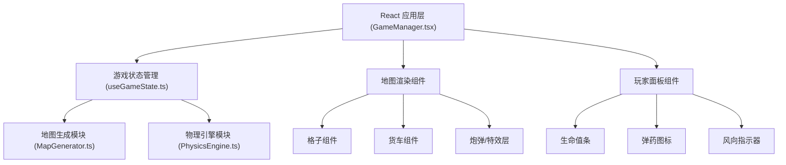

## 1. 架构设计



**架构说明**：
- **表现层**：React 组件负责 UI 渲染和用户交互
- **状态层**：useReducer 管理游戏状态，集中式状态调度
- **业务逻辑层**：独立模块处理地图生成和物理计算
- **数据层**：二维数组存储地图网格数据，对象存储玩家状态

## 2. 技术选型说明

- **前端框架**：React 18 + TypeScript（严格模式）
- **构建工具**：Vite 5 + @vitejs/plugin-react
- **状态管理**：React useReducer（自定义 Hook 封装）
- **样式方案**：CSS Modules + 内联样式（动画特效）
- **动画方案**：requestAnimationFrame + CSS Transitions/Animations
- **渲染方式**：DOM + CSS（网格布局）+ Canvas（炮弹轨迹/粒子特效可选）

**选择理由**：
- Vite 提供极速开发体验和 HMR
- TypeScript 严格模式保证类型安全
- useReducer 适合回合制游戏的状态流转
- 纯 DOM 渲染便于调试和维护，性能满足 60fps 要求

## 3. 文件结构设计

```
project/
├── package.json
├── index.html
├── vite.config.js
├── tsconfig.json
├── src/
│   ├── GameManager.tsx          # 游戏主循环、回合管理、胜负判定
│   ├── MapGenerator.ts          # 沙漠地图生成模块
│   ├── PhysicsEngine.ts         # 炮弹轨迹与碰撞检测
│   ├── hooks/
│   │   └── useGameState.ts      # 游戏状态管理 Hook
│   ├── components/
│   │   ├── GameMap.tsx          # 地图组件
│   │   ├── GridCell.tsx         # 网格格子组件
│   │   ├── Truck.tsx            # 货车组件
│   │   ├── Projectile.tsx       # 炮弹组件
│   │   ├── PlayerPanel.tsx      # 玩家面板组件
│   │   ├── HealthBar.tsx        # 生命值条组件
│   │   ├── WindIndicator.tsx    # 风向指示器
│   │   ├── VictoryBanner.tsx    # 胜利横幅
│   │   └── ParticleEffect.tsx   # 粒子特效组件
│   ├── types/
│   │   └── game.ts              # 类型定义
│   ├── utils/
│   │   └── constants.ts         # 游戏常量配置
│   ├── App.tsx
│   ├── main.tsx
│   └── styles/
│       └── global.css           # 全局样式
```

## 4. 核心数据模型

### 4.1 类型定义

```typescript
// 地形类型
type TerrainType = 'sand' | 'dune' | 'ore';

// 格子数据
interface GridCell {
  terrain: TerrainType;
  x: number;
  y: number;
}

// 玩家数据
interface Player {
  id: number;
  position: { x: number; y: number };
  health: number;
  maxHealth: number;
  ammo: number;
  angle: number;
  color: string;
}

// 风向数据
interface Wind {
  angle: number;   // 0-360度
  strength: number; // 1-5级
}

// 炮弹数据
interface Projectile {
  id: number;
  x: number;
  y: number;
  vx: number;
  vy: number;
  ownerId: number;
  trail: Array<{ x: number; y: number }>;
  active: boolean;
}

// 游戏状态
interface GameState {
  map: GridCell[][];
  players: Player[];
  currentPlayer: number;
  wind: Wind;
  projectile: Projectile | null;
  gameStatus: 'playing' | 'ended';
  winner: number | null;
  effects: Effect[];
  screenShake: boolean;
}

// 特效数据
interface Effect {
  id: number;
  type: 'damage' | 'explosion' | 'bounce';
  x: number;
  y: number;
  value?: number;
  startTime: number;
  duration: number;
}
```

### 4.2 Action 类型

```typescript
type GameAction =
  | { type: 'INIT_GAME' }
  | { type: 'ADJUST_ANGLE'; playerId: number; delta: number }
  | { type: 'FIRE_PROJECTILE'; playerId: number }
  | { type: 'UPDATE_PROJECTILE' }
  | { type: 'PROJECTILE_HIT_TRUCK'; targetId: number; damage: number }
  | { type: 'PROJECTILE_HIT_DUNE'; bounceVelocity: { vx: number; vy: number } }
  | { type: 'PROJECTILE_HIT_ORE' }
  | { type: 'PROJECTILE_OUT_OF_BOUNDS' }
  | { type: 'SWITCH_TURN' }
  | { type: 'END_GAME'; winner: number }
  | { type: 'RESET_GAME' };
```

## 5. 核心算法

### 5.1 地图生成算法
- 10x8 网格，随机分配地形：沙地60%、沙丘30%、矿石堆10%
- 确保左右两侧各有至少一排沙地用于货车生成
- 货车初始位置随机生成在左右两侧的沙地上

### 5.2 抛物线物理引擎
- 重力加速度：9.8 m/s²（按像素比例缩放）
- 初始速度：根据游戏平衡调优
- 每帧更新位置：`x += vx + windX`, `y += vy`, `vy += gravity`
- 每帧间隔：16ms（60fps）
- 轨迹尾迹：保留最近10个位置点

### 5.3 碰撞检测
- 格子级碰撞：炮弹位置映射到网格坐标
- 货车碰撞：AABB 矩形碰撞检测
- 沙丘反弹：计算碰撞面法线，速度衰减30%
- 边界检测：炮弹超出地图范围则销毁

### 5.4 风力影响
- 风向角度转换为向量：`windX = cos(angle) * strength * factor`
- 每帧叠加到炮弹水平速度
- 风力等级1-5对应不同偏移系数

## 6. 性能优化策略

### 6.1 地图生成性能
- 预先生成随机数数组，一次性填充网格
- 目标：≤50ms 完成生成

### 6.2 物理计算性能
- 每帧物理计算控制在1ms内
- 轨迹点数量限制为10个，避免数组膨胀
- 使用简单数学运算，避免复杂计算

### 6.3 渲染性能
- 使用 CSS transform 进行位置更新，触发 GPU 加速
- 粒子特效使用 CSS 动画，自动回收
- 避免不必要的重渲染，合理使用 React.memo
- 目标：60fps 稳定运行，20个粒子时不低于50fps

### 6.4 状态更新
- 批量处理状态更新，减少 re-render 次数
- 炮弹位置使用 ref 直接操作 DOM，避免 React 状态更新开销

## 7. 游戏常量配置

| 参数 | 值 | 说明 |
|------|----|------|
| 地图宽度 | 10 格 | 横向格子数 |
| 地图高度 | 8 格 | 纵向格子数 |
| 格子大小 | 60px | 每格像素尺寸 |
| 初始生命值 | 100 | 玩家初始血量 |
| 初始弹药 | 8 发 | 每局弹药数 |
| 角度范围 | 0-90 度 | 炮管调节范围 |
| 角度步进 | 0.5 度 | 每次调节量 |
| 风力范围 | 1-5 级 | 风力等级 |
| 伤害范围 | 15-25 | 命中伤害随机值 |
| 反弹衰减 | 30% | 沙丘反弹速度衰减 |
| 重力加速度 | 0.5 px/帧² | 按像素调整的重力 |
| 炮弹初速度 | 8 px/帧 | 初始速度大小 |
